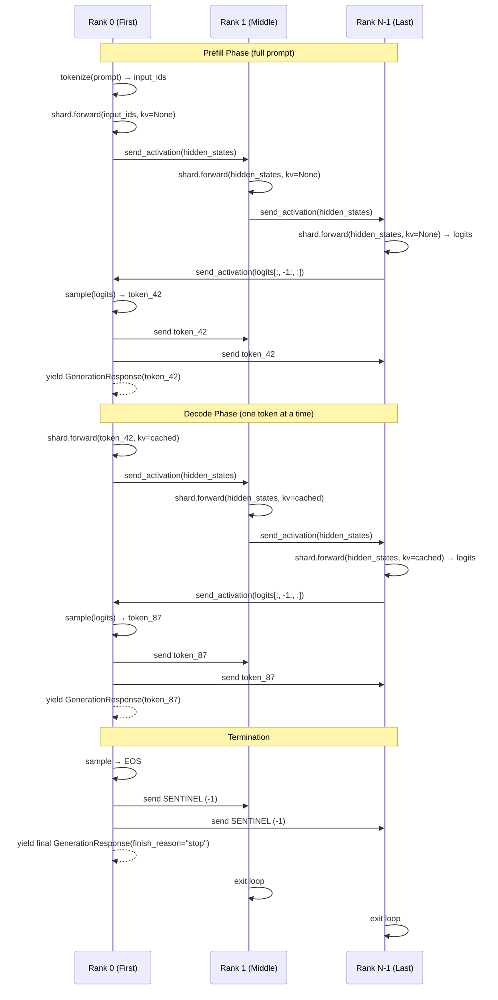
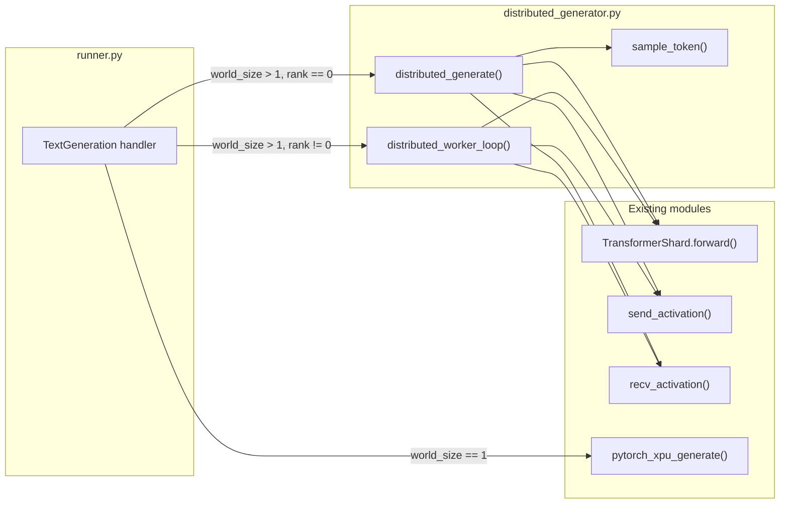

# Design Document: Distributed Generation Pipeline

## Overview

This design implements the coordinated autoregressive text generation loop for pipeline-parallel inference across the 4 gremlin nodes. The cluster already has: Gloo process group initialization, model loading with TransformerShard (layers split across ranks), and warmup. What's missing is the actual generation coordination — the loop that produces tokens by forwarding activations through shards in pipeline order.

The core module is `distributed_generator.py`, which provides two entry points:
- **`distributed_generate()`** — a Python generator function called by rank 0 that orchestrates the pipeline, samples tokens, and yields `GenerationResponse` objects to the runner
- **`distributed_worker_loop()`** — a blocking loop called by non-rank-0 nodes that receives activations, computes forward passes, sends results, and waits for the next iteration signal

The design leverages the existing `send_activation`/`recv_activation` primitives from `distributed.py` for all inter-rank tensor communication. On Intel iGPU nodes with shared memory, the CPU↔GPU staging is nearly free.

Key design decisions:
- **Only last-position logits transferred** — the last rank sends only `logits[:, -1:, :]` (shape `(1, 1, vocab_size)`) back to rank 0, not the full sequence logits, reducing transfer size from `O(seq_len × vocab_size)` to `O(vocab_size)`
- **Token broadcast via small tensor** — rank 0 broadcasts the sampled token ID as a `(1,)` int64 tensor to all other ranks, using the same send_activation primitive
- **Termination via sentinel value** — token ID `-1` signals termination to non-first ranks, avoiding a separate control channel
- **Single-file module** — all distributed generation logic lives in one file for simplicity; the runner dispatches to it based on `world_size > 1`

## Architecture

### Pipeline-Parallel Generation Flow



### Module Integration



## Components and Interfaces

### distributed_generator.py

New module at `src/exo/worker/engines/pytorch_xpu/distributed_generator.py`.

#### `distributed_generate()`

```python
def distributed_generate(
    model: TransformerShard,
    tokenizer: Any,
    prompt: str,
    device_type: str,
    device_id: int,
    rank: int,
    world_size: int,
    max_tokens: int = 100,
    temperature: float = 1.0,
    top_k: int | None = None,
    top_p: float | None = None,
    model_id: str = "",
) -> Generator[GenerationResponse, None, None]:
    """
    Orchestrate distributed generation from rank 0.
    
    Only called on rank 0. Drives the pipeline by:
    1. Tokenizing the prompt
    2. Running prefill (full sequence through pipeline)
    3. Running decode loop (one token at a time)
    4. Sampling tokens and broadcasting to other ranks
    5. Yielding GenerationResponse for each token
    """
```

#### `distributed_worker_loop()`

```python
def distributed_worker_loop(
    model: TransformerShard,
    device_type: str,
    device_id: int,
    rank: int,
    world_size: int,
    hidden_size: int,
    dtype: torch.dtype,
) -> None:
    """
    Blocking loop for non-rank-0 nodes.
    
    Runs until termination signal received:
    1. Receive hidden states from previous rank (or token from rank 0 for first shard)
    2. Forward through local TransformerShard
    3. Send output to next rank (or logits back to rank 0 if last rank)
    4. Receive next token ID from rank 0
    5. If token == SENTINEL, exit
    """
```

#### `sample_token()`

```python
def sample_token(
    logits: torch.Tensor,
    temperature: float = 1.0,
    top_k: int | None = None,
    top_p: float | None = None,
) -> int:
    """
    Sample a single token from logits with temperature, top-k, and top-p.
    
    Applies in order: temperature scaling → top-k filtering → top-p filtering → softmax → multinomial.
    
    Args:
        logits: Shape (1, 1, vocab_size) or (1, vocab_size) — last position logits only
        temperature: Divide logits by this value (1.0 = no change)
        top_k: Keep only top-k highest logit values (None = disabled)
        top_p: Keep smallest set of tokens with cumulative prob ≥ top_p (None = disabled)
    
    Returns:
        Sampled token ID as integer
    """
```

### Runner Integration (runner.py modification)

The TextGeneration handler at ~line 670 will be modified:

```python
if backend_type == "pytorch_xpu" and world_size > 1:
    if rank == 0:
        # Rank 0: orchestrate generation, yield responses
        pytorch_xpu_generator = distributed_generate(
            model=pytorch_xpu_model,
            tokenizer=pytorch_xpu_tokenizer,
            prompt=prompt,
            device_type=device_type,
            device_id=device_id,
            rank=rank,
            world_size=world_size,
            max_tokens=task_params.max_output_tokens or 100,
            temperature=task_params.temperature or 1.0,
            top_k=task_params.top_k,
            top_p=task_params.top_p,
            model_id=str(shard_metadata.model_card.model_id),
        )
    else:
        # Non-rank-0: run worker loop (blocks until generation ends)
        distributed_worker_loop(
            model=pytorch_xpu_model,
            device_type=device_type,
            device_id=device_id,
            rank=rank,
            world_size=world_size,
            hidden_size=model_hidden_size,
            dtype=model_dtype,
        )
        pytorch_xpu_generator = iter([])  # No responses from non-first ranks
elif backend_type == "pytorch_xpu":
    # Single-node: existing path unchanged
    pytorch_xpu_generator = pytorch_xpu_generate(...)
```

## Data Models

### Communication Protocol

All inter-rank communication uses the existing `send_activation`/`recv_activation` from `distributed.py`. The protocol defines what tensors are sent at each step:

| Step | Sender | Receiver | Tensor | Shape | dtype |
|------|--------|----------|--------|-------|-------|
| Forward pass (prefill) | rank i | rank i+1 | hidden_states | `(1, seq_len, hidden_size)` | model dtype |
| Forward pass (decode) | rank i | rank i+1 | hidden_states | `(1, 1, hidden_size)` | model dtype |
| Logits return | last rank | rank 0 | last_logits | `(1, 1, vocab_size)` | float32 |
| Token broadcast | rank 0 | all others | token_id | `(1,)` | int64 |

### Sentinel Values

```python
TERMINATION_SENTINEL: int = -1  # Token ID that signals generation is complete
```

### Per-Rank State

Each rank maintains during generation:

```python
@dataclass
class RankGenerationState:
    """Mutable state held by each rank during a generation run."""
    past_key_values: list[tuple[torch.Tensor, torch.Tensor]] | None  # KV cache for this rank's layers
    iteration: int  # Current iteration count (0 = prefill, 1+ = decode)
    device: torch.device  # Target device for this rank
```

### GenerationResponse (existing, unchanged)

The `distributed_generate()` function yields the same `GenerationResponse` objects as the existing `pytorch_xpu_generate()`:

```python
class GenerationResponse(BaseRunnerResponse):
    text: str                          # Decoded token text
    token: int                         # Token ID
    logprob: float | None              # Log probability (optional)
    top_logprobs: list[TopLogprobItem] | None
    finish_reason: FinishReason | None # "stop", "length", "error", or None
    stats: GenerationStats | None      # TPS and memory stats
    usage: Usage | None                # Token counts
```

## Correctness Properties

*A property is a characteristic or behavior that should hold true across all valid executions of a system — essentially, a formal statement about what the system should do. Properties serve as the bridge between human-readable specifications and machine-verifiable correctness guarantees.*

### Property 1: Sampling uses last position only

*For any* logits tensor of shape `(1, seq_len, vocab_size)` where `seq_len >= 1`, the `sample_token` function SHALL produce the same result as if called with `logits[:, -1:, :]` — i.e., only the last position's logits influence the sampled token.

**Validates: Requirements 2.2**

### Property 2: EOS token terminates with "stop"

*For any* logits tensor that, after sampling, produces a token ID matching any configured EOS token ID, the generation loop SHALL terminate and the final `GenerationResponse` SHALL have `finish_reason == "stop"`.

**Validates: Requirements 2.5**

### Property 3: Max tokens terminates with "length"

*For any* configured `max_tokens` value N, after exactly N tokens have been generated (without encountering EOS), the generation loop SHALL terminate and the final `GenerationResponse` SHALL have `finish_reason == "length"`.

**Validates: Requirements 2.6**

### Property 4: Temperature scaling is division

*For any* logits tensor and temperature value T > 0, applying temperature scaling SHALL produce a tensor equal to `logits / T`. When T == 1.0, the logits SHALL be unchanged.

**Validates: Requirements 3.1**

### Property 5: Top-k retains exactly k values

*For any* logits tensor of vocabulary size V and top_k value k where 0 < k ≤ V, after top-k filtering, exactly k logit values SHALL be finite (not negative infinity), and these SHALL be the k largest values from the original tensor.

**Validates: Requirements 3.2**

### Property 6: Top-p respects cumulative probability threshold

*For any* logits tensor and top_p value p where 0 < p < 1, after top-p filtering and softmax, the cumulative probability of all retained tokens SHALL be ≥ p, and removing any single retained token (other than the highest-probability one) would make the cumulative probability < p.

**Validates: Requirements 3.3**

### Property 7: GenerationResponse contains all required fields

*For any* token generated during the decode phase, the yielded `GenerationResponse` SHALL have: non-None `usage` with `prompt_tokens > 0` and `completion_tokens > 0`, a valid `token` ID ≥ 0, and `text` that is the tokenizer's decoding of that token ID (or empty string for stop tokens).

**Validates: Requirements 4.1**

### Property 8: KV cache grows correctly across phases

*For any* prompt of length N tokens, after the prefill phase completes, the KV cache on each rank SHALL contain key-value pairs covering N positions. After each subsequent decode step, the KV cache length SHALL increase by exactly 1.

**Validates: Requirements 5.2, 5.3, 8.3, 8.4**

### Property 9: Input tensor shape reflects generation phase

*For any* generation run with a prompt of length N, the first forward pass input to each rank's TransformerShard SHALL have `seq_len == N` (prefill), and all subsequent forward pass inputs SHALL have `seq_len == 1` (decode).

**Validates: Requirements 8.1, 8.2, 8.5**

### Property 10: Only rank 0 produces output

*For any* rank r where r != 0, the `distributed_worker_loop` SHALL produce zero `GenerationResponse` objects and SHALL not invoke any token decoding (tokenizer.decode) operations.

**Validates: Requirements 9.1, 9.2, 9.4**

### Property 11: All ranks execute equal iterations

*For any* generation run that produces K tokens, every participating rank SHALL execute exactly K+1 forward passes (1 prefill + K decode steps).

**Validates: Requirements 6.5**

### Property 12: Sampling pipeline order

*For any* logits tensor with temperature ≠ 1.0, top_k set, and top_p set, the `sample_token` function SHALL produce results consistent with applying operations in the exact order: temperature scaling → top-k filtering → top-p filtering → softmax → multinomial sampling.

**Validates: Requirements 3.5**

## Error Handling

### Error Propagation Strategy

Errors are handled differently depending on which rank encounters them:

**Rank 0 errors:**
1. Catch the exception in `distributed_generate()`
2. Send `TERMINATION_SENTINEL` to all other ranks (best-effort)
3. Yield a final `GenerationResponse` with `finish_reason="error"` and error message
4. Release KV cache

**Non-rank-0 errors:**
1. The failing rank's `distributed_worker_loop()` catches the exception
2. Logs the error
3. Exits the loop (releases KV cache)
4. Rank 0 will detect the failure when its next `send_activation` or `recv_activation` raises a Gloo timeout/connection error
5. Rank 0 then follows its own error path (send sentinel to remaining ranks, yield error response)

**Gloo communication failures:**
- `send_activation` and `recv_activation` already raise `RuntimeError` on failure
- These propagate up to the generation loop which handles them as rank errors
- Gloo's internal timeout (configured during `init_process_group`) prevents indefinite hangs

### Specific Error Cases

| Error | Detection | Recovery |
|-------|-----------|----------|
| TransformerShard.forward() exception | try/except in generation loop | Send sentinel, yield error |
| Gloo send timeout | RuntimeError from send_activation | Log, yield error, exit |
| Gloo recv timeout | RuntimeError from recv_activation | Log, yield error, exit |
| OOM during forward pass | RuntimeError from PyTorch | Send sentinel, yield error |
| Invalid logits (NaN/Inf) | Check before sampling | Yield error, terminate |
| Tokenizer failure | Exception during encode/decode | Yield error before pipeline starts |

### Resource Cleanup

On any termination (normal or error):
- KV cache references set to `None` (Python GC handles deallocation)
- No explicit `torch.cuda.empty_cache()` needed on Intel iGPU (shared memory)
- Gloo process group remains alive for future generation requests

## Testing Strategy

### Property-Based Testing

This feature is suitable for property-based testing because the sampling logic (temperature, top-k, top-p) consists of pure functions with clear mathematical properties, and the generation loop has well-defined invariants around KV cache growth and phase transitions.

**Library:** [Hypothesis](https://hypothesis.readthedocs.io/) (already in use in this project — see `.hypothesis/` directory)

**Configuration:** Minimum 100 iterations per property test.

**Tag format:** `# Feature: distributed-generation-pipeline, Property {N}: {title}`

Properties 1–12 from the Correctness Properties section will each be implemented as a single Hypothesis property test in `src/exo/worker/engines/pytorch_xpu/tests/test_distributed_generator_properties.py`.

### Unit Tests

Unit tests cover specific examples and edge cases not suited to PBT:

- **Prefill/decode transition**: Verify that after one prefill pass, the loop switches to single-token mode
- **EOS detection with multiple stop tokens**: Test with models that have `<|im_end|>`, `<|endoftext|>`, etc.
- **Empty prompt handling**: Verify graceful error when prompt tokenizes to 0 tokens
- **Temperature edge cases**: T=0 (greedy), very high T (uniform-ish)
- **Top-k edge cases**: k=1 (greedy), k=vocab_size (no-op)
- **Top-p edge cases**: p=0.0 (top-1), p=1.0 (no-op)
- **Sentinel value handling**: Worker loop exits cleanly on receiving -1

Test file: `src/exo/worker/engines/pytorch_xpu/tests/test_distributed_generator.py`

### Integration Tests

Integration tests verify multi-rank coordination (require mocked or real multi-process setup):

- **2-rank pipeline**: Verify hidden states flow from rank 0 to rank 1 and logits return
- **4-rank pipeline**: Full pipeline with 4 simulated ranks
- **Error propagation**: Inject error on middle rank, verify all ranks terminate
- **Token broadcast**: Verify all ranks receive the same token ID each iteration

Test file: `src/exo/worker/engines/pytorch_xpu/tests/test_distributed_generator_integration.py`

These use `torch.multiprocessing.spawn()` to create actual multi-process Gloo groups for realistic testing.

### Test Execution

```bash
# Property tests (fast, no GPU needed — uses CPU tensors)
LD_LIBRARY_PATH="/nix/store/cf1a53iqg6ncnygl698c4v0l8qam5a2q-gcc-14.3.0-lib/lib:$LD_LIBRARY_PATH" \
  uv run pytest src/exo/worker/engines/pytorch_xpu/tests/test_distributed_generator_properties.py -v

# Unit tests
LD_LIBRARY_PATH="/nix/store/cf1a53iqg6ncnygl698c4v0l8qam5a2q-gcc-14.3.0-lib/lib:$LD_LIBRARY_PATH" \
  uv run pytest src/exo/worker/engines/pytorch_xpu/tests/test_distributed_generator.py -v

# Integration tests (requires multi-process, slower)
LD_LIBRARY_PATH="/nix/store/cf1a53iqg6ncnygl698c4v0l8qam5a2q-gcc-14.3.0-lib/lib:$LD_LIBRARY_PATH" \
  uv run pytest src/exo/worker/engines/pytorch_xpu/tests/test_distributed_generator_integration.py -v
```
