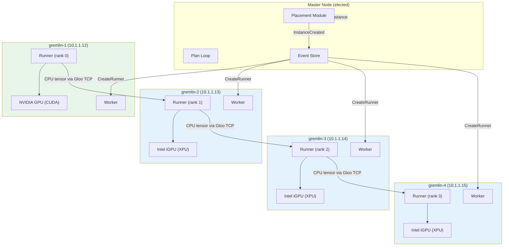
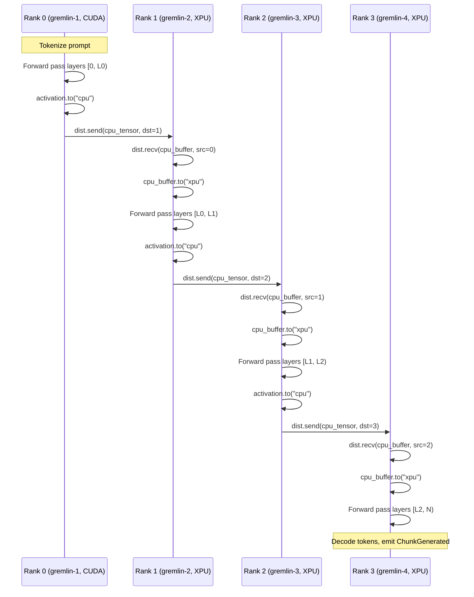
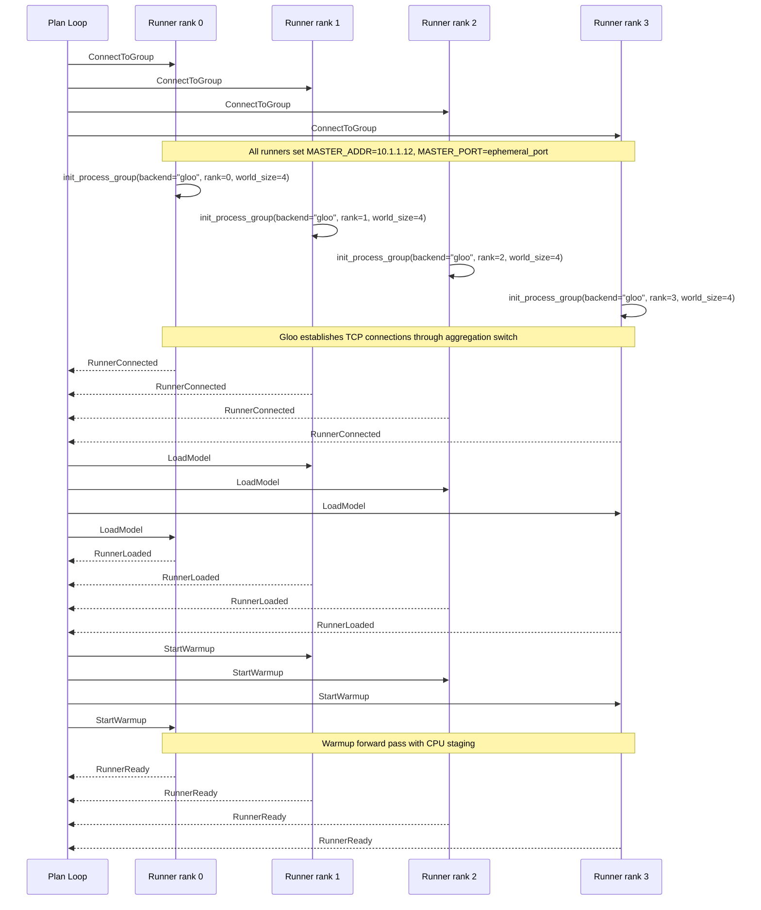
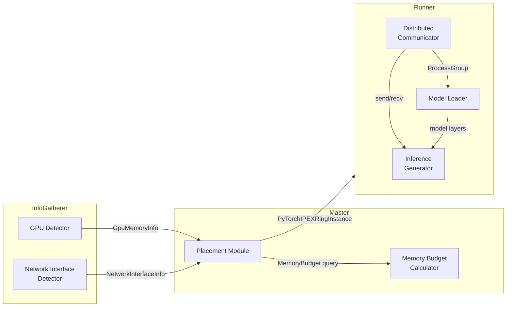
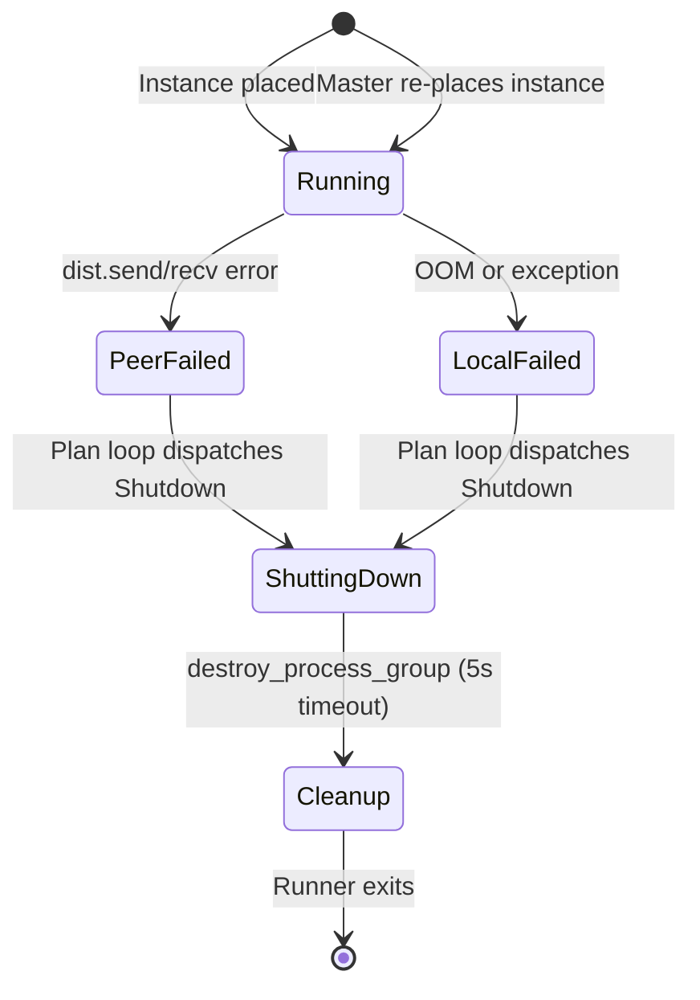

# Design Document: Distributed GPU Sharding

## Overview

This design extends the exo distributed inference system to support pipeline-parallel model inference across 4 heterogeneous NixOS gremlin nodes connected via switched ethernet. The cluster mixes one NVIDIA discrete GPU node (gremlin-1) with three Intel integrated GPU nodes (gremlin-2/3/4) that share system RAM.

The core challenge is that no single distributed backend supports both NVIDIA CUDA and Intel Arc integrated GPUs in a single process group. XCCL only works on Intel Data Center GPU Max Series, and NCCL only works on NVIDIA GPUs. **Gloo over TCP** is the only `torch.distributed` backend that works across both device types, but it requires all tensors to be on CPU for send/recv operations.

The design introduces a **CPU tensor staging pattern**: GPU→CPU before `dist.send()`, CPU→GPU after `dist.recv()`. On Intel integrated GPU nodes this copy is nearly free (shared memory architecture), while on the NVIDIA node it crosses PCIe. This pattern enables a unified pipeline-parallel inference flow across the heterogeneous cluster using a single Gloo process group.

Key design decisions:
- **Single Gloo process group** for all 4 nodes — simplest correct approach for this hardware mix
- **CPU tensor staging** as a universal pattern — consistent API across shared and discrete memory architectures
- **Native PyTorch XPU** (2.11+) — no IPEX dependency, upstream support only
- **Memory-architecture-aware placement** — shared-memory nodes get different budgeting than discrete GPU nodes
- **Integration with existing exo architecture** — extends runner.py task dispatch, info_gatherer.py, and placement.py without restructuring

## Architecture

### System Architecture



### Pipeline-Parallel Inference Flow with CPU Staging



### Process Group Initialization Sequence



## Components and Interfaces

### 1. PyTorch Distributed Communicator (`src/exo/worker/engines/pytorch_ipex/distributed.py`)

New module responsible for process group lifecycle and CPU-staged tensor communication.

```python
from dataclasses import dataclass
from typing import Literal

import torch
import torch.distributed as dist

DeviceType = Literal["cuda", "xpu", "cpu"]

@dataclass(frozen=True)
class ProcessGroupConfig:
    """Configuration for torch.distributed process group initialization."""
    rank: int
    world_size: int
    master_addr: str
    master_port: int
    backend: Literal["gloo"] = "gloo"
    init_timeout_seconds: int = 120

@dataclass(frozen=True)
class CpuStagedTensor:
    """A tensor that has been staged to CPU for Gloo transport."""
    cpu_tensor: torch.Tensor
    original_dtype: torch.dtype
    original_shape: tuple[int, ...]

def init_process_group(config: ProcessGroupConfig) -> None:
    """Initialize torch.distributed with Gloo backend via env:// rendezvous."""
    ...

def destroy_process_group(timeout_seconds: float = 5.0) -> None:
    """Destroy process group with timeout to avoid blocking on unreachable peers."""
    ...

def stage_to_cpu(tensor: torch.Tensor) -> CpuStagedTensor:
    """Move a GPU tensor to CPU for Gloo transport. Returns staged tensor."""
    ...

def unstage_from_cpu(staged: CpuStagedTensor, target_device: str) -> torch.Tensor:
    """Move a CPU-staged tensor back to the target GPU device."""
    ...

def send_activation(tensor: torch.Tensor, dst_rank: int) -> None:
    """Stage tensor to CPU and send to destination rank via Gloo."""
    ...

def recv_activation(shape: tuple[int, ...], dtype: torch.dtype, src_rank: int, target_device: str) -> torch.Tensor:
    """Receive tensor on CPU buffer and move to target GPU device."""
    ...
```

### 2. GPU Detector (`src/exo/worker/engines/pytorch_ipex/gpu_detector.py`)

New module for Linux GPU detection with shared-memory architecture awareness.

```python
from dataclasses import dataclass
from enum import Enum
from typing import Literal

class GpuMemoryArchitecture(str, Enum):
    Shared = "Shared"      # Intel integrated GPU — shares system RAM
    Discrete = "Discrete"  # NVIDIA or Intel discrete — dedicated VRAM

@dataclass(frozen=True)
class GpuInfo:
    """Detected GPU information for a single device."""
    name: str
    device_type: Literal["cuda", "xpu"]
    device_index: int
    memory_architecture: GpuMemoryArchitecture
    total_memory_bytes: int          # VRAM for discrete, system RAM for shared
    available_memory_bytes: int

@dataclass(frozen=True)
class NodeGpuReport:
    """Complete GPU report for a node."""
    gpus: list[GpuInfo]
    has_gpu: bool
    primary_device_type: Literal["cuda", "xpu", "cpu"]

def detect_gpus() -> NodeGpuReport:
    """Detect all GPUs on this Linux node using native PyTorch APIs.
    
    Uses torch.cuda for NVIDIA, torch.xpu for Intel Arc.
    Classifies Intel integrated GPUs as Shared memory architecture.
    Falls back to CPU-only if no GPU detected or detection fails.
    """
    ...
```

### 3. Memory Budget Calculator (`src/exo/master/memory_budget.py`)

New module for memory-architecture-aware shard placement budgeting.

```python
from dataclasses import dataclass

from exo.shared.types.memory import Memory

@dataclass(frozen=True)
class MemoryBudget:
    """Calculated memory budget for a node."""
    total_pool: Memory           # VRAM for discrete, system RAM for shared
    os_overhead: Memory          # Subtracted from shared-memory nodes
    available_for_model: Memory  # total_pool - os_overhead
    architecture: str            # "Shared" or "Discrete"

def calculate_memory_budget(
    total_memory: Memory,
    architecture: str,
    os_overhead_bytes: int = 2 * 1024**3,  # 2 GiB default
) -> MemoryBudget:
    """Calculate available memory for model placement.
    
    For Shared memory: available = total_system_ram - os_overhead
    For Discrete memory: available = total_vram (no overhead subtraction)
    """
    ...
```

### 4. Extended MemoryUsage Type

The existing `MemoryUsage` in `profiling.py` needs extension to carry GPU memory architecture information.

```python
class GpuMemoryInfo(CamelCaseModel):
    """GPU-specific memory information for placement decisions."""
    device_type: Literal["cuda", "xpu", "cpu"]
    memory_architecture: Literal["Shared", "Discrete"]
    gpu_total_memory: Memory
    gpu_available_memory: Memory

class MemoryUsage(CamelCaseModel):
    ram_total: Memory
    ram_available: Memory
    swap_total: Memory
    swap_available: Memory
    gpu_info: GpuMemoryInfo | None = None  # New field, None for macOS/CPU-only nodes
```

### 5. Runner Task Dispatch Extensions (`src/exo/worker/runner/runner.py`)

The existing runner's `main()` function already has backend dispatch (`is_pytorch_ipex` branch). The design extends the PyTorch code paths:

- **ConnectToGroup**: Replace `initialize_mlx(bound_instance)` with `init_process_group()` using Gloo, deriving MASTER_ADDR/PORT from `hosts_by_node`
- **LoadModel**: Use HuggingFace transformers to load only `[start_layer, end_layer)` onto the detected GPU device
- **StartWarmup**: Execute a forward pass with CPU-staged activation passing through the process group
- **TextGeneration**: Run pipeline-parallel inference with CPU staging between ranks
- **Shutdown**: Call `destroy_process_group()` before releasing GPU resources

### 6. Placement Module Extensions (`src/exo/master/placement.py`)

The existing `place_instance()` already handles `PyTorchIPEXRing` via `get_mlx_ring_hosts_by_node()`. Extensions needed:

- **Host resolution**: Create `get_pytorch_ring_hosts_by_node()` that generates hosts_by_node with ethernet IP addresses for all nodes (not just left/right neighbors as in MLX ring), since `torch.distributed` needs full-mesh connectivity for rendezvous
- **Memory budgeting**: Integrate `MemoryBudget` calculations into `filter_cycles_by_memory()` to account for shared-memory overhead on Intel iGPU nodes
- **Ethernet validation**: Verify all nodes in a candidate cycle have ethernet interfaces before selecting for PyTorchIPEXRing placement

### 7. Info Gatherer Extensions (`src/exo/utils/info_gatherer/info_gatherer.py`)

The existing `InfoGatherer` is macOS-focused. Extensions for Linux:

- **GPU detection loop**: On Linux, periodically call `detect_gpus()` and emit `GpuMemoryInfo` as part of `MemoryUsage`
- **Network interface detection**: On Linux, detect ethernet interfaces via `psutil.net_if_addrs()` and report them with `interface_type="ethernet"`
- **Static node info**: On Linux, read `/sys/class/dmi/id/product_name` for model identification

### Component Interaction Diagram



## Data Models

### ProcessGroupConfig

| Field | Type | Description |
|-------|------|-------------|
| `rank` | `int` | This node's rank in the process group (0 to world_size-1) |
| `world_size` | `int` | Total number of nodes in the process group |
| `master_addr` | `str` | IP address of rank 0 node (from hosts_by_node) |
| `master_port` | `int` | Ephemeral port for rendezvous (from PyTorchIPEXRingInstance) |
| `backend` | `Literal["gloo"]` | Always "gloo" for this cluster |
| `init_timeout_seconds` | `int` | Timeout for init_process_group (default 120s) |

### GpuInfo

| Field | Type | Description |
|-------|------|-------------|
| `name` | `str` | GPU device name (e.g., "NVIDIA GeForce RTX 3060", "Intel Arc Graphics") |
| `device_type` | `Literal["cuda", "xpu"]` | PyTorch device type |
| `device_index` | `int` | Device index for `torch.device(type, index)` |
| `memory_architecture` | `GpuMemoryArchitecture` | Shared (iGPU) or Discrete |
| `total_memory_bytes` | `int` | Total memory available to GPU |
| `available_memory_bytes` | `int` | Currently available memory |

### GpuMemoryInfo (new field on MemoryUsage)

| Field | Type | Description |
|-------|------|-------------|
| `device_type` | `Literal["cuda", "xpu", "cpu"]` | Primary GPU device type |
| `memory_architecture` | `Literal["Shared", "Discrete"]` | Memory architecture classification |
| `gpu_total_memory` | `Memory` | Total GPU memory pool |
| `gpu_available_memory` | `Memory` | Available GPU memory |

### MemoryBudget

| Field | Type | Description |
|-------|------|-------------|
| `total_pool` | `Memory` | Raw memory pool (VRAM or system RAM) |
| `os_overhead` | `Memory` | Reserved for OS (2 GiB default, shared-memory only) |
| `available_for_model` | `Memory` | Usable for model weights + activations + KV cache |
| `architecture` | `str` | "Shared" or "Discrete" |

### MASTER_ADDR/PORT Derivation

The `ProcessGroupConfig` is derived from `PyTorchIPEXRingInstance` at ConnectToGroup time:

```
rank = bound_shard.device_rank
world_size = bound_shard.world_size
master_addr = hosts_by_node[rank_0_node_id][0].ip  # rank 0's ethernet IP
master_port = instance.ephemeral_port
```

Where `rank_0_node_id` is found by looking up which node has `device_rank == 0` in the shard assignments.

## Correctness Properties

*A property is a characteristic or behavior that should hold true across all valid executions of a system — essentially, a formal statement about what the system should do. Properties serve as the bridge between human-readable specifications and machine-verifiable correctness guarantees.*

### Property 1: Process group initialization correctness

*For any* valid (rank, world_size) pair where `0 <= rank < world_size` and any valid `PyTorchIPEXRingInstance` with hosts_by_node containing ethernet IPs, initializing the process group SHALL always use `backend="gloo"`, the correct rank and world_size from the shard metadata, and derive MASTER_ADDR from rank 0's ethernet IP and MASTER_PORT from the instance's ephemeral_port.

**Validates: Requirements 1.1, 1.3**

### Property 2: Communication failure reporting completeness

*For any* `torch.distributed` operation failure (init timeout, send/recv timeout, peer disconnect), the resulting `RunnerFailed` error message SHALL contain the local rank, the peer rank (if applicable), and the backend identifier ("gloo"). For send/recv failures, the error message SHALL additionally contain the tensor shape.

**Validates: Requirements 1.5, 2.6, 10.2**

### Property 3: CPU tensor staging round-trip preserves dtype and shape

*For any* tensor with arbitrary shape and dtype (float16, bfloat16, float32), staging to CPU via `.to("cpu")` and then unstaging to a target device (cuda or xpu) SHALL produce a tensor with identical dtype and shape to the original. The staged CPU tensor SHALL always reside on the CPU device.

**Validates: Requirements 2.1, 2.2, 2.3**

### Property 4: GPU detection and classification

*For any* Linux node with a detectable GPU (NVIDIA via `torch.cuda` or Intel via `torch.xpu`), the GPU detector SHALL return a `GpuInfo` with the correct `device_type`, a non-empty `name`, and a `memory_architecture` classification of either `Shared` (for Intel integrated GPUs sharing system RAM) or `Discrete` (for NVIDIA GPUs or Intel discrete GPUs with dedicated VRAM). The reported `total_memory_bytes` SHALL be positive.

**Validates: Requirements 3.1, 3.2, 3.3, 3.6**

### Property 5: Selective layer loading respects shard range

*For any* valid `PipelineShardMetadata` with `0 <= start_layer < end_layer <= n_layers`, loading the model SHALL result in exactly `end_layer - start_layer` layers being loaded, and no layer outside the `[start_layer, end_layer)` range SHALL be present in GPU memory.

**Validates: Requirements 4.1**

### Property 6: Host resolution completeness with ethernet prioritization

*For any* cycle of nodes where all nodes have at least one ethernet interface reported, `get_pytorch_ring_hosts_by_node()` SHALL return a `hosts_by_node` mapping with an entry for every node in the cycle. For each node pair, the selected IP SHALL be an ethernet IP when one is available, preferring ethernet over wifi, unknown, or thunderbolt interface types.

**Validates: Requirements 6.1, 6.3, 6.4**

### Property 7: MASTER_ADDR derivation from rank 0

*For any* `PyTorchIPEXRingInstance` with a valid hosts_by_node mapping, the derived MASTER_ADDR SHALL always be the ethernet IP address of the node assigned rank 0 in the shard assignments, and MASTER_PORT SHALL always equal the instance's `ephemeral_port`.

**Validates: Requirements 6.2**

### Property 8: Memory budget calculation for heterogeneous nodes

*For any* node with `Shared` memory architecture and total system RAM `R`, the calculated available memory for model placement SHALL equal `R - os_overhead` (default 2 GiB). *For any* node with `Discrete` memory architecture and total VRAM `V`, the calculated available memory SHALL equal `V` with no overhead subtraction. The placement module SHALL use the `memory_architecture` field from `GpuMemoryInfo` to select the correct calculation.

**Validates: Requirements 12.1, 12.2, 12.3, 12.4**

### Property 9: Memory budget enforcement rejects over-committed placements

*For any* shard assignment where the estimated memory requirement (model weights for assigned layers + activation buffers + KV cache estimate) exceeds the calculated `available_for_model` budget on a `Shared` memory node, the placement module SHALL reject the placement and not include that node in the instance.

**Validates: Requirements 12.5**

## Error Handling

### Process Group Initialization Failures

| Failure Mode | Detection | Recovery |
|---|---|---|
| Peer node unreachable | `init_process_group` timeout (120s default) | Runner → `RunnerFailed` with rank/world_size/backend in error message. Plan loop dispatches Shutdown to all runners in instance. |
| Port already in use | `OSError` from Gloo TCP bind | Runner → `RunnerFailed`. Master can re-place with different ephemeral port. |
| Mismatched world_size | Gloo rendezvous failure | Runner → `RunnerFailed`. Indicates placement bug — log full instance config. |

### Activation Passing Failures

| Failure Mode | Detection | Recovery |
|---|---|---|
| Send timeout | `dist.send` raises `RuntimeError` | Runner → `RunnerFailed` with source rank, dest rank, tensor shape. All runners in instance shut down. |
| Recv timeout | `dist.recv` raises `RuntimeError` | Same as send timeout. |
| Peer disconnected mid-transfer | Gloo TCP connection reset | Runner catches exception, transitions to `RunnerFailed` identifying failed peer rank. |
| Tensor shape mismatch | Assertion in `recv_activation` | Runner → `RunnerFailed` with expected vs actual shape. |

### GPU Memory Failures

| Failure Mode | Detection | Recovery |
|---|---|---|
| OOM during model loading | `torch.cuda.OutOfMemoryError` or `RuntimeError` from XPU | Runner → `RunnerFailed` with required vs available memory. Master can re-place with fewer layers on this node. |
| OOM during inference | Same exceptions during forward pass | Runner → `RunnerFailed`. Instance shut down and re-placed. |
| Shared-memory contention (iGPU nodes) | System OOM killer or `RuntimeError` | Runner → `RunnerFailed`. Memory budget calculator should prevent this via OS overhead reservation. |

### Process Group Cleanup

On any runner failure or shutdown:

1. Attempt `destroy_process_group()` with 5-second timeout
2. If timeout: log warning, proceed with local cleanup
3. Clear GPU caches: `torch.cuda.empty_cache()` or `torch.xpu.empty_cache()`
4. Delete model references to free GPU memory
5. Runner process exits, `RunnerSupervisor` detects exit

### Node Failure Recovery Flow



## Testing Strategy

### Property-Based Tests (fast-check via Hypothesis)

Property-based tests use the **Hypothesis** library for Python. Each property test runs a minimum of **100 iterations** with randomly generated inputs.

**Library**: `hypothesis` (Python PBT library)
**Configuration**: `@settings(max_examples=100)` minimum per property test
**Tag format**: `# Feature: distributed-gpu-sharding, Property {N}: {title}`

Properties to implement as PBT:

1. **Process group initialization correctness** — Generate random (rank, world_size, hosts_by_node) configurations, mock `torch.distributed`, verify correct parameters
2. **Communication failure reporting completeness** — Generate random failure scenarios with varying ranks and tensor shapes, verify error messages contain all required fields
3. **CPU tensor staging round-trip** — Generate random tensors with varying shapes and dtypes, verify staging preserves dtype and shape
4. **GPU detection and classification** — Generate random GPU property combinations, mock torch.cuda/torch.xpu, verify correct classification
5. **Selective layer loading** — Generate random (start_layer, end_layer, n_layers) tuples, verify correct layer count
6. **Host resolution completeness** — Generate random topologies with ethernet interfaces, verify complete mapping with ethernet prioritization
7. **MASTER_ADDR derivation** — Generate random instance configurations, verify rank 0's IP is always MASTER_ADDR
8. **Memory budget calculation** — Generate random (total_memory, architecture, overhead) tuples, verify correct budget for shared vs discrete
9. **Memory budget enforcement** — Generate random (shard_size, budget) pairs, verify rejection when over-committed

### Unit Tests (Example-Based)

- ConnectToGroup success → RunnerConnected transition
- ConnectToGroup failure → RunnerFailed with descriptive message
- LoadModel success → RunnerLoaded transition
- LoadModel OOM → RunnerFailed with memory info
- StartWarmup success → RunnerReady transition
- Shutdown → destroy_process_group called, GPU caches cleared
- Backend dispatch: PyTorchIPEXRingInstance → PyTorch path, MlxRingInstance → MLX path
- Import isolation: PyTorch runner doesn't import MLX, MLX runner doesn't import PyTorch
- GPU detection fallback: no GPU → CPU-only report
- GPU detection failure: import error → warning + CPU-only fallback
- Ethernet-missing node → ValueError from placement
- NixOS service startup → GPU detection logged

### Integration Tests

- Full pipeline warmup with 2-node mock cluster (rank 0 sends, rank 1 receives)
- End-to-end TextGeneration with mocked model across 2 ranks
- Instance failure and re-placement flow
- Process group cleanup on runner failure (verify no leaked ports)

### NixOS Configuration Tests

- Smoke test: verify systemd service unit has MASTER_ADDR/MASTER_PORT environment variables
- Smoke test: verify firewall rules include ephemeral port range
- Smoke test: verify PyTorch with XPU support is importable on Intel nodes
- Smoke test: verify no IPEX imports remain in codebase (`grep -r "intel_extension_for_pytorch"`)
