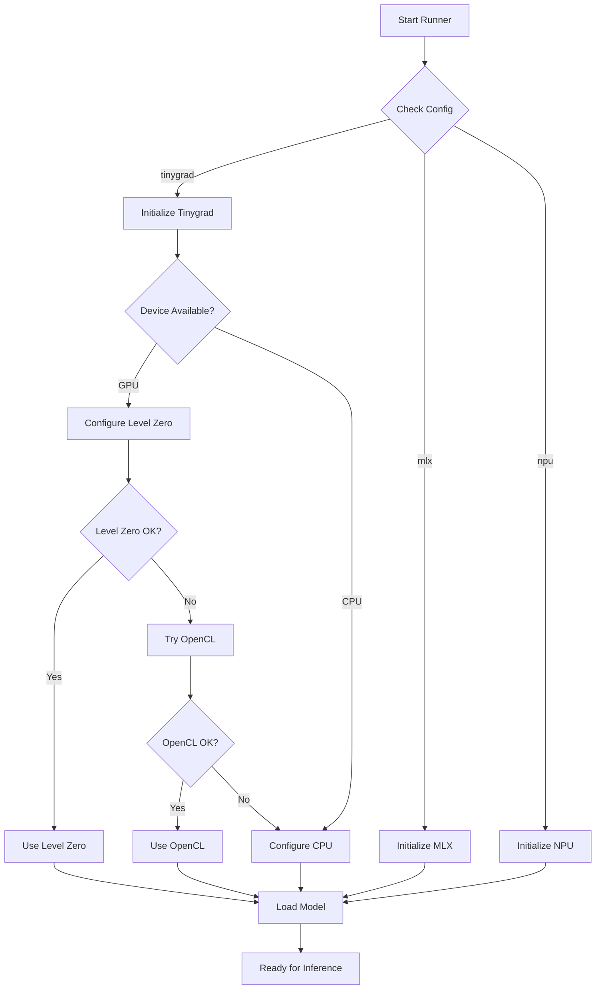
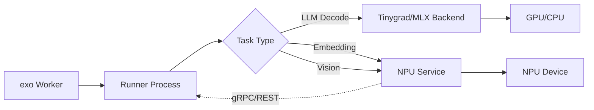

# Design Document

## Overview

This design implements Intel hardware acceleration support for exo across three phases:

1. **Phase 1**: Restore and formalize tinygrad backend integration
2. **Phase 2**: Enable Intel Arc iGPU acceleration via tinygrad
3. **Phase 3** (Optional): Explore Intel NPU capabilities via OpenVINO

The design follows exo's existing architecture patterns where runners execute in separate processes and communicate via multiprocessing channels. Each backend is responsible for model loading, inference execution, and error handling within the runner process lifecycle.

## Architecture

### Current exo Backend Architecture

exo uses a process-based runner architecture:
- **Worker**: Coordinates runners and manages cluster state
- **RunnerSupervisor**: Manages runner process lifecycle and forwards events
- **Runner Process**: Executes model inference using a specific backend (currently MLX)

The runner process (`src/exo/worker/runner/runner.py`) implements a state machine:
```
Idle → Connecting → Connected → Loading → Loaded → WarmingUp → Ready → Running → Ready
```

Backends are currently tightly coupled to the runner implementation. MLX-specific code is directly embedded in the runner's main loop.

### Proposed Tinygrad Backend Architecture


#### Backend Abstraction Layer

Create a backend abstraction to decouple inference engines from the runner:

```python
# src/exo/worker/engines/base.py
class InferenceBackend(Protocol):
    """Protocol defining the interface all backends must implement."""
    
    def initialize(self, shard_metadata: ShardMetadata, group: Any | None) -> None:
        """Initialize the backend with model metadata."""
        ...
    
    def load_model(self) -> tuple[Any, Any]:
        """Load model and tokenizer. Returns (model, tokenizer)."""
        ...
    
    def warmup(self, model: Any, tokenizer: Any) -> None:
        """Perform warmup inference."""
        ...
    
    def generate(
        self, 
        model: Any, 
        tokenizer: Any, 
        task_params: TextGenerationTaskParams
    ) -> Generator[GenerationResponse | ToolCallResponse]:
        """Execute text generation."""
        ...
```

#### Tinygrad Backend Implementation

```python
# src/exo/worker/engines/tinygrad/backend.py
class TinygradBackend:
    """Tinygrad inference backend with Intel Arc support."""
    
    def __init__(self, device: str = "CPU"):
        self.device = device  # CPU, GPU, METAL, etc.
        self.runtime = None   # Level Zero, OpenCL, etc.
    
    def initialize(self, shard_metadata: ShardMetadata, group: Any | None) -> None:
        """Set up tinygrad device and runtime."""
        self._configure_device()
        self._validate_dependencies()
    
    def _configure_device(self) -> None:
        """Configure tinygrad device based on available hardware."""
        if self.device == "GPU":
            # Try Level Zero first, fall back to OpenCL
            if self._check_level_zero():
                self.runtime = "LEVEL_ZERO"
            elif self._check_opencl():
                self.runtime = "OPENCL"
            else:
                logger.warning("GPU requested but no runtime available, falling back to CPU")
                self.device = "CPU"
```


### Phase 1: Tinygrad Backend Foundation

#### Component Structure

```
src/exo/worker/engines/
├── base.py                    # Backend protocol/interface
├── tinygrad/
│   ├── __init__.py
│   ├── backend.py            # Main backend implementation
│   ├── model_loader.py       # Model weight loading
│   ├── generator.py          # Text generation logic
│   └── device_config.py      # Device detection and configuration
```

#### Device Configuration

The `device_config.py` module handles hardware detection:

```python
@dataclass
class DeviceCapabilities:
    device_type: Literal["CPU", "GPU", "METAL"]
    runtime: str | None  # "LEVEL_ZERO", "OPENCL", None
    memory_gb: float
    compute_units: int | None

def detect_capabilities() -> DeviceCapabilities:
    """Detect available hardware and return capabilities."""
    # Check for GPU support
    # Check for Level Zero runtime
    # Check for OpenCL runtime
    # Fall back to CPU
```

#### Model Loading Strategy

Tinygrad uses a different model format than MLX. The loader must:
1. Download HuggingFace weights (reuse existing download infrastructure)
2. Convert weights to tinygrad format if needed
3. Load weights onto the configured device
4. Handle sharding for distributed inference

#### Integration with Runner

Modify `runner.py` to support multiple backends:

```python
# Detect backend from configuration or shard metadata
backend_type = shard_metadata.backend  # "mlx", "tinygrad", etc.

if backend_type == "tinygrad":
    from exo.worker.engines.tinygrad import TinygradBackend
    backend = TinygradBackend(device="GPU")
    backend.initialize(shard_metadata, group)
    model, tokenizer = backend.load_model()
    backend.warmup(model, tokenizer)
    # Use backend.generate() for inference
elif backend_type == "mlx":
    # Existing MLX code path
```


### Phase 2: Intel Arc iGPU Acceleration

#### Runtime Detection and Selection

```python
# src/exo/worker/engines/tinygrad/intel_arc.py

def detect_intel_arc() -> bool:
    """Check if Intel Arc iGPU is available."""
    # Check lspci for Intel graphics
    # Verify driver availability
    return has_intel_gpu

def select_runtime() -> Literal["LEVEL_ZERO", "OPENCL", None]:
    """Select best available runtime for Intel Arc."""
    if check_level_zero_available():
        logger.info("Using Level Zero runtime for Intel Arc")
        return "LEVEL_ZERO"
    elif check_opencl_available():
        logger.info("Using OpenCL runtime for Intel Arc (Level Zero unavailable)")
        return "OPENCL"
    else:
        logger.warning("No GPU runtime available for Intel Arc")
        return None

def check_level_zero_available() -> bool:
    """Verify Level Zero runtime is installed and functional."""
    try:
        # Check for libze_loader.so
        # Verify device enumeration works
        return True
    except Exception as e:
        logger.debug(f"Level Zero check failed: {e}")
        return False

def check_opencl_available() -> bool:
    """Verify OpenCL runtime is installed and functional."""
    try:
        # Check for libOpenCL.so
        # Verify platform enumeration works
        return True
    except Exception as e:
        logger.debug(f"OpenCL check failed: {e}")
        return False
```

#### Tinygrad GPU Configuration

```python
# Configure tinygrad to use Intel Arc
import os

if runtime == "LEVEL_ZERO":
    os.environ["GPU"] = "1"
    os.environ["LEVEL_ZERO"] = "1"
    # Tinygrad will use Level Zero backend
elif runtime == "OPENCL":
    os.environ["GPU"] = "1"
    os.environ["OPENCL"] = "1"
    # Tinygrad will use OpenCL backend
```

#### Performance Monitoring

Track GPU utilization and performance:

```python
@dataclass
class GPUMetrics:
    device_name: str
    runtime: str
    memory_used_mb: float
    memory_total_mb: float
    utilization_percent: float | None

def collect_gpu_metrics() -> GPUMetrics:
    """Collect GPU performance metrics."""
    # Use Level Zero or OpenCL APIs to query device
    # Report to cluster state for dashboard visibility
```


### Phase 3: Intel NPU Integration (Optional/Exploratory)

#### Discovery and Capability Assessment

```python
# src/exo/worker/engines/npu/discovery.py

@dataclass
class NPUCapabilities:
    available: bool
    device_path: str | None  # /dev/accel/accel0
    driver_version: str | None
    supported_ops: set[str]
    max_memory_mb: float | None
    software_stack: Literal["OPENVINO", "NONE"]

def discover_npu() -> NPUCapabilities:
    """Discover Intel NPU hardware and capabilities."""
    # Check for /dev/accel/accel0 or similar
    # Identify kernel modules (intel_vpu, ivpu)
    # Check for OpenVINO availability
    # Determine supported model types
    
    if not Path("/dev/accel/accel0").exists():
        return NPUCapabilities(available=False, ...)
    
    # Verify driver is loaded
    driver_info = check_kernel_modules()
    
    # Check OpenVINO availability
    openvino_available = check_openvino()
    
    return NPUCapabilities(
        available=True,
        device_path="/dev/accel/accel0",
        driver_version=driver_info.version,
        supported_ops=determine_supported_ops(),
        software_stack="OPENVINO" if openvino_available else "NONE"
    )
```

#### Integration Approach: Sidecar Service (Recommended)

Rather than integrating NPU directly into the runner, use a sidecar service:

```
┌─────────────────────────────────────────┐
│           exo Worker Node               │
│                                         │
│  ┌──────────────┐    ┌──────────────┐  │
│  │   Runner     │    │ NPU Service  │  │
│  │   (MLX/TG)   │◄──►│  (OpenVINO)  │  │
│  └──────────────┘    └──────────────┘  │
│         │                    │          │
│         │                    │          │
│         ▼                    ▼          │
│      GPU/CPU               NPU          │
└─────────────────────────────────────────┘
```

Benefits:
- Isolates NPU complexity from core inference path
- Allows independent NPU service updates
- Easier to disable/enable without affecting main system
- Can be reused by multiple runners

#### NPU Service Design

```python
# src/exo/worker/engines/npu/service.py

class NPUInferenceService:
    """Standalone service for NPU inference using OpenVINO."""
    
    def __init__(self, port: int = 52416):
        self.port = port
        self.openvino_core = None
        self.loaded_models: dict[ModelId, Any] = {}
    
    async def start(self):
        """Start NPU inference service."""
        self.openvino_core = initialize_openvino()
        await self._start_server()
    
    async def infer(
        self, 
        model_id: ModelId, 
        input_data: Any
    ) -> Any:
        """Execute inference on NPU."""
        # Load model if not cached
        # Execute on NPU device
        # Return results
```

#### Workload Routing

Determine which tasks can benefit from NPU:

```python
def should_use_npu(task: Task, npu_caps: NPUCapabilities) -> bool:
    """Determine if task should be routed to NPU."""
    if not npu_caps.available:
        return False
    
    # NPU is good for:
    # - Embedding generation
    # - Small vision models
    # - Audio processing
    # - VAD (Voice Activity Detection)
    
    # NPU is NOT good for:
    # - Large LLM decode (use GPU/CPU)
    # - High-throughput streaming
    
    if isinstance(task, TextGeneration):
        # Only use NPU for embedding models
        return "embed" in task.model_id.lower()
    
    return False
```


## Components and Interfaces

### Backend Protocol

```python
# src/exo/worker/engines/base.py

from typing import Protocol, Any, Generator
from exo.shared.types.worker.shards import ShardMetadata
from exo.shared.types.text_generation import TextGenerationTaskParams
from exo.shared.types.worker.runner_response import GenerationResponse, ToolCallResponse

class InferenceBackend(Protocol):
    """Protocol that all inference backends must implement."""
    
    def initialize(
        self, 
        shard_metadata: ShardMetadata, 
        group: Any | None
    ) -> None:
        """Initialize backend with model metadata and optional distributed group."""
        ...
    
    def load_model(self) -> tuple[Any, Any]:
        """Load model and tokenizer.
        
        Returns:
            (model, tokenizer) tuple
        """
        ...
    
    def warmup(self, model: Any, tokenizer: Any) -> int:
        """Perform warmup inference.
        
        Returns:
            Number of tokens generated during warmup
        """
        ...
    
    def generate(
        self,
        model: Any,
        tokenizer: Any,
        task_params: TextGenerationTaskParams,
        kv_cache: Any | None = None,
    ) -> Generator[GenerationResponse | ToolCallResponse, None, None]:
        """Execute text generation.
        
        Yields:
            GenerationResponse or ToolCallResponse objects
        """
        ...
    
    def cleanup(self) -> None:
        """Clean up resources."""
        ...
```

### Backend Factory

```python
# src/exo/worker/engines/factory.py

from typing import Literal
from exo.worker.engines.base import InferenceBackend

BackendType = Literal["mlx", "tinygrad", "npu"]

def create_backend(
    backend_type: BackendType,
    device: str = "CPU",
    **kwargs
) -> InferenceBackend:
    """Factory function to create appropriate backend."""
    
    if backend_type == "mlx":
        from exo.worker.engines.mlx_backend import MLXBackend
        return MLXBackend(**kwargs)
    
    elif backend_type == "tinygrad":
        from exo.worker.engines.tinygrad import TinygradBackend
        return TinygradBackend(device=device, **kwargs)
    
    elif backend_type == "npu":
        from exo.worker.engines.npu import NPUBackend
        return NPUBackend(**kwargs)
    
    else:
        raise ValueError(f"Unknown backend type: {backend_type}")
```

### Configuration Schema

```python
# src/exo/shared/types/backend_config.py

from pydantic import BaseModel
from typing import Literal

class BackendConfig(BaseModel, frozen=True, strict=True):
    """Configuration for inference backend selection."""
    
    backend_type: Literal["mlx", "tinygrad", "npu"]
    device: Literal["CPU", "GPU", "METAL", "NPU"] = "CPU"
    
    # Tinygrad-specific
    runtime: Literal["LEVEL_ZERO", "OPENCL", "AUTO"] | None = "AUTO"
    
    # NPU-specific
    npu_service_port: int = 52416
    npu_enabled: bool = False
    
    # Fallback behavior
    fallback_to_cpu: bool = True
```


## Data Models

### Device Information

```python
# src/exo/shared/types/hardware.py

from pydantic import BaseModel
from typing import Literal

class DeviceInfo(BaseModel, frozen=True, strict=True):
    """Information about available hardware devices."""
    
    device_type: Literal["CPU", "GPU", "NPU"]
    device_name: str
    vendor: str  # "Intel", "Apple", etc.
    driver_version: str | None
    memory_total_mb: float
    memory_available_mb: float
    compute_units: int | None
    
class GPUInfo(DeviceInfo):
    """GPU-specific device information."""
    
    runtime: Literal["LEVEL_ZERO", "OPENCL", "METAL", "CUDA"]
    pci_id: str | None
    
class NPUInfo(DeviceInfo):
    """NPU-specific device information."""
    
    device_path: str  # /dev/accel/accel0
    software_stack: Literal["OPENVINO", "NONE"]
    supported_model_types: list[str]
```

### Backend Status

```python
# src/exo/shared/types/events.py (additions)

class BackendInitialized(Event):
    """Event emitted when a backend successfully initializes."""
    
    runner_id: RunnerId
    backend_type: Literal["mlx", "tinygrad", "npu"]
    device_info: DeviceInfo
    
class BackendFailed(Event):
    """Event emitted when a backend fails to initialize."""
    
    runner_id: RunnerId
    backend_type: Literal["mlx", "tinygrad", "npu"]
    error_message: str
    fallback_backend: str | None
```

### Performance Metrics

```python
# src/exo/shared/types/metrics.py

from pydantic import BaseModel

class InferenceMetrics(BaseModel, frozen=True, strict=True):
    """Metrics collected during inference."""
    
    backend_type: str
    device_type: str
    tokens_per_second: float
    memory_used_mb: float
    gpu_utilization_percent: float | None
    power_watts: float | None
    
class BackendBenchmark(BaseModel, frozen=True, strict=True):
    """Benchmark results for backend comparison."""
    
    backend_type: str
    device_type: str
    model_id: str
    prompt_tokens: int
    completion_tokens: int
    total_time_seconds: float
    tokens_per_second: float
    memory_peak_mb: float
```


## Error Handling

### Backend Initialization Failures

```python
class BackendInitializationError(Exception):
    """Raised when backend fails to initialize."""
    
    def __init__(
        self, 
        backend_type: str, 
        reason: str, 
        can_fallback: bool = True
    ):
        self.backend_type = backend_type
        self.reason = reason
        self.can_fallback = can_fallback
        super().__init__(f"{backend_type} initialization failed: {reason}")
```

### Fallback Strategy

```python
# src/exo/worker/engines/fallback.py

def initialize_with_fallback(
    preferred_backend: BackendType,
    shard_metadata: ShardMetadata,
    group: Any | None
) -> tuple[InferenceBackend, BackendType]:
    """Initialize backend with automatic fallback."""
    
    fallback_chain = get_fallback_chain(preferred_backend)
    
    for backend_type in fallback_chain:
        try:
            backend = create_backend(backend_type)
            backend.initialize(shard_metadata, group)
            logger.info(f"Successfully initialized {backend_type} backend")
            return backend, backend_type
        except BackendInitializationError as e:
            logger.warning(f"Failed to initialize {backend_type}: {e.reason}")
            if not e.can_fallback:
                raise
            continue
    
    raise RuntimeError("All backends failed to initialize")

def get_fallback_chain(preferred: BackendType) -> list[BackendType]:
    """Get ordered list of backends to try."""
    
    if preferred == "tinygrad":
        return ["tinygrad", "mlx"]  # Try tinygrad, fall back to MLX
    elif preferred == "npu":
        return ["npu", "tinygrad", "mlx"]  # NPU → tinygrad → MLX
    else:
        return [preferred]  # No fallback for MLX (it's the baseline)
```

### Runtime Error Recovery

```python
class InferenceError(Exception):
    """Raised during inference execution."""
    
    def __init__(self, message: str, recoverable: bool = False):
        self.recoverable = recoverable
        super().__init__(message)

def handle_inference_error(
    error: Exception,
    backend: InferenceBackend,
    task: Task
) -> None:
    """Handle errors during inference."""
    
    if isinstance(error, InferenceError) and error.recoverable:
        # Log error but continue
        logger.warning(f"Recoverable inference error: {error}")
        # Send error chunk to client
        send_error_chunk(task.command_id, str(error))
    else:
        # Fatal error - mark runner as failed
        logger.error(f"Fatal inference error: {error}")
        backend.cleanup()
        raise
```


## Testing Strategy

### Unit Tests

#### Backend Interface Tests
```python
# src/exo/worker/engines/tinygrad/tests/test_backend.py

def test_tinygrad_backend_initialization():
    """Test backend initializes correctly."""
    backend = TinygradBackend(device="CPU")
    assert backend.device == "CPU"
    assert backend.runtime is None

def test_device_detection():
    """Test device capability detection."""
    caps = detect_capabilities()
    assert caps.device_type in ["CPU", "GPU", "METAL"]
    assert caps.memory_gb > 0

def test_fallback_to_cpu():
    """Test GPU fallback to CPU when unavailable."""
    backend = TinygradBackend(device="GPU")
    # Mock GPU unavailable
    backend._configure_device()
    assert backend.device == "CPU"
```

#### Intel Arc Detection Tests
```python
# src/exo/worker/engines/tinygrad/tests/test_intel_arc.py

def test_detect_intel_arc():
    """Test Intel Arc GPU detection."""
    # Mock lspci output
    has_arc = detect_intel_arc()
    assert isinstance(has_arc, bool)

def test_runtime_selection():
    """Test Level Zero vs OpenCL selection."""
    runtime = select_runtime()
    assert runtime in ["LEVEL_ZERO", "OPENCL", None]

def test_level_zero_check():
    """Test Level Zero availability check."""
    available = check_level_zero_available()
    assert isinstance(available, bool)
```

### Integration Tests

#### End-to-End Inference Tests
```python
# src/exo/worker/engines/tinygrad/tests/test_integration.py

@pytest.mark.slow
async def test_tinygrad_text_generation():
    """Test complete text generation flow with tinygrad."""
    backend = TinygradBackend(device="CPU")
    
    # Initialize with test model
    shard_metadata = create_test_shard_metadata()
    backend.initialize(shard_metadata, group=None)
    
    # Load model
    model, tokenizer = backend.load_model()
    assert model is not None
    assert tokenizer is not None
    
    # Warmup
    tokens = backend.warmup(model, tokenizer)
    assert tokens > 0
    
    # Generate
    task_params = create_test_task_params()
    responses = list(backend.generate(model, tokenizer, task_params))
    assert len(responses) > 0
    assert all(isinstance(r, GenerationResponse) for r in responses)

@pytest.mark.slow
@pytest.mark.skipif(not has_intel_arc(), reason="Intel Arc not available")
async def test_intel_arc_gpu_inference():
    """Test inference on Intel Arc iGPU."""
    backend = TinygradBackend(device="GPU")
    backend.initialize(create_test_shard_metadata(), group=None)
    
    # Verify GPU is actually being used
    assert backend.runtime in ["LEVEL_ZERO", "OPENCL"]
    
    # Run inference and verify performance
    model, tokenizer = backend.load_model()
    task_params = create_test_task_params()
    
    start = time.time()
    responses = list(backend.generate(model, tokenizer, task_params))
    duration = time.time() - start
    
    # GPU should be faster than CPU baseline
    assert duration < cpu_baseline_duration * 1.5
```

### NPU Discovery Tests
```python
# src/exo/worker/engines/npu/tests/test_discovery.py

def test_npu_discovery():
    """Test NPU hardware discovery."""
    caps = discover_npu()
    assert isinstance(caps, NPUCapabilities)
    
    if caps.available:
        assert caps.device_path is not None
        assert caps.driver_version is not None

@pytest.mark.skipif(not has_npu(), reason="NPU not available")
def test_npu_openvino_smoke():
    """Test basic OpenVINO NPU execution."""
    # Load simple model
    # Execute on NPU
    # Verify output correctness
    pass
```

### Performance Benchmarks
```python
# tests/benchmarks/test_backend_performance.py

@pytest.mark.benchmark
def test_backend_comparison(benchmark_model: str):
    """Compare performance across backends."""
    results = {}
    
    for backend_type in ["mlx", "tinygrad"]:
        backend = create_backend(backend_type)
        metrics = run_benchmark(backend, benchmark_model)
        results[backend_type] = metrics
    
    # Log comparison
    logger.info(f"Benchmark results: {results}")
    
    # Verify tinygrad is within acceptable performance range
    assert results["tinygrad"].tokens_per_second > 0
```


## NixOS Configuration

### Flake Structure

```nix
# flake.nix (additions)

outputs = inputs: {
  nixosModules.exo-intel = { config, lib, pkgs, ... }: {
    options.services.exo.intel = {
      enable = lib.mkEnableOption "Intel hardware acceleration for exo";
      
      arc = {
        enable = lib.mkEnableOption "Intel Arc iGPU support";
        runtime = lib.mkOption {
          type = lib.types.enum [ "level-zero" "opencl" "auto" ];
          default = "auto";
          description = "GPU runtime to use";
        };
      };
      
      npu = {
        enable = lib.mkEnableOption "Intel NPU support (experimental)";
        servicePort = lib.mkOption {
          type = lib.types.port;
          default = 52416;
          description = "Port for NPU inference service";
        };
      };
    };
    
    config = lib.mkIf config.services.exo.intel.enable {
      # Base tinygrad support
      environment.systemPackages = with pkgs; [
        python3Packages.tinygrad
      ];
      
      # Intel Arc iGPU support
      hardware.graphics = lib.mkIf config.services.exo.intel.arc.enable {
        enable = true;
        extraPackages = with pkgs; [
          intel-compute-runtime  # OpenCL
          level-zero            # Level Zero
        ];
      };
      
      # Intel NPU support
      systemd.services.exo-npu = lib.mkIf config.services.exo.intel.npu.enable {
        description = "exo Intel NPU Inference Service";
        wantedBy = [ "multi-user.target" ];
        
        serviceConfig = {
          ExecStart = "${pkgs.python3}/bin/python -m exo.worker.engines.npu.service";
          Restart = "on-failure";
          User = "exo";
        };
        
        environment = {
          NPU_SERVICE_PORT = toString config.services.exo.intel.npu.servicePort;
        };
      };
      
      # Kernel modules for NPU
      boot.kernelModules = lib.mkIf config.services.exo.intel.npu.enable [
        "intel_vpu"
      ];
    };
  };
};
```

### Example Configuration

```nix
# /etc/nixos/flake.nix (on gremlin-1)

{
  inputs = {
    nixpkgs.url = "github:NixOS/nixpkgs/nixos-unstable";
    exo.url = "github:exo-explore/exo";
  };
  
  outputs = { self, nixpkgs, exo }: {
    nixosConfigurations.gremlin-1 = nixpkgs.lib.nixosSystem {
      system = "x86_64-linux";
      modules = [
        exo.nixosModules.exo-intel
        {
          services.exo.intel = {
            enable = true;
            
            arc = {
              enable = true;
              runtime = "level-zero";  # Prefer Level Zero
            };
            
            npu = {
              enable = true;  # Experimental NPU support
              servicePort = 52416;
            };
          };
        }
      ];
    };
  };
}
```

### Package Dependencies

```nix
# python/parts.nix (additions)

perSystem = { config, pkgs, ... }: {
  packages = {
    # Tinygrad with Intel support
    tinygrad-intel = pkgs.python3Packages.buildPythonPackage {
      pname = "tinygrad";
      version = "0.9.0";
      
      propagatedBuildInputs = with pkgs.python3Packages; [
        numpy
        pillow
        # Intel-specific
        pyopencl
      ];
      
      # Enable Intel backends
      makeWrapperArgs = [
        "--set GPU 1"
        "--set LEVEL_ZERO 1"
      ];
    };
    
    # OpenVINO for NPU
    openvino-npu = pkgs.openvino.override {
      enableNPU = true;
    };
  };
};
```


## Observability and Monitoring

### Logging Strategy

```python
# Structured logging for backend operations

logger.info(
    "Backend initialized",
    extra={
        "backend_type": "tinygrad",
        "device": "GPU",
        "runtime": "LEVEL_ZERO",
        "device_name": "Intel Arc Graphics",
        "memory_gb": 16.0
    }
)

logger.warning(
    "GPU runtime unavailable, falling back to CPU",
    extra={
        "requested_runtime": "LEVEL_ZERO",
        "fallback_device": "CPU",
        "reason": "libze_loader.so not found"
    }
)
```

### Metrics Collection

```python
# src/exo/worker/engines/metrics.py

class BackendMetricsCollector:
    """Collect and report backend performance metrics."""
    
    def __init__(self, backend_type: str, device_type: str):
        self.backend_type = backend_type
        self.device_type = device_type
        self.inference_count = 0
        self.total_tokens = 0
        self.total_time = 0.0
    
    def record_inference(
        self,
        tokens: int,
        duration: float,
        memory_used: float
    ):
        """Record metrics for a single inference."""
        self.inference_count += 1
        self.total_tokens += tokens
        self.total_time += duration
        
        # Report to cluster state
        emit_metric(InferenceMetrics(
            backend_type=self.backend_type,
            device_type=self.device_type,
            tokens_per_second=tokens / duration,
            memory_used_mb=memory_used,
            gpu_utilization_percent=get_gpu_utilization(),
        ))
```

### Dashboard Integration

```typescript
// dashboard/src/lib/types/hardware.ts

export interface BackendInfo {
  type: 'mlx' | 'tinygrad' | 'npu';
  device: 'CPU' | 'GPU' | 'NPU' | 'METAL';
  runtime?: 'LEVEL_ZERO' | 'OPENCL' | 'METAL';
  deviceName: string;
  memoryUsedMB: number;
  memoryTotalMB: number;
  utilizationPercent?: number;
}

export interface NodeHardware {
  nodeId: string;
  backends: BackendInfo[];
  activeBackend: BackendInfo;
}
```

```svelte
<!-- dashboard/src/lib/components/NodeHardwareStatus.svelte -->

<script lang="ts">
  import type { NodeHardware } from '$lib/types/hardware';
  
  export let hardware: NodeHardware;
</script>

<div class="hardware-status">
  <h3>Node {hardware.nodeId}</h3>
  
  <div class="active-backend">
    <span class="label">Active Backend:</span>
    <span class="value">{hardware.activeBackend.type}</span>
    <span class="device">{hardware.activeBackend.device}</span>
    
    {#if hardware.activeBackend.runtime}
      <span class="runtime">({hardware.activeBackend.runtime})</span>
    {/if}
  </div>
  
  <div class="device-info">
    <span>{hardware.activeBackend.deviceName}</span>
    <span>
      {hardware.activeBackend.memoryUsedMB.toFixed(0)} / 
      {hardware.activeBackend.memoryTotalMB.toFixed(0)} MB
    </span>
    
    {#if hardware.activeBackend.utilizationPercent}
      <progress 
        value={hardware.activeBackend.utilizationPercent} 
        max="100"
      />
    {/if}
  </div>
</div>
```


## Migration and Compatibility

### Backward Compatibility

The design maintains full backward compatibility with existing MLX-based deployments:

1. **Default Behavior**: MLX remains the default backend on macOS
2. **Configuration**: Backend selection is opt-in via configuration
3. **API Compatibility**: No changes to external APIs (OpenAI-compatible endpoints)
4. **State Format**: No changes to cluster state schema (backend info is additive)

### Migration Path

For existing exo deployments:

```python
# Phase 1: Add tinygrad support (no breaking changes)
# - MLX continues to work as before
# - Tinygrad is available but not used by default

# Phase 2: Enable Intel Arc on specific nodes
# - Configure via NixOS module
# - Nodes with Intel Arc use tinygrad+GPU
# - Other nodes continue using MLX or tinygrad+CPU

# Phase 3: Optional NPU experimentation
# - Completely isolated in sidecar service
# - Can be enabled/disabled without affecting main system
```

### Configuration Migration

```python
# Old configuration (implicit MLX)
# No backend specified - uses MLX by default

# New configuration (explicit backend selection)
backend_config = BackendConfig(
    backend_type="tinygrad",
    device="GPU",
    runtime="LEVEL_ZERO",
    fallback_to_cpu=True
)
```

### Feature Flags

```python
# src/exo/shared/constants.py

# Feature flags for gradual rollout
EXO_TINYGRAD_ENABLED = os.getenv("EXO_TINYGRAD_ENABLED", "false").lower() == "true"
EXO_INTEL_ARC_ENABLED = os.getenv("EXO_INTEL_ARC_ENABLED", "false").lower() == "true"
EXO_NPU_ENABLED = os.getenv("EXO_NPU_ENABLED", "false").lower() == "true"

def should_use_tinygrad() -> bool:
    """Check if tinygrad backend should be used."""
    return EXO_TINYGRAD_ENABLED and tinygrad_available()

def should_use_intel_arc() -> bool:
    """Check if Intel Arc acceleration should be used."""
    return EXO_INTEL_ARC_ENABLED and detect_intel_arc()
```


## Implementation Phases

### Phase 1: Tinygrad Backend Foundation (2-3 weeks)

**Week 1: Backend Abstraction**
- Create `InferenceBackend` protocol
- Implement backend factory
- Refactor runner.py to use backend abstraction
- Add backend configuration schema

**Week 2: Tinygrad Integration**
- Implement `TinygradBackend` class
- Add device detection and configuration
- Implement model loading for tinygrad
- Add CPU-only text generation

**Week 3: Testing and Validation**
- Write unit tests for backend interface
- Add integration tests for tinygrad CPU
- Validate against MLX baseline
- Document tinygrad backend usage

**Deliverables:**
- Working tinygrad backend on CPU
- Backend abstraction layer
- Test suite with >80% coverage
- Documentation for backend developers

### Phase 2: Intel Arc iGPU Acceleration (2-3 weeks)

**Week 1: Runtime Detection**
- Implement Level Zero detection
- Implement OpenCL detection
- Add runtime selection logic
- Create NixOS module for Intel Arc

**Week 2: GPU Execution**
- Configure tinygrad for Level Zero
- Configure tinygrad for OpenCL fallback
- Implement GPU memory management
- Add performance monitoring

**Week 3: Testing and Optimization**
- Test on Intel Arc hardware (Core Ultra 9 185H)
- Benchmark against CPU baseline
- Optimize memory usage
- Document Intel Arc setup

**Deliverables:**
- Intel Arc iGPU support via Level Zero
- OpenCL fallback implementation
- NixOS configuration module
- Performance benchmarks

### Phase 3: Intel NPU Exploration (3-4 weeks, Optional)

**Week 1: Discovery and Assessment**
- Implement NPU hardware detection
- Test OpenVINO on NPU
- Document supported model types
- Create capability report

**Week 2: Sidecar Service**
- Implement NPU inference service
- Add OpenVINO integration
- Create service communication protocol
- Add workload routing logic

**Week 3: Integration**
- Connect NPU service to exo worker
- Implement task routing
- Add monitoring and metrics
- Test on Core Ultra hardware

**Week 4: Validation and Documentation**
- Measure NPU performance vs CPU/GPU
- Document NPU limitations
- Create setup guide
- Mark as experimental feature

**Deliverables:**
- NPU capability assessment report
- Optional NPU sidecar service
- Performance comparison data
- Experimental feature documentation


## Security Considerations

### Device Access

```python
# Ensure proper permissions for device access
def check_device_permissions(device_path: str) -> bool:
    """Verify user has access to hardware device."""
    try:
        with open(device_path, 'rb') as f:
            # Test read access
            return True
    except PermissionError:
        logger.error(f"No permission to access {device_path}")
        return False
```

### Runtime Library Loading

```python
# Validate runtime libraries before loading
def validate_runtime_library(lib_path: str) -> bool:
    """Verify runtime library is legitimate."""
    # Check library signature
    # Verify it's from trusted source (Intel, system packages)
    # Prevent loading arbitrary shared libraries
    return True
```

### NPU Service Isolation

```python
# NPU service runs with limited privileges
# - No network access except localhost
# - Limited file system access
# - Resource limits (CPU, memory)

systemd_service_config = {
    "PrivateNetwork": "yes",  # No external network
    "ProtectSystem": "strict",  # Read-only system
    "ProtectHome": "yes",  # No home directory access
    "NoNewPrivileges": "yes",  # Can't escalate privileges
    "MemoryMax": "4G",  # Memory limit
}
```

### Input Validation

```python
# Validate all inputs to backend
def validate_task_params(params: TextGenerationTaskParams) -> None:
    """Validate task parameters before execution."""
    if params.max_tokens > MAX_ALLOWED_TOKENS:
        raise ValueError(f"max_tokens exceeds limit: {params.max_tokens}")
    
    if len(params.messages) > MAX_MESSAGES:
        raise ValueError(f"Too many messages: {len(params.messages)}")
    
    # Validate prompt content
    # Check for injection attempts
    # Sanitize inputs
```

## Performance Considerations

### Memory Management

```python
# Efficient memory usage across backends
class MemoryManager:
    """Manage memory allocation across devices."""
    
    def __init__(self, device_type: str):
        self.device_type = device_type
        self.allocated_mb = 0.0
        self.peak_mb = 0.0
    
    def allocate(self, size_mb: float) -> bool:
        """Attempt to allocate memory."""
        available = self.get_available_memory()
        if size_mb > available:
            logger.warning(f"Insufficient memory: need {size_mb}MB, have {available}MB")
            return False
        
        self.allocated_mb += size_mb
        self.peak_mb = max(self.peak_mb, self.allocated_mb)
        return True
    
    def free(self, size_mb: float):
        """Free allocated memory."""
        self.allocated_mb -= size_mb
```

### Batch Processing

```python
# Optimize for batch inference when possible
def should_batch_requests(
    pending_requests: list[Task],
    backend_type: str
) -> bool:
    """Determine if requests should be batched."""
    
    # Batching benefits vary by backend
    if backend_type == "tinygrad" and len(pending_requests) >= 2:
        # Tinygrad benefits from batching on GPU
        return True
    
    return False
```

### Caching Strategy

```python
# Cache compiled models and KV caches
class ModelCache:
    """Cache compiled models to avoid recompilation."""
    
    def __init__(self, max_size_gb: float = 10.0):
        self.cache: dict[str, Any] = {}
        self.max_size_gb = max_size_gb
    
    def get(self, model_id: str, backend_type: str) -> Any | None:
        """Retrieve cached model."""
        key = f"{backend_type}:{model_id}"
        return self.cache.get(key)
    
    def put(self, model_id: str, backend_type: str, model: Any):
        """Cache compiled model."""
        key = f"{backend_type}:{model_id}"
        self.cache[key] = model
```

## Diagrams

### Backend Selection Flow



### NPU Sidecar Architecture




## Open Questions and Decisions

### Q1: Should tinygrad be the default backend on Linux?

**Options:**
- A: Keep MLX as default everywhere (current behavior)
- B: Use tinygrad by default on Linux, MLX on macOS
- C: Auto-detect best backend per platform

**Recommendation:** Option A initially, then Option C after Phase 2 validation.

**Rationale:** Maintain stability during rollout. After Intel Arc support is proven, enable auto-detection to optimize performance per platform.

### Q2: How should we handle model format differences?

**Challenge:** MLX and tinygrad may use different weight formats.

**Options:**
- A: Convert weights at load time
- B: Store separate weight files per backend
- C: Use common format (safetensors) and convert in-memory

**Recommendation:** Option C - use safetensors as common format.

**Rationale:** Minimizes storage overhead while maintaining flexibility. Conversion overhead is one-time per model load.

### Q3: Should NPU service be in-process or separate?

**Options:**
- A: Separate systemd service (sidecar)
- B: In-process thread pool
- C: Separate process spawned by worker

**Recommendation:** Option A - separate systemd service.

**Rationale:** Better isolation, easier to manage, can be shared across multiple workers, simpler to disable/enable.

### Q4: How to handle backend-specific optimizations?

**Challenge:** Different backends may have different optimal configurations.

**Options:**
- A: Backend-specific configuration files
- B: Auto-tuning per backend
- C: Unified configuration with backend-specific overrides

**Recommendation:** Option C - unified config with overrides.

**Rationale:** Maintains consistency while allowing backend-specific tuning. Example:

```python
backend_config = BackendConfig(
    backend_type="tinygrad",
    device="GPU",
    # Tinygrad-specific
    tinygrad_opts={
        "jit": True,
        "opt_level": 2,
    }
)
```

### Q5: Should we support mixed backends in a cluster?

**Question:** Can a cluster have some nodes using MLX and others using tinygrad?

**Answer:** Yes, this is a key requirement.

**Implementation:** Backend type is per-node metadata. Master scheduler is backend-agnostic and routes tasks based on model availability, not backend type.

```python
# Cluster state includes backend info per node
node_info = {
    "node_1": {"backend": "mlx", "device": "METAL"},
    "node_2": {"backend": "tinygrad", "device": "GPU", "runtime": "LEVEL_ZERO"},
    "node_3": {"backend": "tinygrad", "device": "CPU"},
}
```

## Success Metrics

### Phase 1 Success Criteria
- [ ] Tinygrad backend passes all existing MLX tests
- [ ] CPU inference performance within 20% of MLX
- [ ] Zero regressions in existing MLX functionality
- [ ] Documentation complete and reviewed

### Phase 2 Success Criteria
- [ ] Intel Arc iGPU successfully detected on test hardware
- [ ] Level Zero runtime functional
- [ ] GPU inference faster than CPU baseline (>2x tokens/sec)
- [ ] Automatic fallback to CPU works correctly
- [ ] NixOS module tested on at least 2 nodes

### Phase 3 Success Criteria (Optional)
- [ ] NPU hardware detected and accessible
- [ ] At least one workload type runs successfully on NPU
- [ ] NPU performance measured and documented
- [ ] Clear documentation of NPU limitations
- [ ] Sidecar service stable for 24+ hours

## References

### External Documentation
- [tinygrad Documentation](https://github.com/tinygrad/tinygrad)
- [Intel Level Zero Specification](https://spec.oneapi.io/level-zero/latest/)
- [Intel OpenCL Runtime](https://github.com/intel/compute-runtime)
- [OpenVINO Documentation](https://docs.openvino.ai/)
- [NixOS Module System](https://nixos.org/manual/nixos/stable/#sec-writing-modules)

### Internal References
- `src/exo/worker/runner/runner.py` - Current runner implementation
- `src/exo/worker/engines/mlx/` - MLX backend reference
- `AGENTS.md` - Project development guidelines
- `docs/architecture.md` - exo architecture overview

