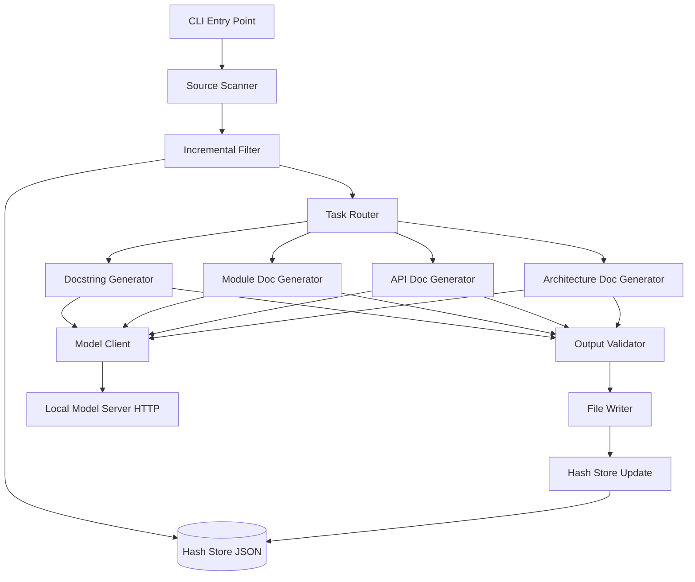

# Design Document: Local Model Documentation Generator

## Overview

The Local Model Documentation Generator is a standalone CLI tool (`generate-docs`) that scans the exo project's source files, identifies undocumented or poorly documented code entities, and invokes local LLM servers (DeepSeek, Condense, Fast) via HTTP to produce comprehensive documentation. The tool operates as a pipeline: scan → filter (incremental) → generate → validate → write, with support for dry-run previews, forced regeneration, and strict validation modes.

The tool communicates with local model servers (ollama/llama.cpp) over HTTP POST to `/api/chat` or `/v1/chat/completions` endpoints — it does not depend on MCP and runs fully standalone. It uses Python's `ast` module for source file parsing and a JSON-based SHA-256 hash store for incremental change detection.

## Architecture



The architecture follows a linear pipeline with a shared model client. Each stage is a pure function (or near-pure with injected I/O) that transforms data from the previous stage. The pipeline is orchestrated by the CLI entry point which wires dependencies together.

### Module Layout

```
src/exo/docgen/
├── __init__.py
├── cli.py              # CLI entry point (argparse, main loop)
├── scanner.py          # AST-based source file scanning
├── models.py           # Pydantic data models
├── hash_store.py       # Incremental hash store (JSON + SHA-256)
├── model_client.py     # HTTP client for local model servers
├── model_selector.py   # Routes tasks to appropriate model alias
├── generators/
│   ├── __init__.py
│   ├── docstring.py    # Google-style docstring generation
│   ├── module_doc.py   # Module README generation
│   ├── api_doc.py      # FastAPI route documentation
│   └── architecture.py # Architecture overview + Mermaid diagrams
├── validator.py        # Output completeness validation
├── writer.py           # File I/O with dry-run support
└── tests/
    ├── __init__.py
    ├── test_scanner.py
    ├── test_hash_store.py
    ├── test_model_selector.py
    ├── test_validator.py
    └── test_properties.py  # Property-based tests
```

## Components and Interfaces

### 1. CLI Entry Point (`cli.py`)

Registered in `pyproject.toml` as `generate-docs = "exo.docgen.cli:main"`. Uses `argparse` following the same pattern as `exo.main:Args`.

The `main()` function parses arguments into a `GenerateDocsArgs` model, builds the pipeline components, executes the pipeline, and returns the appropriate exit code.

The CLI accepts: `--dry-run`, `--force`, `--strict`, `--target <path>`, `--output <directory>`.

### 2. Source Scanner (`scanner.py`)

Uses `ast.parse()` to build an AST for each Python file, then walks the tree to identify `DocumentableEntity` instances (functions, classes, methods, modules). For each entity, it checks whether a docstring exists (first statement is `ast.Expr` with `ast.Constant` string value that is non-whitespace).

The scanner extracts:
- Function/method parameters with type annotations from `ast.FunctionDef.args`
- Return type annotations from `ast.FunctionDef.returns`
- Raised exceptions by walking `ast.Raise` nodes within function bodies
- Public instance attributes by scanning `self.x = ...` assignments in `__init__`
- Indentation level from `ast.AST.col_offset`

**Key design decision**: The scanner operates on a single file at a time and returns a `ScanResult`. Directory traversal is handled separately, making the scanner easily testable with synthetic ASTs.

### 3. Incremental Filter (`hash_store.py`)

Maintains a JSON file (`.docgen_hashes.json` in project root) mapping file paths to their SHA-256 content hashes. On each run, compares current file hashes against stored values to determine which files need reprocessing.

**Hash computation**: Read file bytes, compute `hashlib.sha256(content).hexdigest()`.

**Filter logic** (pure function):
- If `--force`: all files pass through
- If file path not in store: file is "changed"
- If file hash differs from stored hash: file is "changed"
- If file hash matches stored hash: file is "skipped"

**Post-run update**:
- Add/update entries for all scanned files (both processed and skipped)
- Remove entries for files that no longer exist on disk

### 4. Model Client (`model_client.py`)

HTTP client that sends chat completion requests to a local model server. Uses `httpx` (already a project dependency) for async HTTP.

**Configuration**:
- Base URL from `DOCGEN_MODEL_URL` env var (default: `http://localhost:11434`)
- Timeout: 60 seconds per request
- Model alias → actual model name mapping from `DOCGEN_MODEL_MAP` env var or defaults

**Protocol**: Sends POST to `/v1/chat/completions` with:
```json
{
  "model": "<resolved_model_name>",
  "messages": [
    {"role": "system", "content": "<system_prompt>"},
    {"role": "user", "content": "<user_prompt>"}
  ],
  "temperature": 0.3,
  "max_tokens": 2048
}
```

**Error handling**: On timeout or HTTP error, returns `None`. The caller logs a warning and skips the entity.

### 5. Model Selector (`model_selector.py`)

Pure function that maps a `DocumentationType` to a `ModelAlias`. The mapping is total (covers all types) and non-overlapping (each type maps to exactly one alias).

| Documentation Type | Model Alias | Rationale |
|---|---|---|
| `docstring` | `deepseek` | Code understanding requires strong code model |
| `api_documentation` | `deepseek` | Route analysis needs code comprehension |
| `module_documentation` | `condense` | Summarization of module purpose |
| `architecture_documentation` | `condense` | High-level system summarization |
| `scaffolding` | `fast` | Template expansion, low complexity |
| `formatting` | `fast` | Mechanical reformatting, no reasoning |

### 6. Generators (`generators/`)

Each generator takes scan results and source context, constructs prompts, calls the model client, and returns structured documentation output.

- **Docstring Generator** (`docstring.py`): Builds prompts from function/class/module metadata (signature, params, return type, raises). Parses model output into structured docstring sections. Handles indentation-aware insertion into source files using line-based text manipulation (not AST rewriting, to preserve formatting).

- **Module Doc Generator** (`module_doc.py`): Aggregates public API from all files in a module directory. Handles `<!-- manual -->` section preservation by splitting existing README content at markers, regenerating auto sections, and reassembling.

- **API Doc Generator** (`api_doc.py`): Extracts FastAPI route decorators (`@app.get`, `@app.post`, etc.), parameter annotations, and Pydantic model schemas from AST. Groups routes by first path segment, sorts alphabetically within groups.

- **Architecture Generator** (`architecture.py`): Uses hardcoded knowledge of the 5 components (Router, Worker, Master, Election, API) plus AST analysis of `src/exo/routing/topics.py` to generate Mermaid diagrams and component descriptions. Reads topic definitions to extract publish policies and message types.

### 7. Output Validator (`validator.py`)

Validates generated documentation against structural requirements before writing. Returns a list of validation failures.

**Docstring validation rules**:
- If entity has parameters → docstring must contain "Args:" section
- If entity has return annotation → docstring must contain "Returns:" section
- Summary line must be ≤ 79 characters

**Module doc validation rules**:
- Must contain at least one non-empty paragraph (summary)
- Must contain a list of classes/functions (or "no public API" note)
- Must contain at least one code example (fenced code block)

### 8. File Writer (`writer.py`)

Handles file I/O with dry-run support. In dry-run mode, produces diffs and previews to stdout without touching the filesystem.

**Dry-run output format**:
- For updates: unified diff (using `difflib.unified_diff`)
- For creates: full content prefixed with `[create] <path>`
- Summary list of all planned operations with create/update labels

**Normal mode**: Creates parent directories as needed, writes content, reports results.

## Data Models

All models use the project's `FrozenModel` base class (Pydantic with `frozen=True`, `strict=True`, camelCase aliases).

### Core Types

- `ModelAlias = Literal["deepseek", "condense", "fast"]`
- `DocumentationType = Literal["docstring", "api_documentation", "module_documentation", "architecture_documentation", "scaffolding", "formatting"]`
- `EntityKind = Literal["function", "class", "method", "module"]`

### Scanner Models

- `ParameterInfo`: name, type_annotation (optional), default_value (optional), is_required
- `AttributeInfo`: name, type_annotation (optional)
- `DocumentableEntity`: kind, name, line_number, indentation_level, has_docstring, parameters, return_annotation, raises, public_attributes
- `ScanResult`: file_path, entities, documentation_score, undocumented_count

### Hash Store

- `HashStore`: hashes mapping (file_path string → sha256 hex string)

### Generation Models

- `GeneratedDocstring`: summary, args_section, returns_section, raises_section, attributes_section (all optional except summary)
- `RouteInfo`: http_method, path, path_prefix, query_parameters, request_body_model, request_body_fields, response_body_model, response_body_fields, status_codes
- `FieldInfo`: name, type_annotation, is_required, default_value

### Output Models

- `PlannedWrite`: destination path, content, action (create/update), existing_content
- `WriteResult`: destination path, action (create/update/skipped), success
- `ValidationFailure`: file_path, missing_sections, message

### CLI Args

- `GenerateDocsArgs`: dry_run, force, strict, target (optional Path), output (Path, default "docs")

## Correctness Properties

*A property is a characteristic or behavior that should hold true across all valid executions of a system — essentially, a formal statement about what the system should do. Properties serve as the bridge between human-readable specifications and machine-verifiable correctness guarantees.*

### Property 1: Scanner identifies exactly the undocumented entities

*For any* valid Python source file containing a mix of documented and undocumented functions, classes, and methods, the scanner SHALL return exactly those entities whose first body statement is not a non-whitespace string constant, and no others.

**Validates: Requirements 1.1**

### Property 2: Documentation score is correctly bounded and computed

*For any* list of documentable entities where at least one entity exists, the computed documentation score SHALL equal `round(documented_count / total_count, 2)` and SHALL be in the range [0.0, 1.0].

**Validates: Requirements 1.2**

### Property 3: Summary report is sorted by score ascending

*For any* collection of scan results, the summary report output SHALL list files in non-decreasing order of documentation score.

**Validates: Requirements 1.3**

### Property 4: File path filter accepts only .py files in target directories

*For any* file path, the scanner's file filter SHALL return True if and only if the path has a `.py` extension AND resides within one of the configured target directories (`src/exo/`, `rust/`, `dashboard/`).

**Validates: Requirements 1.5**

### Property 5: Model selection is total and non-overlapping

*For any* valid `DocumentationType` value, `select_model` SHALL return exactly one `ModelAlias`, and for any two distinct documentation types that map to different model aliases, their selection criteria SHALL not overlap.

**Validates: Requirements 2.1, 2.2, 2.3, 2.5**

### Property 6: Generated docstring sections match function metadata

*For any* function entity, the generated docstring SHALL contain an Args section if and only if the function has at least one parameter, a Returns section if and only if the function has a non-None return annotation, and a Raises section if and only if the function explicitly raises at least one exception.

**Validates: Requirements 3.1, 3.2**

### Property 7: Docstring insertion preserves source indentation

*For any* Python source file and any entity within it, inserting a generated docstring SHALL not alter the indentation of any existing line in the file, and the docstring itself SHALL be indented to match the body indentation level of the target entity.

**Validates: Requirements 3.5, 3.6**

### Property 8: README regeneration preserves manual sections

*For any* existing README.md containing content between `<!-- manual -->` and `<!-- /manual -->` markers, regenerating the auto-generated sections SHALL preserve the manual section content byte-for-byte.

**Validates: Requirements 4.3**

### Property 9: Route documentation completeness matches route parameters

*For any* FastAPI route definition, the generated documentation SHALL include a request body section if and only if the route has a request body parameter, and SHALL always include HTTP method, path, and response schema.

**Validates: Requirements 5.1, 5.4**

### Property 10: Routes are grouped by prefix and sorted alphabetically

*For any* set of route definitions, the aggregated output SHALL group routes by their first path segment, and within each group, routes SHALL appear in alphabetical order by full path.

**Validates: Requirements 5.2**

### Property 11: Incremental hash filtering correctness

*For any* source file and hash store state, the incremental filter SHALL mark a file as "changed" if and only if the file has no entry in the hash store OR the file's current SHA-256 hash differs from the stored hash.

**Validates: Requirements 7.1, 7.2**

### Property 12: Hash store reflects current filesystem state after run

*For any* completed generation run, the updated hash store SHALL contain an entry for every source file that exists on disk with its current SHA-256 hash, and SHALL contain no entries for files that no longer exist on disk.

**Validates: Requirements 7.3, 7.5**

### Property 13: Force mode bypasses incremental filtering

*For any* hash store state (including one where all files match their stored hashes), when force mode is active, the filter SHALL mark all source files as "changed" regardless of hash comparison.

**Validates: Requirements 8.2**

### Property 14: Target flag restricts scanning scope

*For any* target path and file tree, the scanner SHALL process only files that are descendants of the target path, and no files outside that subtree.

**Validates: Requirements 8.3**

### Property 15: Validation detects missing required sections

*For any* generated documentation (docstring or module doc) that is missing one or more required sections based on the entity's metadata, the validator SHALL return at least one `ValidationFailure` identifying the missing sections.

**Validates: Requirements 9.1, 9.2**

### Property 16: Invalid documentation is never written to disk

*For any* generated documentation that fails validation, the file writer SHALL not create or modify any file for that documentation, regardless of strict mode setting.

**Validates: Requirements 9.3**

### Property 17: Dry-run never modifies filesystem

*For any* execution in dry-run mode with any combination of inputs, the file writer SHALL not create, modify, or delete any file on disk.

**Validates: Requirements 10.2**

### Property 18: Dry-run produces correct diff/content output

*For any* planned write where the destination file exists, dry-run SHALL produce a valid unified diff between existing and proposed content. For any planned write where the destination does not exist, dry-run SHALL display the full proposed content with a "create" label.

**Validates: Requirements 10.3, 10.4**

## Error Handling

| Error Condition | Behavior | Exit Code |
|---|---|---|
| Source file has syntax error | Log warning (file path + error), skip file, continue | 0 (unless --strict) |
| Source file permission denied | Log warning (file path + error), skip file, continue | 0 (unless --strict) |
| Model server timeout (60s) | Log warning (model alias + target file), skip entity, continue | 0 (unless --strict) |
| Model server connection refused | Log warning, skip entity, continue | 0 (unless --strict) |
| Model returns unparseable response | Log warning, skip entity, continue | 0 (unless --strict) |
| Validation failure (non-strict) | Log warning to stderr, skip writing, continue | 0 |
| Validation failure (strict) | Log warning to stderr, continue processing all files, exit non-zero | 1 |
| Invalid --target path | Print error to stderr, exit immediately | 1 |
| Hash store corrupt/missing | Treat all files as changed, create new store on completion | 0 |
| Output directory doesn't exist | Create it before writing | 0 |

All warnings use `loguru.logger.warning()` for consistency with the rest of the exo project. Errors that prevent the tool from starting (invalid arguments) use `sys.stderr` and immediate exit.

## Testing Strategy

### Property-Based Tests

Property-based tests use `hypothesis` (the standard PBT library for Python). Each property test runs a minimum of 100 iterations and is tagged with its corresponding design property.

**Library**: `hypothesis`
**Configuration**: `@settings(max_examples=100)`
**Tag format**: `# Feature: local-model-documentation-generator, Property {N}: {title}`

Properties to implement as PBT:
- Properties 1–5 (scanner, score, sorting, filtering, model selection) — pure functions with clear input/output
- Properties 6–7 (docstring structure, indentation) — AST manipulation with verifiable invariants
- Property 8 (manual section preservation) — string transformation with round-trip property
- Properties 9–10 (route documentation) — structural output verification
- Properties 11–14 (hash store, force, target) — state machine properties
- Properties 15–16 (validation) — predicate verification
- Properties 17–18 (dry-run) — side-effect absence verification

### Unit Tests (Example-Based)

Unit tests cover:
- CLI argument parsing (all flag combinations)
- Error handling paths (syntax errors, timeouts, permission errors)
- Edge cases (empty modules, no public API, missing hash store, modules with only private functions)
- Mermaid diagram syntax validation
- Architecture doc component section completeness

### Integration Tests

- End-to-end run against a small fixture directory with known source files
- Model client integration with a mock HTTP server (using `pytest-httpx` or `respx`)
- Full pipeline dry-run verification against fixture files
- Hash store persistence across multiple runs

### Test Organization

```
src/exo/docgen/tests/
├── __init__.py
├── test_scanner.py          # Scanner unit + property tests
├── test_hash_store.py       # Hash store property tests
├── test_model_selector.py   # Model selection property tests
├── test_validator.py        # Validation property tests
├── test_writer.py           # Writer + dry-run property tests
├── test_cli.py              # CLI argument parsing tests
├── test_generators.py       # Generator integration tests
└── fixtures/                # Sample Python files for testing
    ├── documented.py
    ├── undocumented.py
    ├── mixed.py
    └── syntax_error.py
```
