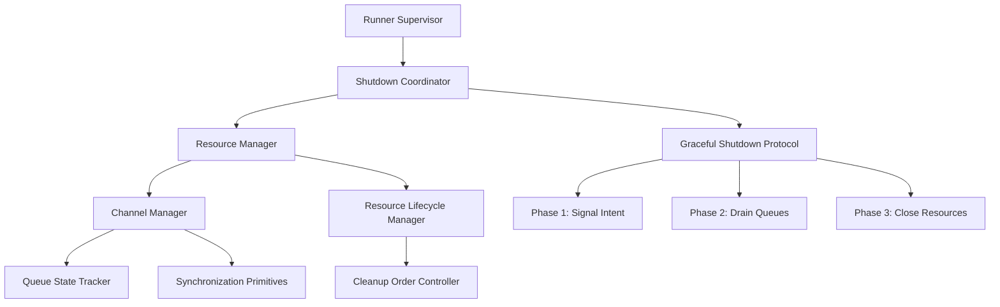

# Design Document

## Overview

The multiprocessing race condition in EXO's multi-node system occurs during runner shutdown when channels are closed while other processes are still attempting to use them. This design implements a coordinated shutdown protocol with proper resource lifecycle management to eliminate the race condition.

## Architecture

### Current Problem Analysis

The race condition happens in this sequence:
1. Runner receives shutdown signal
2. Runner starts cleanup process
3. Multiprocessing queue gets closed prematurely
4. Other processes try to use the closed queue
5. `ValueError: Queue is closed` and `ClosedResourceError` exceptions occur
6. Runner terminates with exit code 1

### Solution Architecture



## Components and Interfaces

### 1. Shutdown Coordinator

**Purpose:** Orchestrate graceful shutdown across all runner processes

**Interface:**
```python
class ShutdownCoordinator:
    async def initiate_shutdown(self, runner_id: str, timeout: float = 30.0) -> bool
    async def wait_for_shutdown_complete(self, runner_id: str) -> bool
    def register_shutdown_handler(self, handler: Callable) -> None
    def get_shutdown_status(self, runner_id: str) -> ShutdownStatus
```

**Key Features:**
- Three-phase shutdown protocol
- Timeout-based safety mechanisms
- Cross-process coordination
- Status tracking and reporting

### 2. Resource Manager

**Purpose:** Manage lifecycle of multiprocessing resources with proper ordering

**Interface:**
```python
class ResourceManager:
    def register_resource(self, resource: Any, cleanup_order: int) -> ResourceHandle
    async def cleanup_resources(self, timeout: float = 10.0) -> CleanupResult
    def is_resource_active(self, handle: ResourceHandle) -> bool
    def get_resource_dependencies(self, handle: ResourceHandle) -> List[ResourceHandle]
```

**Key Features:**
- Dependency-aware cleanup ordering
- Resource state tracking
- Timeout-based cleanup with fallbacks
- Leak detection and reporting

### 3. Channel Manager

**Purpose:** Provide race-condition-free multiprocessing communication

**Interface:**
```python
class ChannelManager:
    def create_channel(self, name: str, buffer_size: int = 1000) -> Channel
    async def close_channel(self, name: str, drain_timeout: float = 5.0) -> bool
    def is_channel_active(self, name: str) -> bool
    async def drain_channel(self, name: str) -> List[Any]
```

**Key Features:**
- Atomic channel operations
- Graceful draining before closure
- State synchronization across processes
- Deadlock prevention mechanisms

### 4. Enhanced Runner Supervisor

**Purpose:** Coordinate runner lifecycle with improved error handling

**Interface:**
```python
class EnhancedRunnerSupervisor:
    async def start_runner(self, config: RunnerConfig) -> RunnerHandle
    async def stop_runner(self, handle: RunnerHandle, graceful: bool = True) -> bool
    def get_runner_health(self, handle: RunnerHandle) -> HealthStatus
    async def recover_runner(self, handle: RunnerHandle) -> RecoveryResult
```

## Data Models

### Shutdown State Machine

```python
@dataclass
class ShutdownState:
    phase: ShutdownPhase  # SIGNALING, DRAINING, CLOSING, COMPLETE
    started_at: datetime
    timeout_at: datetime
    resources_remaining: Set[ResourceHandle]
    error_count: int
    last_error: Optional[Exception]

class ShutdownPhase(Enum):
    SIGNALING = "signaling"      # Notify all processes of shutdown intent
    DRAINING = "draining"        # Drain all queues and channels
    CLOSING = "closing"          # Close resources in dependency order
    COMPLETE = "complete"        # All resources cleaned up
    FAILED = "failed"           # Shutdown failed, force cleanup
```

### Resource Tracking

```python
@dataclass
class ResourceHandle:
    id: str
    resource_type: ResourceType
    cleanup_order: int
    dependencies: Set[str]
    state: ResourceState
    created_at: datetime
    
class ResourceState(Enum):
    ACTIVE = "active"
    DRAINING = "draining"
    CLOSING = "closing"
    CLOSED = "closed"
    ERROR = "error"
```

## Error Handling

### Graceful Degradation Strategy

1. **Timeout-based Fallbacks:** If graceful shutdown takes too long, fall back to force cleanup
2. **Partial Cleanup:** Continue cleanup even if some resources fail to close properly
3. **Error Isolation:** Prevent errors in one resource from blocking cleanup of others
4. **State Recovery:** Maintain consistent state even during error conditions

### Error Recovery Patterns

```python
class ErrorRecoveryStrategy:
    async def handle_queue_closed_error(self, error: ValueError) -> RecoveryAction
    async def handle_resource_error(self, error: Exception) -> RecoveryAction
    async def handle_timeout_error(self, timeout: float) -> RecoveryAction
    
class RecoveryAction(Enum):
    RETRY = "retry"
    SKIP = "skip"
    FORCE_CLEANUP = "force_cleanup"
    ESCALATE = "escalate"
```

## Testing Strategy

### Unit Tests
- Resource lifecycle management
- Shutdown coordination logic
- Channel state transitions
- Error handling paths

### Integration Tests
- Multi-process shutdown scenarios
- Race condition reproduction and prevention
- Timeout handling
- Resource dependency resolution

### Stress Tests
- High-frequency shutdown/startup cycles
- Resource exhaustion scenarios
- Network partition simulation
- Concurrent shutdown requests

## Implementation Phases

### Phase 1: Core Infrastructure
- Implement ShutdownCoordinator
- Create ResourceManager
- Add basic synchronization primitives

### Phase 2: Channel Management
- Implement ChannelManager
- Add graceful draining logic
- Create state synchronization

### Phase 3: Integration
- Integrate with existing RunnerSupervisor
- Update bootstrap and cleanup code
- Add comprehensive logging

### Phase 4: Testing & Validation
- Comprehensive test suite
- Performance validation
- Multi-node testing
- Production readiness verification

## Performance Considerations

### Optimization Strategies
- **Lazy Resource Creation:** Only create resources when needed
- **Batch Operations:** Group resource operations to reduce overhead
- **Async Cleanup:** Use asynchronous operations where possible
- **Memory Efficiency:** Minimize memory usage during shutdown

### Monitoring and Metrics
- Shutdown duration tracking
- Resource cleanup success rates
- Error frequency and types
- Performance impact measurement

## Security Considerations

### Resource Isolation
- Prevent resource leaks between runners
- Ensure proper cleanup of sensitive data
- Validate resource access permissions

### Error Information Disclosure
- Sanitize error messages in logs
- Prevent information leakage through error details
- Secure cleanup of temporary resources