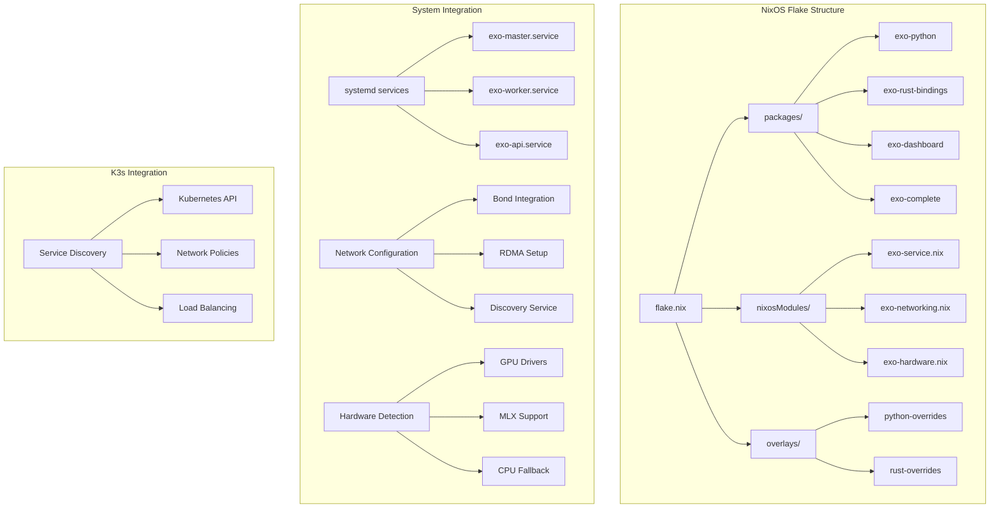
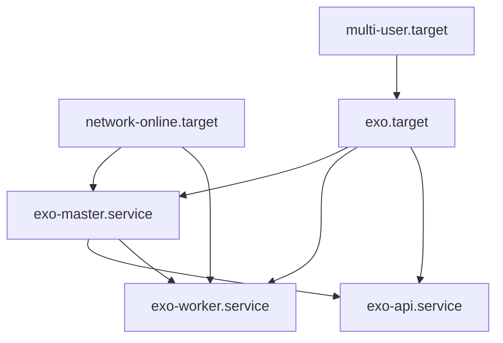

# EXO NixOS Flake Integration Design

## Overview

This design document outlines the architecture for creating a comprehensive NixOS flake that packages the EXO distributed AI inference system. The flake will provide a complete solution including package definitions, NixOS modules, system services, and integration with existing K3s infrastructure. The design emphasizes modularity, security, and seamless integration with bonded networking and dynamic hardware acceleration.

## Architecture

### High-Level Architecture



### Component Architecture

The flake consists of several key components:

1. **Package Definitions**: Individual packages for each EXO component
2. **NixOS Modules**: System configuration modules for service integration
3. **Hardware Abstraction**: Dynamic detection and configuration of accelerators
4. **Network Integration**: Bonded network and RDMA configuration
5. **Service Management**: Systemd service definitions with proper dependencies
6. **K3s Integration**: Kubernetes service discovery and networking

## Components and Interfaces

### Package Structure

#### Core Packages

**exo-python**: The main Python application package
- Dependencies: Python 3.13, all PyPI dependencies from pyproject.toml
- Build process: Uses uv for dependency resolution and installation
- Outputs: Python wheel and executable scripts

**exo-rust-bindings**: Compiled Rust networking components
- Dependencies: Rust toolchain, libp2p, system libraries
- Build process: Cargo build with cross-compilation support
- Outputs: Shared libraries for Python integration

**exo-dashboard**: Web dashboard built from Node.js sources
- Dependencies: Node.js, npm packages
- Build process: npm install && npm run build
- Outputs: Static web assets and server components

**exo-complete**: Meta-package combining all components
- Dependencies: All above packages plus runtime requirements
- Purpose: Single package for complete EXO installation

#### Hardware-Specific Packages

**exo-cuda**: CUDA-enabled variant
- Additional dependencies: CUDA toolkit, cuDNN
- Conditional inclusion based on hardware detection

**exo-rocm**: ROCm-enabled variant for AMD GPUs
- Additional dependencies: ROCm stack, HIP libraries
- AMD GPU detection and configuration

**exo-mlx**: Apple Silicon optimized variant
- Dependencies: MLX framework, Metal performance shaders
- macOS/Apple Silicon specific optimizations

### NixOS Module Design

#### exo-service.nix

Primary service configuration module providing:

```nix
{
  services.exo = {
    enable = mkEnableOption "EXO distributed AI inference";
    
    package = mkOption {
      type = types.package;
      default = pkgs.exo-complete;
      description = "EXO package to use";
    };
    
    mode = mkOption {
      type = types.enum [ "master" "worker" "auto" ];
      default = "auto";
      description = "Node operation mode";
    };
    
    apiPort = mkOption {
      type = types.port;
      default = 52415;
      description = "API server port";
    };
    
    networking = {
      bondInterface = mkOption {
        type = types.nullOr types.str;
        default = null;
        description = "Bonded network interface to use";
      };
      
      rdmaEnabled = mkOption {
        type = types.bool;
        default = true;
        description = "Enable RDMA over Thunderbolt if available";
      };
    };
    
    hardware = {
      autoDetect = mkOption {
        type = types.bool;
        default = true;
        description = "Automatically detect and configure hardware acceleration";
      };
      
      preferredAccelerator = mkOption {
        type = types.nullOr (types.enum [ "cuda" "rocm" "mlx" "cpu" ]);
        default = null;
        description = "Preferred hardware accelerator";
      };
    };
    
    k3s = {
      integration = mkOption {
        type = types.bool;
        default = false;
        description = "Enable K3s integration";
      };
      
      serviceDiscovery = mkOption {
        type = types.bool;
        default = true;
        description = "Register with K3s service discovery";
      };
    };
  };
}
```

#### exo-networking.nix

Network configuration integration:

- Automatic detection of bonded interfaces
- RDMA over Thunderbolt configuration
- Integration with existing systemd-networkd setup
- Firewall rules for EXO communication ports
- Network namespace isolation options

#### exo-hardware.nix

Hardware detection and configuration:

- GPU driver detection (NVIDIA, AMD, Intel)
- Apple Silicon MLX support detection
- CPU capability assessment
- Memory and storage requirements validation
- Hardware-specific package selection

### Service Architecture

#### Service Definitions

**exo-master.service**
```ini
[Unit]
Description=EXO Master Node
After=network-online.target
Wants=network-online.target
PartOf=exo.target

[Service]
Type=exec
User=exo
Group=exo
ExecStart=/run/current-system/sw/bin/exo-master
Restart=always
RestartSec=5
Environment=EXO_LOG_LEVEL=info
EnvironmentFile=-/etc/exo/environment

[Install]
WantedBy=exo.target
```

**exo-worker.service**
```ini
[Unit]
Description=EXO Worker Node
After=network-online.target exo-master.service
Wants=network-online.target
PartOf=exo.target

[Service]
Type=exec
User=exo
Group=exo
ExecStart=/run/current-system/sw/bin/exo-worker
Restart=always
RestartSec=5
Environment=EXO_LOG_LEVEL=info
EnvironmentFile=-/etc/exo/environment

[Install]
WantedBy=exo.target
```

**exo-api.service**
```ini
[Unit]
Description=EXO API Server
After=exo-master.service
Requires=exo-master.service
PartOf=exo.target

[Service]
Type=exec
User=exo
Group=exo
ExecStart=/run/current-system/sw/bin/exo --spawn-api --api-port=${API_PORT}
Restart=always
RestartSec=5
Environment=EXO_LOG_LEVEL=info
EnvironmentFile=-/etc/exo/environment

[Install]
WantedBy=exo.target
```

#### Service Dependencies



## Data Models

### Configuration Schema

```nix
{
  # Service configuration
  services.exo = {
    enable = true;
    mode = "auto";  # master | worker | auto
    
    # Network configuration
    networking = {
      bondInterface = "bond0";
      rdmaEnabled = true;
      discoveryPort = 52416;
      apiPort = 52415;
    };
    
    # Hardware configuration
    hardware = {
      autoDetect = true;
      preferredAccelerator = null;  # cuda | rocm | mlx | cpu
      memoryLimit = "80%";
    };
    
    # K3s integration
    k3s = {
      integration = true;
      namespace = "exo-system";
      serviceAccount = "exo";
    };
    
    # Security configuration
    security = {
      user = "exo";
      group = "exo";
      dataDir = "/var/lib/exo";
      configDir = "/etc/exo";
    };
  };
}
```

### Runtime State Management

- **Configuration Files**: Generated in `/etc/exo/`
- **Runtime Data**: Stored in `/var/lib/exo/`
- **Logs**: Managed by systemd journal
- **Model Cache**: Configurable location with proper permissions
- **Network State**: Integration with systemd-networkd

## Error Handling

### Service Failure Recovery

1. **Automatic Restart**: Services restart on failure with exponential backoff
2. **Health Checks**: Periodic health monitoring and reporting
3. **Graceful Degradation**: Worker nodes continue operating if master fails
4. **State Recovery**: Persistent state storage for cluster topology
5. **Network Resilience**: Automatic reconnection on network failures

### Hardware Failure Handling

1. **GPU Failure**: Automatic fallback to CPU inference
2. **Network Failure**: Failover to backup network interfaces
3. **Storage Failure**: Graceful handling of model cache corruption
4. **Memory Pressure**: Dynamic resource allocation adjustment

### Configuration Validation

1. **Pre-flight Checks**: Validate configuration before service start
2. **Hardware Compatibility**: Verify hardware requirements are met
3. **Network Connectivity**: Test network interfaces and ports
4. **Permission Validation**: Ensure proper file and device permissions

## Testing Strategy

### Unit Testing

1. **Package Builds**: Verify all packages build correctly on target architectures
2. **Module Validation**: Test NixOS module configuration options
3. **Service Integration**: Validate systemd service definitions
4. **Hardware Detection**: Test hardware detection logic

### Integration Testing

1. **Multi-Node Setup**: Test cluster formation and communication
2. **K3s Integration**: Verify Kubernetes service discovery
3. **Network Bonding**: Test bonded interface utilization
4. **Hardware Acceleration**: Validate GPU/MLX acceleration

### System Testing

1. **Full Deployment**: End-to-end deployment testing
2. **Failure Scenarios**: Test various failure and recovery scenarios
3. **Performance Validation**: Verify performance characteristics
4. **Security Testing**: Validate security isolation and permissions

### Continuous Integration

1. **Multi-Architecture Builds**: Test on x86_64 and aarch64
2. **Hardware Variants**: Test with different GPU configurations
3. **NixOS Versions**: Compatibility testing across NixOS releases
4. **Regression Testing**: Automated testing of core functionality

## Security Considerations

### Service Isolation

1. **Dedicated User**: Services run under dedicated `exo` user
2. **Minimal Permissions**: Least privilege access to system resources
3. **Network Isolation**: Configurable network namespace isolation
4. **File System Permissions**: Strict permissions on data and config directories

### Hardware Access

1. **GPU Device Access**: Minimal required device permissions
2. **Network Interface Access**: Controlled access to network interfaces
3. **Memory Management**: Proper memory isolation and limits
4. **Process Isolation**: Container-like isolation where appropriate

### Data Protection

1. **Model Security**: Secure storage and transmission of AI models
2. **Configuration Security**: Protected configuration files
3. **Log Security**: Secure handling of potentially sensitive log data
4. **Network Security**: Encrypted communication between nodes

## Performance Optimization

### Build Optimization

1. **Parallel Builds**: Utilize all available CPU cores
2. **Incremental Builds**: Cache intermediate build artifacts
3. **Cross-Compilation**: Efficient cross-architecture builds
4. **Dependency Caching**: Reuse common dependencies

### Runtime Optimization

1. **Memory Management**: Efficient memory allocation and cleanup
2. **Network Optimization**: Optimal network buffer sizes and protocols
3. **Hardware Utilization**: Maximum utilization of available accelerators
4. **Load Balancing**: Intelligent workload distribution

### Resource Management

1. **Dynamic Scaling**: Automatic resource allocation based on demand
2. **Priority Scheduling**: Prioritize critical system operations
3. **Resource Limits**: Configurable resource limits and quotas
4. **Monitoring Integration**: Integration with system monitoring tools