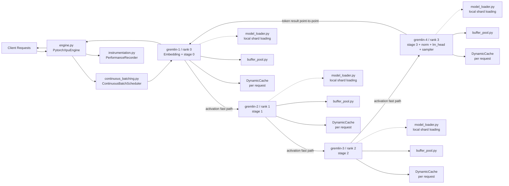
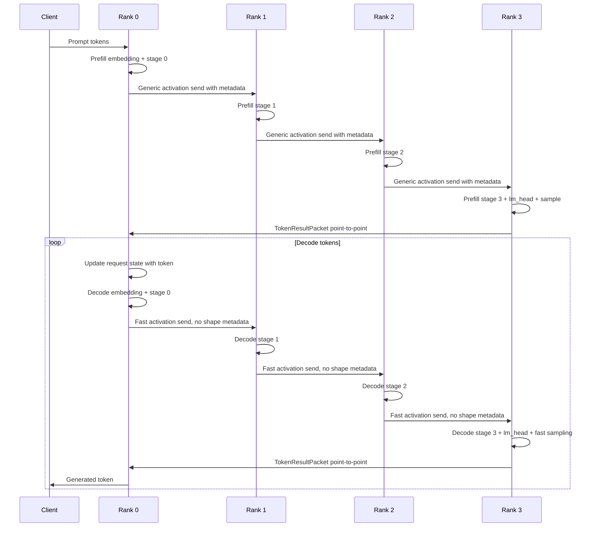
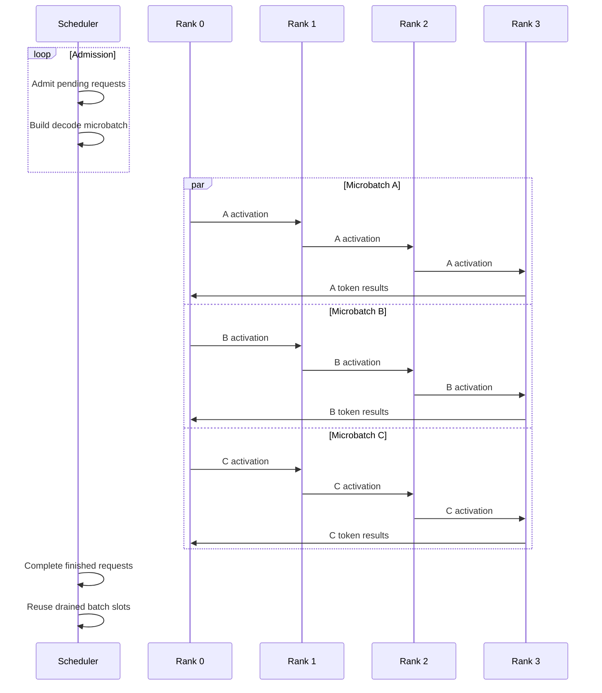

# Design: Qwen3.5-27B Pipeline-Parallel XPU Inference Optimization

## Overview

This design optimizes pipeline-parallel inference for Qwen3.5-27B on four Intel Arc Meteor Lake-P iGPU nodes connected by 10 Gbps Ethernet.

The design keeps the existing PyTorch 2.11+xpu and Gloo architecture while addressing the main bottlenecks:

1. Single-request pipeline bubble
2. Sequential GatedDeltaNet prefill
3. Per-token fp32 state casting
4. Lack of kernel fusion from `torch.compile` failures
5. Decode shape metadata overhead
6. Fresh tensor allocations during decode
7. Full-vocabulary sort in sampling
8. Blocking token broadcast
9. Lack of continuous batching
10. Final-rank concentration of `lm_head` and sampling overhead

## Target File Areas

The implementation will primarily modify:

- `src/exo/worker/engines/pytorch_xpu/engine.py`
- `src/exo/worker/engines/pytorch_xpu/pipeline_generator.py`
- `src/exo/worker/engines/pytorch_xpu/pipeline_parallel_shard.py`
- `src/exo/worker/engines/pytorch_xpu/distributed.py`
- `src/exo/worker/engines/pytorch_xpu/model_loader.py`
- `src/exo/worker/engines/pytorch_xpu/gated_deltanet.py`
- `src/exo/worker/engines/pytorch_xpu/distributed_generator.py`
- `src/exo/worker/engines/pytorch_xpu/bench_xpu.py`

New support modules:

- `src/exo/worker/engines/pytorch_xpu/instrumentation.py`
- `src/exo/worker/engines/pytorch_xpu/pipeline_config.py`
- `src/exo/worker/engines/pytorch_xpu/buffer_pool.py`
- `src/exo/worker/engines/pytorch_xpu/continuous_batching.py`
- `src/exo/worker/engines/pytorch_xpu/sampling.py`

All new configuration classes must use Pydantic models with `frozen=True`.

---

## High-Level Architecture



---

## Decode Data Flow: Single Request



---

## Decode Data Flow: Continuous Batching



---

## Component Responsibilities

### `engine.py` — PytorchXpuEngine

- Accept generation requests
- Create request identifiers
- Pass requests to the continuous batching scheduler
- Manage cancellation
- Return generated tokens to clients
- Select single-request or continuous-batching execution mode
- Initialize distributed ranks
- Initialize instrumentation
- Ensure `past_key_values` is used when invoking model shards

### `pipeline_generator.py` — Pipeline Orchestration

- Drive prefill and decode loops
- Use fast-path decode communication after protocol negotiation
- Maintain in-flight microbatch metadata
- Support both single-request and continuous-batching decode
- Separate prefill and decode instrumentation

### `pipeline_parallel_shard.py` — Local Model Stage

- Execute rank-local layers
- Hold rank-local `DynamicCache` state per request
- Run embedding only on rank 0
- Run final normalization and `lm_head` only on rank 3
- Expose per-layer timing hooks
- Support configurable layer ranges
- Call Qwen3.5 model layers with `past_key_values`

### `distributed.py` — Communication

- Existing generic tensor send/receive remains available
- Add decode fast-path protocol
- Add preallocated CPU buffer communication
- Add rank 3 to rank 0 token-result send
- Add structured communication errors
- Record communication timing

### `model_loader.py` — Local Shard Loading

- Parse safetensors index
- Resolve tensor names to rank ownership
- Load only owned tensors
- Instantiate only local modules
- Expose loaded tensor manifest
- Validate distribution coverage

### `gated_deltanet.py` — Optimized Recurrence

- Store persistent fp32 recurrent state
- Avoid per-token state casting
- Reuse output buffers where possible
- Provide sequential and chunked prefill
- Preserve `DynamicCache` compatibility

### `sampling.py` — Fast Token Sampling

- Split sampling into greedy, top-k, and fallback paths
- Avoid full-vocabulary sort in greedy and top-k-only modes
- Move NaN validation behind debug flag
- Support per-request sampling configuration

### `buffer_pool.py` — Communication Buffer Management

- Manage reusable CPU tensors for Gloo communication
- Key buffers by name, dtype, shape, source rank, and destination rank
- Avoid allocation in steady-state decode loop

### `continuous_batching.py` — Request Scheduling

- Implement request admission queue
- Implement prefill queue
- Implement decode-ready queue
- Track completed and cancelled requests
- Form decode microbatches from active requests
- Support request-level state isolation

### `instrumentation.py` — Performance Recording

- Context-manager span API using `time.perf_counter()`
- JSON serialization for cross-run comparison
- Per-rank, per-stage, per-mode metrics
- Low overhead in normal mode

---

## Memory Layout and Buffer Management

### Activation Shapes

Decode hidden states use a stable shape:

```
[microbatch_size, 1, hidden_size]
```

The chosen layout is negotiated in `DecodeActivationProtocol` and remains fixed during steady-state fast-path decode.

### Communication Buffers

A buffer pool manages reusable CPU tensors:

```python
class CommunicationBufferPool:
    def get_send_buffer(self, name: str, shape: tuple[int, ...], dtype: torch.dtype) -> torch.Tensor: ...
    def get_receive_buffer(self, name: str, shape: tuple[int, ...], dtype: torch.dtype) -> torch.Tensor: ...
    def reset(self) -> None: ...
```

### Decode Buffer Lifecycle

1. During protocol negotiation, each rank allocates send and receive buffers for neighboring ranks.
2. On decode step: local XPU activation is copied into CPU send buffer, Gloo sends the preallocated CPU tensor, receiver writes into preallocated CPU receive buffer, receive buffer is transferred to XPU for local compute.
3. No new CPU communication tensor is allocated in the steady-state loop.
4. If microbatch shape changes: renegotiate protocol, allocate or reuse matching buffers, resume fast path.

### GatedDeltaNet State Memory

Persistent state is allocated per request and per layer:

- fp32 recurrent matrices
- Shape metadata
- Owning request identifier
- Layer index
- Device
- Reset/recycle status

No decode step performs repeated state dtype promotion from bf16 to fp32.

---

## Communication Protocol Changes

### Existing Generic Path (retained)

Used for prefill, debug mode, shape-changing operations, protocol negotiation, and fallback after errors.

### New Decode Fast Path

Protocol fields:

```python
class DecodeActivationProtocol(BaseModel):
    model_config = ConfigDict(frozen=True)
    protocol_version: int
    source_rank: int
    destination_rank: int
    dtype_name: str
    shape: tuple[int, ...]
    maximum_microbatch_size: int
    hidden_size: int
    requires_contiguous: bool
```

Fast path message flow:
1. Sender validates local activation against protocol
2. Sender copies activation into preallocated CPU send buffer
3. Sender calls Gloo send
4. Receiver calls Gloo receive into preallocated CPU receive buffer
5. Receiver returns XPU tensor for compute

### Token Result Protocol

Replace blocking broadcast with direct final-rank-to-rank-zero token result send:

```python
class TokenResultPacket(BaseModel):
    model_config = ConfigDict(frozen=True)
    request_identifier: str
    token_identifier: int
    position: int
    finished: bool
    finish_reason: str | None
```

---

## State Management for Continuous Batching

### Request Lifecycle

```
PENDING → PREFILLING → DECODE_READY → DECODING → FINISHED
                                    ↘ CANCELLING → DRAINED → CANCELLED
```

### Per-Request State

```python
class RequestRuntimeState:
    request_identifier: str
    input_token_identifiers: list[int]
    generated_token_identifiers: list[int]
    dynamic_cache_by_rank: dict[int, DynamicCache]
    gated_deltanet_state_by_layer: dict[int, GatedDeltaNetPersistentState]
    random_generator: torch.Generator | None
```

Batch messages include both `request_identifier` and `slot_generation` to prevent stale in-flight messages from mutating a reused slot.

---

## Error Handling and Recovery

### Structured Exceptions

```python
class PipelineCommunicationError(RuntimeError): ...
class DecodeProtocolMismatchError(PipelineCommunicationError): ...
class LocalShardLoadError(RuntimeError): ...
class ContinuousBatchingStateError(RuntimeError): ...
class SamplingError(RuntimeError): ...
class GatedDeltaNetStateError(RuntimeError): ...
```

### Decode Fast-Path Recovery

On protocol mismatch: record error metric → disable fast path for affected edge → fall back to generic communication → renegotiate at next safe boundary → abort if renegotiation fails.

### Node or Rank Failure

Detect communication failure → mark affected requests failed → emit structured error to rank 0 → stop accepting new requests → flush metrics → exit process group cleanly.

---

## Pipeline Stage Balancing

Layer distribution represented by contiguous ranges:

```python
class PipelineLayerDistribution(BaseModel):
    model_config = ConfigDict(frozen=True)
    layers_per_rank: tuple[int, ...]
```

Examples for four ranks:
- Default: `[16, 16, 16, 16]`
- Final lighter: `[17, 17, 16, 14]`
- Attention aware: `[15, 17, 17, 15]`

Balancing recommendation consumes measured per-layer timings and rank fixed costs (embedding, lm_head, sampling).

---

## Configuration

```python
class PytorchXpuOptimizationConfiguration(BaseModel):
    model_config = ConfigDict(frozen=True)

    enable_performance_instrumentation: bool = True
    enable_decode_fast_path: bool = True
    enable_fast_sampling: bool = True
    enable_gated_deltanet_persistent_state: bool = True
    enable_local_shard_loading: bool = True
    enable_continuous_batching: bool = False
    enable_chunked_gated_deltanet_prefill: bool = False
    maximum_decode_microbatch_size: int = 8
    decode_protocol_version: int = 1
    pipeline_layer_distribution: PipelineLayerDistribution
    chunked_prefill_configuration: ChunkedGatedDeltaNetPrefillConfiguration
```

Defaults prioritize correctness and incremental rollout. Continuous batching and chunked prefill are initially opt-in until tests and benchmarks confirm correctness.
