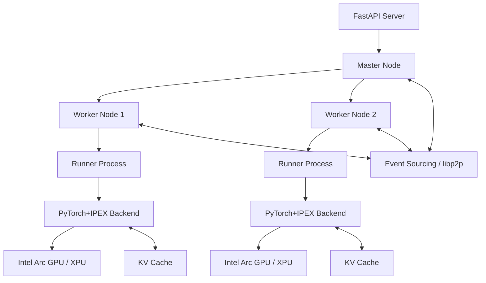
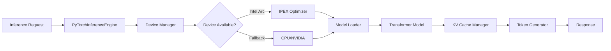
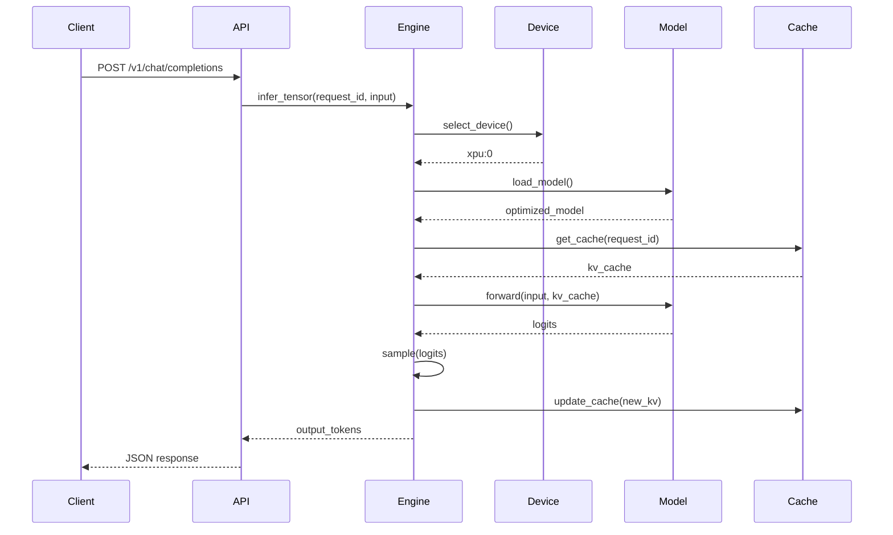
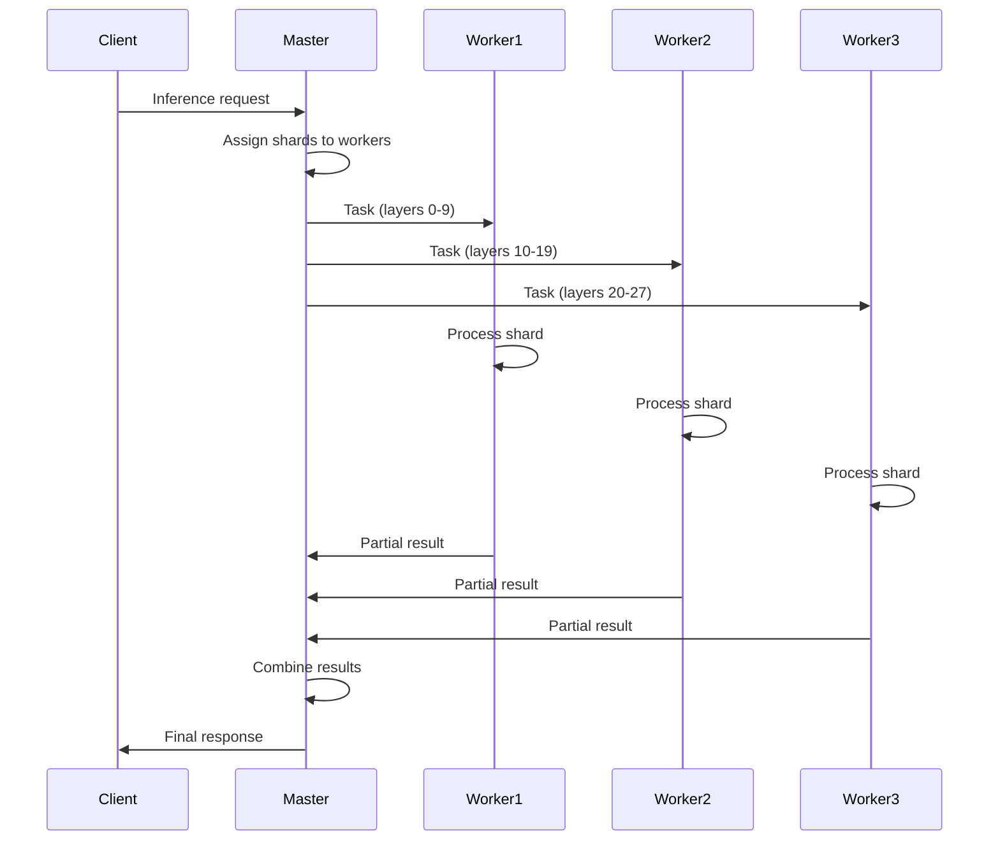

# Design Document: Intel Arc GPU Support via PyTorch + IPEX

## Overview

This document describes the architecture and design for integrating Intel Arc GPU support into exo using PyTorch and Intel Extension for PyTorch (IPEX). The design follows patterns from the successful exo-cuda implementation while adapting for Intel hardware specifics.

## Architecture

### High-Level Architecture



### exo Integration Architecture

The PyTorch+IPEX backend integrates with exo's existing distributed architecture:

- **Master/Worker Pattern**: Master coordinates shard assignments, Workers execute inference
- **Event Sourcing**: All state changes flow through immutable events
- **Runner Process**: Each worker spawns runner processes that load models and execute inference
- **Backend Detection**: Runner detects PyTorchIPEXRingInstance and loads appropriate backend
- **No Custom Coordinator**: exo's existing coordination handles distribution, no custom ring topology needed

### Component Architecture



## Components

### 1. PyTorchInferenceEngine

**Purpose**: Main inference engine implementing the `InferenceEngine` protocol.

**Responsibilities**:
- Manage model lifecycle (load, unload, reload)
- Execute inference requests asynchronously
- Coordinate with device manager for GPU selection
- Maintain KV cache for active requests
- Handle errors and fallbacks

**Interface**:
```python
class PyTorchInferenceEngine(InferenceEngine):
    async def ensure_shard(self, shard: Shard) -> None
    async def infer_tensor(
        self, 
        request_id: str,
        shard: Shard,
        input_data: np.ndarray,
        inference_state: Optional[dict]
    ) -> tuple[np.ndarray, Optional[dict]]
    async def sample(
        self,
        x: np.ndarray,
        temp: float,
        top_p: float
    ) -> np.ndarray
```

**Key Design Decisions**:
- Use asyncio for concurrency, not ThreadPoolExecutor (PyTorch is thread-safe)
- Maintain single model instance per engine (reload on shard change)
- Use torch.cuda.Stream for async GPU operations
- Implement LRU cache eviction for KV cache management

### 2. Device Manager

**Purpose**: Detect, select, and manage compute devices.

**Responsibilities**:
- Enumerate available devices (Intel Arc, NVIDIA, CPU)
- Select optimal device based on availability and memory
- Provide device abstraction layer
- Handle device failures and fallbacks

**Interface**:
```python
class DeviceManager:
    def detect_devices(self) -> List[DeviceInfo]
    def select_device(self, preference: DeviceType) -> torch.device
    def get_device_memory(self, device: torch.device) -> int
    def is_device_available(self, device: torch.device) -> bool
```

**Device Selection Logic**:
1. Check for Intel Arc GPU via `torch.xpu.is_available()`
2. If available, enumerate XPU devices and select one with most free memory
3. If not available, check for NVIDIA GPU via `torch.cuda.is_available()`
4. If no GPU available, fall back to CPU
5. Log selection decision at INFO level

**Intel Arc Detection**:
```python
import intel_extension_for_pytorch as ipex

def detect_intel_arc() -> Optional[torch.device]:
    if not torch.xpu.is_available():
        return None
    
    device_count = torch.xpu.device_count()
    if device_count == 0:
        return None
    
    # Select device with most free memory
    best_device = 0
    max_memory = 0
    
    for i in range(device_count):
        props = torch.xpu.get_device_properties(i)
        free_memory = props.total_memory - torch.xpu.memory_allocated(i)
        if free_memory > max_memory:
            max_memory = free_memory
            best_device = i
    
    return torch.device(f"xpu:{best_device}")
```

### 3. Model Loader

**Purpose**: Load and optimize HuggingFace models for Intel Arc.

**Responsibilities**:
- Download models from HuggingFace or load from cache
- Convert models to PyTorch format if needed
- Apply IPEX optimizations
- Validate model compatibility
- Handle model sharding for distributed inference

**Interface**:
```python
class ModelLoader:
    async def load_model(
        self,
        model_id: str,
        device: torch.device,
        shard: Optional[Shard] = None
    ) -> nn.Module
    
    def apply_ipex_optimizations(
        self,
        model: nn.Module,
        device: torch.device
    ) -> nn.Module
```

**Loading Process**:
1. Check local cache for model weights
2. If not cached, download from HuggingFace
3. Load model using `transformers.AutoModelForCausalLM`
4. Move model to target device
5. Apply IPEX optimizations: `ipex.optimize(model, dtype=torch.bfloat16)`
6. If sharded, extract relevant layers based on `shard.start_layer` and `shard.end_layer`
7. Return optimized model

**IPEX Optimization**:
```python
def apply_ipex_optimizations(model: nn.Module, device: torch.device) -> nn.Module:
    model = model.to(device)
    model = model.eval()
    
    # Apply IPEX optimizations
    model = ipex.optimize(
        model,
        dtype=torch.bfloat16,  # Use bfloat16 for better performance
        inplace=True,
        weights_prepack=True
    )
    
    return model
```

### 4. KV Cache Manager

**Purpose**: Manage key-value cache for transformer inference.

**Responsibilities**:
- Allocate cache tensors per request
- Update cache during inference
- Evict old cache entries when memory is constrained
- Provide cache statistics

**Interface**:
```python
class KVCacheManager:
    def get_cache(self, request_id: str) -> Optional[KVCache]
    def create_cache(self, request_id: str, max_length: int) -> KVCache
    def update_cache(self, request_id: str, new_kv: Tuple[Tensor, Tensor]) -> None
    def evict_cache(self, request_id: str) -> None
    def get_stats(self) -> Dict[str, Any]
```

**Cache Structure**:
```python
@dataclass
class KVCache:
    request_id: str
    keys: List[Tensor]  # One per layer
    values: List[Tensor]  # One per layer
    position: int
    last_accessed: float
    max_length: int
```

**Eviction Policy**:
- Use LRU (Least Recently Used) eviction
- Monitor total cache memory usage
- When usage exceeds 80% of available GPU memory, evict oldest cache
- Always keep cache for active (in-progress) requests

### 5. Token Generator

**Purpose**: Generate tokens from model logits using sampling strategies.

**Responsibilities**:
- Apply temperature scaling
- Implement top-p (nucleus) sampling
- Implement top-k sampling
- Handle special tokens (EOS, PAD)

**Interface**:
```python
class TokenGenerator:
    def sample(
        self,
        logits: Tensor,
        temperature: float = 1.0,
        top_p: float = 0.9,
        top_k: int = 50
    ) -> int
```

**Sampling Implementation**:
```python
def sample(logits: Tensor, temperature: float, top_p: float, top_k: int) -> int:
    # Apply temperature
    logits = logits / temperature
    
    # Apply top-k filtering
    if top_k > 0:
        indices_to_remove = logits < torch.topk(logits, top_k)[0][..., -1, None]
        logits[indices_to_remove] = float('-inf')
    
    # Apply top-p (nucleus) filtering
    if top_p < 1.0:
        sorted_logits, sorted_indices = torch.sort(logits, descending=True)
        cumulative_probs = torch.cumsum(F.softmax(sorted_logits, dim=-1), dim=-1)
        
        # Remove tokens with cumulative probability above threshold
        sorted_indices_to_remove = cumulative_probs > top_p
        sorted_indices_to_remove[..., 1:] = sorted_indices_to_remove[..., :-1].clone()
        sorted_indices_to_remove[..., 0] = 0
        
        indices_to_remove = sorted_indices[sorted_indices_to_remove]
        logits[indices_to_remove] = float('-inf')
    
    # Sample from distribution
    probs = F.softmax(logits, dim=-1)
    token = torch.multinomial(probs, num_samples=1)
    
    return token.item()
```

### 6. Integration with exo Architecture

**Purpose**: Integrate PyTorch+IPEX backend with exo's distributed coordination.

**Responsibilities**:
- Implement runner.py integration for model loading and generation
- Support PyTorchIPEXRingInstance for multi-node coordination
- Use exo's Master/Worker pattern for distributed inference
- Participate in exo's event sourcing and state management

**Integration Points**:
```python
# In runner.py - detect PyTorchIPEXRingInstance
if is_pytorch_ipex:
    backend_type = "pytorch_ipex"
    from exo.worker.engines.pytorch_ipex.pytorch_ipex_backend import PyTorchIPEXBackend
    from exo.worker.engines.pytorch_ipex.device_manager import DeviceManager
    from exo.worker.engines.pytorch_ipex.model_loader import ModelLoader
```

**Runner.py Integration**:
The backend integrates into runner.py following the pattern established by Tinygrad:

1. **Backend Detection**: Runner detects `PyTorchIPEXRingInstance` type
2. **Module Loading**: Lazy-load PyTorch+IPEX modules only when needed
3. **Model Loading**: Use ModelLoader to download and optimize models
4. **Generation Loop**: Implement text generation with streaming support
5. **Event Emission**: Emit BackendInitialized, ChunkGenerated events
6. **Cleanup**: Properly release resources on shutdown

**Distributed Coordination**:
- exo's Master coordinates shard assignments across nodes
- Workers execute inference tasks on assigned shards
- Event sourcing maintains consistent cluster state
- libp2p handles inter-node communication
- No custom ring topology or activation forwarding needed

## Data Flow

### Single-Node Inference Flow



### Multi-Node Distributed Flow (via exo Architecture)



## Error Handling

### Error Categories

1. **Device Errors**: GPU not available, out of memory, driver issues
2. **Model Errors**: Model not found, incompatible format, loading failures
3. **Inference Errors**: NaN outputs, timeout, numerical instability
4. **Network Errors**: Node unreachable, connection timeout, serialization failures

### Error Handling Strategy

```python
class ErrorHandler:
    async def handle_device_error(self, error: Exception) -> torch.device:
        logger.error(f"Device error: {error}")
        # Fall back to CPU
        return torch.device("cpu")
    
    async def handle_model_error(self, error: Exception) -> None:
        logger.error(f"Model error: {error}")
        # Clear cache and retry
        self.clear_model_cache()
        raise
    
    async def handle_inference_error(self, error: Exception) -> None:
        logger.error(f"Inference error: {error}")
        # Return error response to client
        raise InferenceError(str(error))
```

## Testing Strategy

### Unit Tests

- Device detection and selection
- Model loading and optimization
- KV cache management
- Token sampling
- Error handling

### Integration Tests

- End-to-end inference pipeline
- Multi-node distributed inference
- API compatibility
- Performance benchmarks

### Performance Tests

- Inference latency measurement
- Throughput testing
- Memory usage profiling
- GPU utilization monitoring

## NixOS Integration

### Package Structure

```nix
{
  # PyTorch with XPU support built from source
  pytorch-xpu = python3Packages.buildPythonPackage rec {
    pname = "torch";
    version = "2.5.0";
    
    src = fetchFromGitHub {
      owner = "pytorch";
      repo = "pytorch";
      rev = "v${version}";
      sha256 = "...";
      fetchSubmodules = true;
    };
    
    nativeBuildInputs = [
      cmake
      ninja
      intel-compute-runtime
      level-zero
      oneapi-dpcpp-compiler
      oneapi-mkl
    ];
    
    buildInputs = [
      python3
      numpy
      pyyaml
      typing-extensions
    ];
    
    cmakeFlags = [
      "-DUSE_XPU=ON"
      "-DUSE_CUDA=OFF"
      "-DBUILD_SHARED_LIBS=ON"
      "-DCMAKE_BUILD_TYPE=Release"
    ];
    
    preBuild = ''
      export USE_XPU=1
      export MAX_JOBS=$NIX_BUILD_CORES
    '';
  };
  
  # IPEX with XPU support built from source
  intel-extension-for-pytorch-xpu = python3Packages.buildPythonPackage rec {
    pname = "intel-extension-for-pytorch";
    version = "2.5.0+xpu";
    
    src = fetchFromGitHub {
      owner = "intel";
      repo = "intel-extension-for-pytorch";
      rev = "v${version}";
      sha256 = "...";
      fetchSubmodules = true;
    };
    
    nativeBuildInputs = [
      cmake
      ninja
      intel-compute-runtime
      level-zero
      oneapi-dpcpp-compiler
    ];
    
    buildInputs = [
      pytorch-xpu
      oneapi-mkl
    ];
    
    cmakeFlags = [
      "-DUSE_XPU=ON"
      "-DCMAKE_BUILD_TYPE=Release"
    ];
    
    preBuild = ''
      export PYTORCH_INSTALL_DIR=${pytorch-xpu}
    '';
  };
  
  # Main exo package with PyTorch+IPEX backend
  pytorch-ipex-backend = python3Packages.buildPythonPackage {
    pname = "exo-pytorch-ipex";
    version = "0.1.0";
    
    propagatedBuildInputs = [
      pytorch-xpu
      intel-extension-for-pytorch-xpu
      transformers
      safetensors
    ];
    
    nativeBuildInputs = [
      intel-compute-runtime
      level-zero
    ];
  };
}
```

### Systemd Service

```nix
systemd.services.exo = {
  environment = {
    PYTORCH_ENABLE_XPU = "1";
    IPEX_TILE_AS_DEVICE = "1";
  };
  
  serviceConfig = {
    ExecStart = "${exo}/bin/exo --inference-engine pytorch-ipex";
  };
};
```

## Performance Considerations

### Memory Management

- Use bfloat16 precision to reduce memory usage
- Implement gradient checkpointing for large models
- Monitor GPU memory and evict caches proactively
- Use memory-mapped model loading for faster startup

### Optimization Techniques

- Enable IPEX JIT compilation
- Use fused kernels for attention operations
- Batch multiple requests when possible
- Pre-allocate tensors to avoid dynamic allocation

### Benchmarking Targets

- Llama-3.2-3B: >20 tokens/sec on Intel Arc
- Llama-3.2-1B: >40 tokens/sec on Intel Arc
- Memory usage: <6GB for 3B model
- Latency: <100ms first token, <50ms subsequent tokens

## Security Considerations

- Validate all model inputs
- Sanitize file paths for model loading
- Implement rate limiting for API requests
- Use secure communication for multi-node coordination
- Audit all external dependencies

## Future Enhancements

- Support for quantized models (INT8, INT4)
- Dynamic batching for improved throughput
- Model compilation with torch.compile()
- Support for other Intel GPUs (Flex, Max)
- Integration with Intel Neural Compressor
