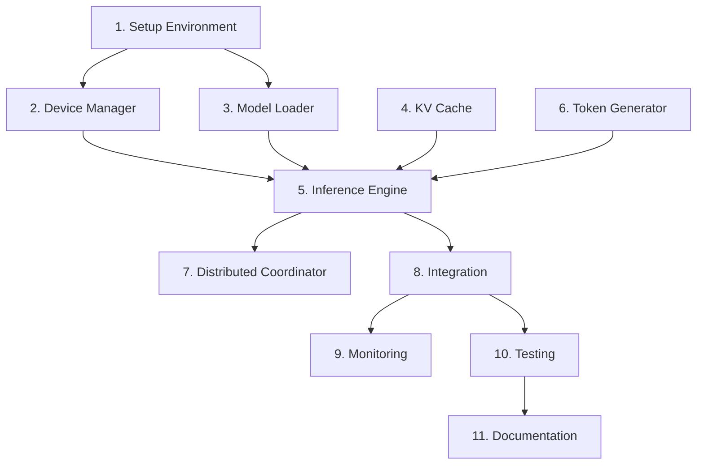

# Implementation Tasks: Intel Arc GPU Support via PyTorch + IPEX

## Overview

This document outlines the implementation tasks for integrating Intel Arc GPU support into exo using PyTorch and Intel Extension for PyTorch (IPEX). Tasks are organized by priority and dependencies.

## Task List

- [x] 1. Set up development environment and dependencies
  - Set up NixOS development environment with PyTorch and IPEX
  - Verify Intel Arc GPU detection and basic PyTorch operations
  - Create test harness for validating GPU operations
  - _Requirements: 7.1, 7.2, 7.3_

- [x] 1.1 Configure NixOS packages
  - Add PyTorch 2.0+ to flake.nix dependencies
  - Add Intel Extension for PyTorch (IPEX) 2.0+
  - Add intel-compute-runtime and level-zero drivers
  - Add HuggingFace transformers and safetensors libraries
  - _Requirements: 7.1_

- [x] 1.2 Create basic GPU detection script
  - Write Python script to detect Intel Arc via torch.xpu
  - Test XPU device enumeration and properties
  - Verify IPEX import and initialization
  - Log device capabilities (memory, compute units)
  - _Requirements: 1.1_

- [x] 1.3 Validate IPEX functionality
  - Create simple tensor operations on XPU device
  - Test IPEX optimization on dummy model
  - Benchmark basic operations (matmul, softmax)
  - Verify bfloat16 support
  - _Requirements: 8.1_

- [x] 2. Implement Device Manager component
  - Create device detection and selection logic
  - Implement fallback mechanism for device failures
  - Add device memory monitoring
  - Provide device abstraction layer
  - _Requirements: 1.1, 1.2, 1.3, 1.4, 1.5_

- [x] 2.1 Create DeviceManager class
  - Implement detect_devices() method
  - Implement select_device() with priority logic
  - Add get_device_memory() for memory queries
  - Add is_device_available() for health checks
  - _Requirements: 1.1_

- [x] 2.2 Implement Intel Arc detection
  - Use torch.xpu.is_available() for detection
  - Enumerate XPU devices with torch.xpu.device_count()
  - Query device properties with torch.xpu.get_device_properties()
  - Select device with most free memory
  - _Requirements: 1.2_

- [x] 2.3 Implement fallback logic
  - Check for NVIDIA GPU if Intel Arc unavailable
  - Fall back to CPU if no GPU available
  - Log all fallback decisions at INFO level
  - Provide clear error messages for device issues
  - _Requirements: 1.4, 10.1_

- [x] 2.4 Add device monitoring
  - Track GPU memory usage per device
  - Monitor device temperature and utilization
  - Implement health check for device availability
  - Log device statistics at DEBUG level
  - _Requirements: 9.2_

- [x] 3. Implement Model Loader component
  - Create model loading from HuggingFace
  - Apply IPEX optimizations to loaded models
  - Support model sharding for distributed inference
  - Validate model compatibility
  - _Requirements: 2.1, 2.2, 2.3, 2.4, 2.5_

- [x] 3.1 Create ModelLoader class
  - Implement load_model() async method
  - Support loading from HuggingFace hub
  - Support loading from local cache
  - Handle safetensors and PyTorch formats
  - _Requirements: 2.1_

- [x] 3.2 Implement IPEX optimization
  - Apply ipex.optimize() to loaded models
  - Configure bfloat16 precision
  - Enable weights prepacking
  - Test optimization impact on performance
  - _Requirements: 2.2, 8.1_

- [x] 3.3 Add model sharding support
  - Extract layer ranges based on Shard metadata
  - Create TransformerShard wrapper class
  - Validate shard boundaries
  - Test with multi-node setup
  - _Requirements: 5.2_

- [x] 3.4 Implement model validation
  - Check model architecture compatibility
  - Verify required model components exist
  - Validate tensor shapes and dtypes
  - Provide detailed error messages for incompatibilities
  - _Requirements: 2.4_

- [ ] 4. Implement KV Cache Manager
  - Create cache data structures
  - Implement LRU eviction policy
  - Add memory monitoring and limits
  - Provide cache statistics
  - _Requirements: 4.1, 4.2, 4.3, 4.4, 4.5_

- [ ] 4.1 Create KVCacheManager class
  - Define KVCache dataclass structure
  - Implement get_cache() method
  - Implement create_cache() method
  - Implement update_cache() method
  - Implement evict_cache() method
  - _Requirements: 4.1_

- [ ] 4.2 Implement LRU eviction
  - Track last access time per cache entry
  - Sort caches by access time
  - Evict oldest when memory threshold exceeded
  - Never evict active request caches
  - _Requirements: 4.2_

- [ ] 4.3 Add memory monitoring
  - Track total cache memory usage
  - Set threshold at 80% of available GPU memory
  - Trigger eviction when threshold exceeded
  - Log eviction events at INFO level
  - _Requirements: 4.2, 9.2_

- [ ] 4.4 Implement cache statistics
  - Track cache hit/miss rates
  - Monitor cache memory usage
  - Count active caches
  - Provide get_stats() method
  - _Requirements: 4.5, 9.2_

- [ ] 5. Implement PyTorchInferenceEngine
  - Create main inference engine class
  - Implement model lifecycle management
  - Add async inference execution
  - Integrate all components
  - _Requirements: 3.1, 3.2, 3.3, 3.4, 3.5_

- [ ] 5.1 Create PyTorchInferenceEngine class
  - Implement InferenceEngine protocol
  - Add __init__ with shard_downloader
  - Initialize device_manager, model_loader, cache_manager
  - Set up logging
  - _Requirements: 3.1_

- [ ] 5.2 Implement ensure_shard() method
  - Check if shard already loaded
  - Download model if needed
  - Load and optimize model
  - Cache model instance
  - _Requirements: 2.1, 2.2_

- [ ] 5.3 Implement infer_tensor() method
  - Accept request_id, shard, input_data, inference_state
  - Ensure correct shard is loaded
  - Get or create KV cache for request
  - Execute forward pass with cache
  - Return output and updated state
  - _Requirements: 3.2, 4.1_

- [ ] 5.4 Implement sample() method
  - Accept logits, temperature, top_p parameters
  - Apply temperature scaling
  - Implement top-p (nucleus) sampling
  - Return sampled token
  - _Requirements: 3.3_

- [ ] 5.5 Add error handling
  - Catch and handle device errors
  - Catch and handle model errors
  - Catch and handle inference errors
  - Provide meaningful error messages
  - _Requirements: 10.1, 10.2, 10.4_

- [ ] 6. Implement Token Generator
  - Create sampling logic
  - Support temperature, top-p, top-k
  - Handle special tokens
  - Optimize for performance
  - _Requirements: 3.3_

- [ ] 6.1 Create TokenGenerator class
  - Implement sample() method
  - Support temperature parameter
  - Support top_p parameter
  - Support top_k parameter
  - _Requirements: 3.3_

- [ ] 6.2 Implement sampling algorithms
  - Apply temperature scaling to logits
  - Implement top-k filtering
  - Implement top-p (nucleus) filtering
  - Sample from filtered distribution
  - _Requirements: 3.3_

- [ ] 6.3 Handle special tokens
  - Detect EOS (end of sequence) token
  - Handle PAD tokens appropriately
  - Support custom stop sequences
  - Return token with metadata
  - _Requirements: 6.3_

- [ ] 7. Implement Distributed Coordinator
  - Create ring topology management
  - Implement activation forwarding
  - Add node failure handling
  - Support load balancing
  - _Requirements: 5.1, 5.2, 5.3, 5.4, 5.5_

- [ ] 7.1 Create DistributedCoordinator class
  - Initialize with node configuration
  - Build ring topology from node list
  - Implement get_next_node() method
  - Track node health status
  - _Requirements: 5.1_

- [ ] 7.2 Implement activation forwarding
  - Serialize tensors for network transfer
  - Send activations to next node via gRPC
  - Receive activations from previous node
  - Deserialize and validate received tensors
  - _Requirements: 5.3_

- [ ] 7.3 Add node failure handling
  - Detect node failures via heartbeat
  - Redistribute work to remaining nodes
  - Update ring topology dynamically
  - Log topology changes at WARN level
  - _Requirements: 5.4, 10.3_

- [ ] 7.4 Implement load balancing
  - Monitor per-node load
  - Adjust shard assignments based on load
  - Rebalance when nodes join/leave
  - Optimize for minimal data transfer
  - _Requirements: 5.5_

- [ ] 8. Integrate with exo architecture
  - Add PyTorch backend to engine factory
  - Update model registry
  - Configure NixOS module
  - Test with existing exo components
  - _Requirements: 6.1, 6.2, 6.3, 6.4, 6.5_

- [ ] 8.1 Update inference engine factory
  - Add "pytorch-ipex" to engine_classes dict
  - Implement lazy import for PyTorchInferenceEngine
  - Add IPEX debug level configuration
  - Test engine selection logic
  - _Requirements: 6.1_

- [ ] 8.2 Update model registry
  - Add PyTorch-compatible model repos
  - Map model IDs to HuggingFace repos
  - Specify layer counts for each model
  - Test model resolution
  - _Requirements: 2.1_

- [ ] 8.3 Create NixOS module
  - Define module options for PyTorch backend
  - Add systemd service configuration
  - Set required environment variables
  - Provide example configuration
  - _Requirements: 7.4, 7.5_

- [ ] 8.4 Test API compatibility
  - Verify OpenAI chat completions format
  - Test streaming responses
  - Test non-streaming responses
  - Validate error response format
  - _Requirements: 6.1, 6.2, 6.3, 6.4, 6.5_

- [ ] 9. Implement monitoring and logging
  - Add structured logging
  - Expose performance metrics
  - Integrate with systemd journal
  - Create health check endpoints
  - _Requirements: 9.1, 9.2, 9.3, 9.4, 9.5_

- [ ] 9.1 Configure structured logging
  - Use loguru for structured logs
  - Log in JSON format
  - Set appropriate log levels
  - Include context in all log messages
  - _Requirements: 9.1, 9.4_

- [ ] 9.2 Add performance metrics
  - Track inference latency per request
  - Monitor GPU utilization
  - Track memory usage
  - Count requests per second
  - _Requirements: 9.2, 9.3_

- [ ] 9.3 Integrate with systemd journal
  - Configure journal logging
  - Add service metadata to logs
  - Test log retrieval with journalctl
  - Verify log rotation
  - _Requirements: 9.5_

- [ ] 9.4 Create health check endpoints
  - Add /health endpoint to API
  - Check device availability
  - Check model loading status
  - Return detailed health status
  - _Requirements: 10.5_

- [ ] 10. Testing and validation
  - Write unit tests for all components
  - Create integration tests
  - Perform performance benchmarking
  - Validate on target hardware
  - _Requirements: 8.1, 8.2, 8.3_

- [ ] 10.1 Write unit tests
  - Test DeviceManager device selection
  - Test ModelLoader model loading
  - Test KVCacheManager cache operations
  - Test TokenGenerator sampling
  - Achieve >80% code coverage
  - _Requirements: 8.1_

- [ ] 10.2 Create integration tests
  - Test end-to-end inference pipeline
  - Test multi-node distributed inference
  - Test error handling and recovery
  - Test API compatibility
  - _Requirements: 8.2_

- [ ] 10.3 Perform benchmarking
  - Measure inference latency
  - Measure throughput (tokens/sec)
  - Profile memory usage
  - Compare with baseline performance
  - _Requirements: 8.3_

- [ ] 10.4 Validate on Intel Arc hardware
  - Test on actual Intel Arc GPU
  - Verify IPEX optimizations work
  - Test with various model sizes
  - Document any hardware-specific issues
  - _Requirements: 1.1, 2.2, 8.1_

- [ ] 11. Documentation and deployment
  - Write user documentation
  - Create deployment guide
  - Document troubleshooting steps
  - Prepare release notes
  - _Requirements: All_

- [ ] 11.1 Write user documentation
  - Document installation steps
  - Explain configuration options
  - Provide usage examples
  - Include API reference
  - _Requirements: 7.4, 7.5_

- [ ] 11.2 Create deployment guide
  - Document NixOS deployment
  - Explain multi-node setup
  - Provide configuration templates
  - Include troubleshooting section
  - _Requirements: 7.1, 7.2, 7.3, 7.4, 7.5_

- [ ] 11.3 Document known issues
  - List hardware compatibility issues
  - Document performance limitations
  - Explain workarounds
  - Provide links to upstream issues
  - _Requirements: All_

- [ ] 11.4 Prepare release notes
  - Summarize new features
  - List breaking changes
  - Document migration path from tinygrad
  - Include performance benchmarks
  - _Requirements: All_

## Task Dependencies

## Priority Levels

### P0 (Critical - Must Have)
- Tasks 1, 2, 3, 4, 5, 6, 8, 10

### P1 (High - Should Have)
- Tasks 7, 9

### P2 (Medium - Nice to Have)
- Task 11

## Estimated Timeline

- Phase 1 (Setup & Core Components): 2-3 weeks
  - Tasks 1-6

- Phase 2 (Integration & Distribution): 1-2 weeks
  - Tasks 7-8

- Phase 3 (Testing & Polish): 1-2 weeks
  - Tasks 9-11

Total: 4-7 weeks

## Success Criteria

- [ ] Intel Arc GPU successfully detected and selected
- [ ] Llama-3.2-3B model loads and runs on Intel Arc
- [ ] Inference achieves >15 tokens/sec on Intel Arc
- [ ] Multi-node distributed inference works correctly
- [ ] API maintains OpenAI compatibility
- [ ] All tests pass with >80% coverage
- [ ] System runs stably on NixOS
- [ ] Documentation is complete and accurate

## Notes

- Focus on getting single-node inference working first before tackling distributed
- Use small models (1B-3B) for initial testing
- Benchmark against CPU baseline to validate GPU acceleration
- Test fallback mechanisms thoroughly
- Document all Intel Arc-specific quirks and workarounds
