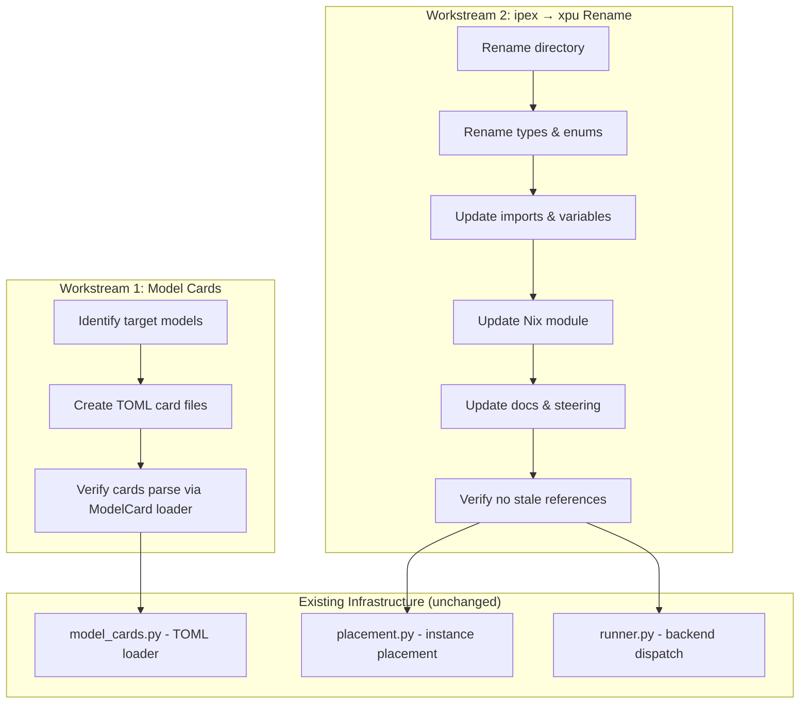
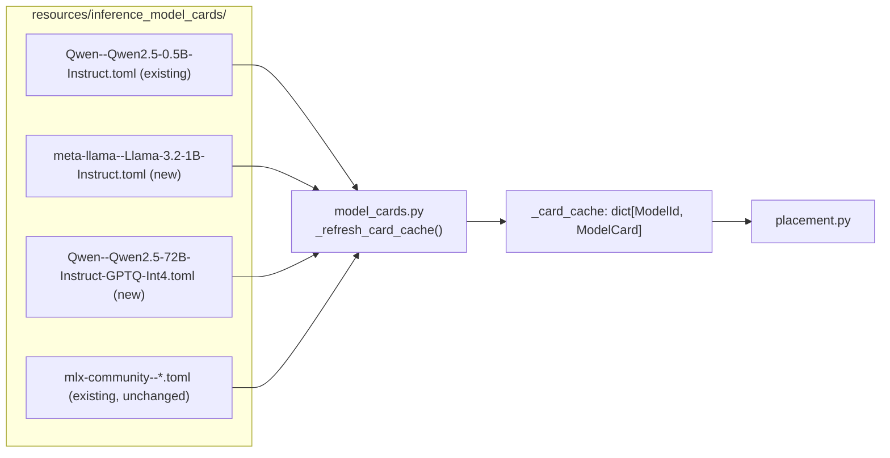

# Design Document: PyTorch Model Cards & ipex → xpu Rename

## Overview

This design covers two coupled changes to the exo distributed inference system:

1. **PyTorch-compatible model cards** — Adding TOML model card files for standard HuggingFace safetensors models that work with PyTorch on Linux (NVIDIA CUDA and Intel XPU). The existing model card loader (`model_cards.py`) already handles these cards — no loader changes are needed. The cards use the same schema as existing MLX cards; the only difference is the `model_id` points to a standard HuggingFace repo (e.g., `Qwen/Qwen2.5-7B-Instruct`) rather than an `mlx-community/` repo.

2. **Codebase-wide rename of `ipex` → `xpu`** — Intel Extension for PyTorch (IPEX) is discontinued. The PyTorch XPU backend now uses native `torch.xpu` (PyTorch 2.11+). All references to "ipex" in directory names, class names, enum values, variable names, Nix module options, environment variables, log messages, documentation, and steering files must be renamed to "xpu".

### Design Decisions

**Decision 1: No `backend` field on ModelCard.** Model cards remain backend-agnostic. The runner already determines the backend from the `InstanceMeta` enum (MlxRing, PyTorchXPURing, etc.), not from the model card. Adding a backend field would create redundancy and coupling. A card for `Qwen/Qwen2.5-7B-Instruct` works on both MLX (if someone builds MLX weights) and PyTorch — the card just describes the model's metadata.

**Decision 2: No GPTQ dependency yet.** Large GPTQ-quantized models (e.g., `Qwen2.5-72B-Instruct-GPTQ-Int4`) require `auto-gptq` or `optimum` libraries. Adding these as dependencies is out of scope for this spec. We will add model cards for GPTQ models with the `quantization` field set appropriately, but actual GPTQ inference support is a separate concern. The cards serve as documentation of what models exist and their memory requirements for placement planning.

**Decision 3: Rename is mechanical but must be atomic.** The ipex → xpu rename touches ~15 files across Python source, Nix configs, docs, and steering files. All changes must be applied together to avoid broken imports. The event sourcing system uses Pydantic tagged unions with class names, so the enum value string `"PyTorchIPEXRing"` must change to `"PyTorchXPURing"` — this is safe because there is no persisted state between deployments (the cluster rebuilds state on startup).

## Architecture

The changes are organized into two independent workstreams that can be executed in either order:



### Model Card Architecture

Model cards are static TOML files discovered at startup. The loader scans `CARD_SEARCH_PATH` directories, parses each `.toml` file into a `ModelCard` Pydantic model, and caches them. No code changes to the loader are needed — only new TOML files.



### Rename Architecture

The rename affects these layers:

| Layer | Before | After |
|-------|--------|-------|
| Directory | `src/exo/worker/engines/pytorch_ipex/` | `src/exo/worker/engines/pytorch_xpu/` |
| Enum value | `InstanceMeta.PyTorchIPEXRing` | `InstanceMeta.PyTorchXPURing` |
| Instance class | `PyTorchIPEXRingInstance` | `PyTorchXPURingInstance` |
| Runner variable | `is_pytorch_ipex` | `is_pytorch_xpu` |
| Runner backend_type | `"pytorch_ipex"` | `"pytorch_xpu"` |
| Env var | `EXO_PYTORCH_IPEX_ENABLED` | `EXO_PYTORCH_XPU_ENABLED` |
| Env var (removed) | `IPEX_TILE_AS_DEVICE` | *(removed)* |
| Nix option | `services.exo.intel.pytorch_ipex` | `services.exo.intel.pytorch_xpu` |
| Nix file | `nix/ipex-xpu.nix` | `nix/xpu.nix` (or removed) |
| Steering file | `pytorch-ipex-status.md` | `pytorch-xpu-status.md` |
| Example config | `docs/examples/nixos-pytorch-ipex-config.nix` | `docs/examples/nixos-pytorch-xpu-config.nix` |

## Components and Interfaces

### 1. New Model Card TOML Files

New TOML files added to `resources/inference_model_cards/`. Each follows the existing schema exactly.

**Small models (< 4 GiB) — single-node testing:**

| Model | File | Storage | Layers | Hidden | Tensor |
|-------|------|---------|--------|--------|--------|
| Qwen2.5-0.5B-Instruct | *(exists)* | 494 MiB | 24 | 896 | false |
| Qwen2.5-1.5B-Instruct | *(exists)* | 1.5 GiB | 28 | 1536 | false |
| Qwen3.5-2B | **new** | ~4 GiB | 36 | 2560 | false |
| Llama-3.2-1B-Instruct | **new** | ~2.5 GiB | 16 | 2048 | true |
| Llama-3.2-3B-Instruct | *(exists)* | 3.2 GiB | 28 | 3072 | true |

**Medium models (4–16 GiB) — fits gremlin-1 NVIDIA GPU:**

| Model | File | Storage | Layers | Hidden | Tensor |
|-------|------|---------|--------|--------|--------|
| Qwen2.5-7B-Instruct | *(exists)* | 7.6 GiB | 28 | 3584 | false |
| Qwen3.5-4B | **new** | ~8 GiB | 36 | 3584 | false |
| Meta-Llama-3.1-8B-Instruct | *(exists)* | 8 GiB | 32 | 4096 | true |
| Mistral-7B-Instruct-v0.3 | *(exists)* | 7 GiB | 32 | 4096 | false |

**Large models (16–100 GiB) — distributed across gremlin cluster:**

| Model | File | Storage | Layers | Hidden | Tensor | Notes |
|-------|------|---------|--------|--------|--------|-------|
| Qwen3.6-27B | **new** | ~54 GiB | 64 | 5120 | false | Dense 27B, fits 3-4 nodes |
| Qwen3.6-35B-A3B | **new** | ~70 GiB | 40 | 2048 | false | MoE 35B (3B active), fits 4 nodes |
| Qwen3.5-397B-A17B (GPTQ-Int4) | **new** | ~100 GiB | 94 | 6400 | false | MoE 397B, tight fit on full cluster |
| GLM-4.7-Flash | **new** | ~60 GiB | 40 | 3584 | false | MoE 30B-A3B, fits 3-4 nodes |
| GLM-4.7 | **new** | ~700 GiB | 62 | 6144 | true | 340B MoE — too large for cluster, card for reference |
| Llama-3.3-70B-Instruct-GPTQ-Int4 | **new** | ~36 GiB | 80 | 8192 | true | Fits 3-4 nodes |
| Meta-Llama-3.1-70B-Instruct | *(exists)* | 70 GiB | 80 | 8192 | true | Needs full cluster |

**Note on GLM-5.1:** GLM-5.1 is ~754B parameters (~1.4 TiB in bf16). Even quantized to 4-bit it's ~460 GiB — far exceeds the cluster's ~105 GiB budget. No card is added for it. The GLM-4.7-Flash (30B-A3B MoE) is the largest GLM model that fits.

**Note on Qwen3.6-27B:** This is a dense 27B model using the new Gated DeltaNet + Gated Attention hybrid architecture. At bf16 it's ~54 GiB, which fits across 3-4 gremlin nodes via pipeline parallelism.

**Note on Qwen3.6-35B-A3B:** This is a MoE model with 35B total / 3B active parameters. Despite the large total parameter count, the full weights are ~70 GiB in bf16, fitting on the full cluster. During inference only 3B parameters are active per token, so memory bandwidth requirements are modest.

**TOML format** (identical to existing cards):

```toml
model_id = "Qwen/Qwen3.6-27B"
n_layers = 64
hidden_size = 5120
supports_tensor = false
tasks = ["TextGeneration"]
family = "qwen"
quantization = ""
base_model = "Qwen3.6 27B"
capabilities = ["text", "thinking"]

[storage_size]
in_bytes = 57982058496
```

For GPTQ models, `quantization = "GPTQ-Int4"` and `model_id` points to the GPTQ repo.

### 2. Renamed Python Modules

**`src/exo/worker/engines/pytorch_xpu/`** (renamed from `pytorch_ipex/`)

All files within the directory retain their names and internal logic. Only the directory name and import paths change:

- `__init__.py`
- `gpu_detector.py`
- `distributed.py`
- `generator.py`
- `model_loader.py`
- `warmup.py`
- `device_manager.py`
- `kv_cache_manager.py`
- `token_generator.py`
- `pytorch_ipex_backend.py` → consider renaming to `pytorch_xpu_backend.py`
- `errors.py`, `health_check.py`, `logging_config.py`, `performance_metrics.py`, `systemd_logging.py`, `validate_xpu.py`
- `tests/` subdirectory
- Various `test_*_simple.py` files
- `README.md`, `USAGE.md`, `USAGE_TOKEN_GENERATOR.md`

### 3. Updated Type Definitions (`instances.py`)

```python
class InstanceMeta(str, Enum):
    MlxRing = "MlxRing"
    MlxJaccl = "MlxJaccl"
    TinygradRing = "TinygradRing"
    PyTorchXPURing = "PyTorchXPURing"  # was PyTorchIPEXRing

class PyTorchXPURingInstance(BaseInstance):  # was PyTorchIPEXRingInstance
    hosts_by_node: dict[NodeId, list[Host]]
    ephemeral_port: int

Instance = MlxRingInstance | MlxJacclInstance | TinygradRingInstance | PyTorchXPURingInstance
```

### 4. Updated Runner (`runner.py` and `bootstrap.py`)

The runner's backend detection logic changes variable names and import paths:

```python
# bootstrap.py
from exo.shared.types.worker.instances import PyTorchXPURingInstance
if isinstance(bound_instance.instance, PyTorchXPURingInstance):
    os.environ["EXO_PYTORCH_XPU_ENABLED"] = "true"
    # ... (no more IPEX_TILE_AS_DEVICE)

# runner.py
is_pytorch_xpu = isinstance(instance, PyTorchXPURingInstance) or ...
if is_pytorch_xpu:
    backend_type = "pytorch_xpu"
    from exo.worker.engines.pytorch_xpu.generator import pytorch_ipex_generate
    from exo.worker.engines.pytorch_xpu.model_loader import ModelLoader
    from exo.worker.engines.pytorch_xpu.warmup import warmup_pytorch_ipex_inference
```

Note: The function names within the pytorch_xpu modules (like `pytorch_ipex_generate`, `warmup_pytorch_ipex_inference`) may also be renamed for consistency, but this is lower priority since they're internal to the module.

### 5. Updated NixOS Module (`flake.nix`)

```nix
pytorch_xpu = {
  enable = lib.mkEnableOption "PyTorch XPU backend for exo" // {
    default = false;
  };
  preferredBackend = lib.mkOption {
    type = lib.types.bool;
    default = false;
    description = "Use PyTorch XPU as the preferred backend over tinygrad";
  };
};

# Environment variables
EXO_PYTORCH_XPU_ENABLED = lib.mkIf config.services.exo.intel.pytorch_xpu.enable "true";
PYTORCH_ENABLE_XPU = lib.mkIf config.services.exo.intel.pytorch_xpu.enable "1";
# IPEX_TILE_AS_DEVICE removed entirely
```

### 6. Updated Placement (`placement.py`)

Only the type references change:

```python
from exo.shared.types.worker.instances import (
    ...
    PyTorchXPURingInstance,  # was PyTorchIPEXRingInstance
)

case InstanceMeta.PyTorchXPURing:  # was PyTorchIPEXRing
    ...
    target_instances[instance_id] = PyTorchXPURingInstance(...)
```

## Data Models

### ModelCard (unchanged)

The `ModelCard` Pydantic model is not modified. New TOML files conform to the existing schema:

```python
class ModelCard(CamelCaseModel):
    model_id: ModelId
    storage_size: Memory
    n_layers: PositiveInt
    hidden_size: PositiveInt
    supports_tensor: bool
    tasks: list[ModelTask]
    components: list[ComponentInfo] | None = None
    family: str = ""
    quantization: str = ""
    base_model: str = ""
    capabilities: list[str] = []
    uses_cfg: bool = False
```

### New Model Card Data

**Qwen3.5-2B** (new card — small, single-node testing):
- `model_id`: `"Qwen/Qwen3.5-2B"`
- `storage_size.in_bytes`: ~4,000,000,000 (~3.7 GiB)
- `n_layers`: 36
- `hidden_size`: 2560
- `supports_tensor`: false
- `family`: `"qwen"`
- `quantization`: `""`
- `capabilities`: `["text", "thinking"]`

**Qwen3.5-4B** (new card — medium, fits gremlin-1 GPU):
- `model_id`: `"Qwen/Qwen3.5-4B"`
- `storage_size.in_bytes`: ~8,000,000,000 (~7.5 GiB)
- `n_layers`: 36
- `hidden_size`: 3584
- `supports_tensor`: false
- `family`: `"qwen"`
- `quantization`: `""`
- `capabilities`: `["text", "thinking"]`

**Llama-3.2-1B-Instruct** (new card — small):
- `model_id`: `"meta-llama/Llama-3.2-1B-Instruct"`
- `storage_size.in_bytes`: ~2,470,000,000 (2.3 GiB)
- `n_layers`: 16
- `hidden_size`: 2048
- `supports_tensor`: true (LlamaForCausalLM is in the supported list)
- `family`: `"llama"`
- `quantization`: `""`

**Qwen3.6-27B** (new card — large, distributed):
- `model_id`: `"Qwen/Qwen3.6-27B"`
- `storage_size.in_bytes`: ~57,982,058,496 (~54 GiB)
- `n_layers`: 64
- `hidden_size`: 5120
- `supports_tensor`: false
- `family`: `"qwen"`
- `quantization`: `""`
- `capabilities`: `["text", "thinking"]`
- Architecture: Hybrid Gated DeltaNet + Gated Attention (dense 27B)

**Qwen3.6-35B-A3B** (new card — large MoE, distributed):
- `model_id`: `"Qwen/Qwen3.6-35B-A3B"`
- `storage_size.in_bytes`: ~70,000,000,000 (~65 GiB)
- `n_layers`: 40
- `hidden_size`: 2048
- `supports_tensor`: false
- `family`: `"qwen"`
- `quantization`: `""`
- `capabilities`: `["text", "thinking"]`
- Architecture: MoE with 35B total / 3B active parameters

**GLM-4.7-Flash** (new card — large MoE, distributed):
- `model_id`: `"zai-org/GLM-4.7-Flash"`
- `storage_size.in_bytes`: ~60,000,000,000 (~56 GiB)
- `n_layers`: 40
- `hidden_size`: 3584
- `supports_tensor`: false
- `family`: `"glm"`
- `quantization`: `""`
- `capabilities`: `["text", "thinking"]`
- Architecture: MoE 30B-A3B

**Llama-3.3-70B-Instruct-GPTQ-Int4** (new card — large quantized, distributed):
- `model_id`: `"hugging-quants/Meta-Llama-3.3-70B-Instruct-GPTQ-INT4"`
- `storage_size.in_bytes`: ~36,000,000,000 (~33.5 GiB)
- `n_layers`: 80
- `hidden_size`: 8192
- `supports_tensor`: true
- `family`: `"llama"`
- `quantization`: `"GPTQ-Int4"`
- `supports_tensor`: false (Qwen2ForCausalLM not in supported list)
- `family`: `"qwen"`
- `quantization`: `"GPTQ-Int4"`

### InstanceMeta Enum (modified)

```python
class InstanceMeta(str, Enum):
    MlxRing = "MlxRing"
    MlxJaccl = "MlxJaccl"
    TinygradRing = "TinygradRing"
    PyTorchXPURing = "PyTorchXPURing"  # renamed from PyTorchIPEXRing
```

### Instance Union (modified)

```python
Instance = MlxRingInstance | MlxJacclInstance | TinygradRingInstance | PyTorchXPURingInstance
```


## Correctness Properties

*A property is a characteristic or behavior that should hold true across all valid executions of a system — essentially, a formal statement about what the system should do. Properties serve as the bridge between human-readable specifications and machine-verifiable correctness guarantees.*

Most of this spec is mechanical (adding static TOML files, renaming identifiers). The one area with meaningful input variation is the model card TOML serialization/deserialization round-trip.

### Property 1: ModelCard TOML round-trip

*For any* valid `ModelCard` instance (with arbitrary `model_id`, `storage_size`, `n_layers`, `hidden_size`, `supports_tensor`, `tasks`, `family`, `quantization`, `base_model`, and `capabilities`), serializing it via `ModelCard.save()` to a TOML file and then re-parsing via `ModelCard.load_from_path()` SHALL produce a `ModelCard` that is equivalent to the original.

This property subsumes several acceptance criteria:
- **1.1**: If the round-trip works, the loader discovers and parses the card correctly.
- **5.1**: If the round-trip works, all required fields are present (Pydantic validation would fail otherwise).
- **5.3**: If the round-trip works, the `[storage_size]` table format is correct.
- **5.4**: This is the explicit round-trip requirement.

**Validates: Requirements 1.1, 5.1, 5.3, 5.4**

## Error Handling

### Model Card Parsing Errors

The existing `_refresh_card_cache()` in `model_cards.py` already catches `ValidationError` and `TOMLKitError` and silently skips invalid cards. This behavior is unchanged. If a new PyTorch card has a typo or missing field, it will be silently skipped during cache refresh — the same as any other malformed card.

### Rename-Related Import Errors

If the rename is incomplete (e.g., a file still imports from `exo.worker.engines.pytorch_ipex`), Python will raise `ModuleNotFoundError` at import time. This will surface immediately when the runner process starts, causing a `RunnerFailed` event. The stale-reference grep tests (Requirements 6.4, 8.4, 11.3, 11.4) catch this at test time before deployment.

### GPTQ Model Loading Errors

GPTQ-quantized model cards will parse correctly (they're just TOML metadata), but attempting to actually load and run inference on a GPTQ model will fail if `auto-gptq` or `optimum` is not installed. This is expected — the cards document what models exist and their memory footprint for placement planning. Actual GPTQ inference support is out of scope.

### Placement Rejection for Oversized Models

If a model card's `storage_size` exceeds the cluster's total available memory, `filter_cycles_by_memory()` in `placement_utils.py` will return an empty list, and `place_instance()` will raise `ValueError("No cycles found with sufficient memory")`. This is existing behavior and requires no changes.

## Testing Strategy

### Property-Based Tests

This spec has one property suitable for property-based testing:

- **ModelCard TOML round-trip** (Property 1): Use Hypothesis to generate random valid `ModelCard` instances and verify the save→load round-trip preserves all fields. Minimum 100 iterations. The generator should produce:
  - Random `model_id` strings (with `/` separator for org/model format)
  - Random `storage_size` (positive integers)
  - Random `n_layers` and `hidden_size` (positive integers)
  - Random `supports_tensor` (bool)
  - Random `tasks` subsets of `ModelTask`
  - Random `family`, `quantization`, `base_model` strings
  - Random `capabilities` lists

**Library**: Hypothesis (already in use — `.hypothesis/` directory exists in workspace)

**Tag format**: `Feature: pytorch-model-cards, Property 1: ModelCard TOML round-trip`

**Configuration**: Minimum 100 examples per test run.

### Unit Tests (Example-Based)

**Model card content verification:**
- Load each new PyTorch card file and verify it produces a valid `ModelCard` without `ValidationError`
- Verify small cards (< 4 GiB) have `quantization == ""` and `TextGeneration` in tasks
- Verify GPTQ cards have `quantization` set to the correct method string
- Verify `supports_tensor` matches the model architecture (true for LlamaForCausalLM, false for Qwen2ForCausalLM)
- Verify all expected card files exist (Requirement 1.3, 2.2, 3.1, 3.2)
- Verify MLX cards still load correctly alongside PyTorch cards (Requirement 4.2)

**Stale reference detection:**
- Grep `src/` for `"pytorch_ipex"` — assert zero matches (excluding the test itself)
- Grep `src/` for `"PyTorchIPEX"` — assert zero matches
- Verify `InstanceMeta.PyTorchXPURing` exists
- Verify `PyTorchXPURingInstance` is importable from `exo.shared.types.worker.instances`
- Verify runner.py uses `is_pytorch_xpu` variable name
- Verify bootstrap.py sets `EXO_PYTORCH_XPU_ENABLED` (not `EXO_PYTORCH_IPEX_ENABLED`)

**Nix configuration verification:**
- Grep `flake.nix` for `pytorch_ipex` — assert zero matches
- Grep `flake.nix` for `IPEX_TILE_AS_DEVICE` — assert zero matches
- Verify `pytorch_xpu` option exists in flake.nix

### Integration Tests

- Run the existing 128 spec tests from the distributed-gpu-sharding spec after the rename — all should pass with only import path and type name changes
- Verify `nix/verify-gpu-on-startup.py` imports from `exo.worker.engines.pytorch_xpu.gpu_detector`

### What Is NOT Tested with PBT

The rename workstream (Requirements 6–11) is entirely mechanical — it's a find-and-replace operation with no input variation. Property-based testing adds no value here. The stale-reference grep tests are the appropriate verification mechanism.

The model card content (Requirements 1–4) is static data authored by hand. The specific field values (n_layers, hidden_size, storage_size) are verified against known HuggingFace model configurations via example-based tests, not PBT.
