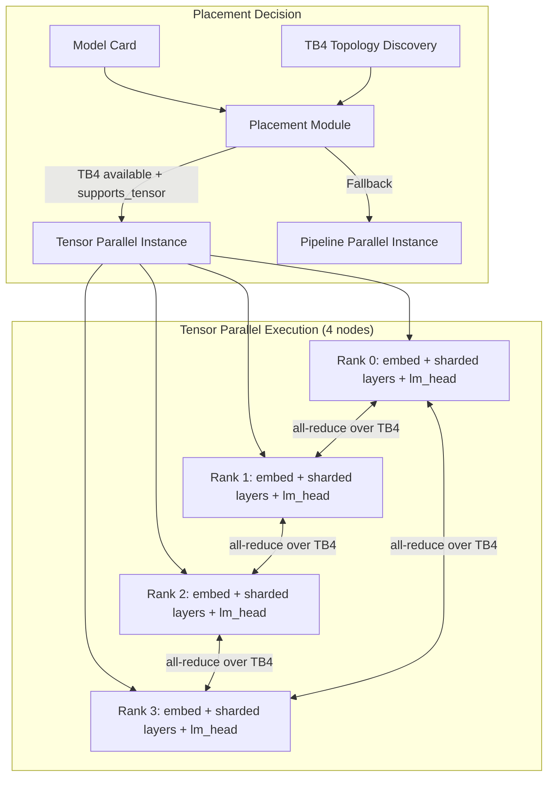
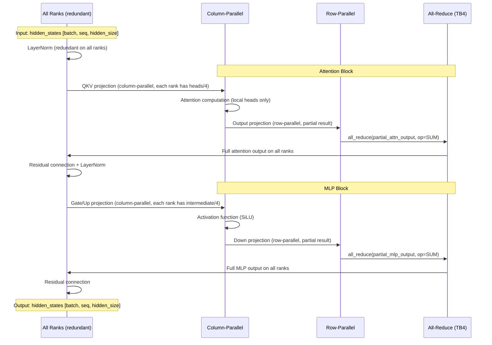
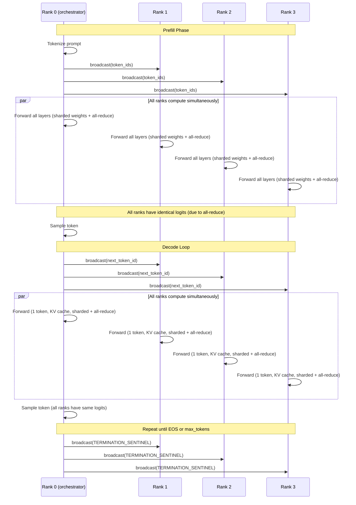
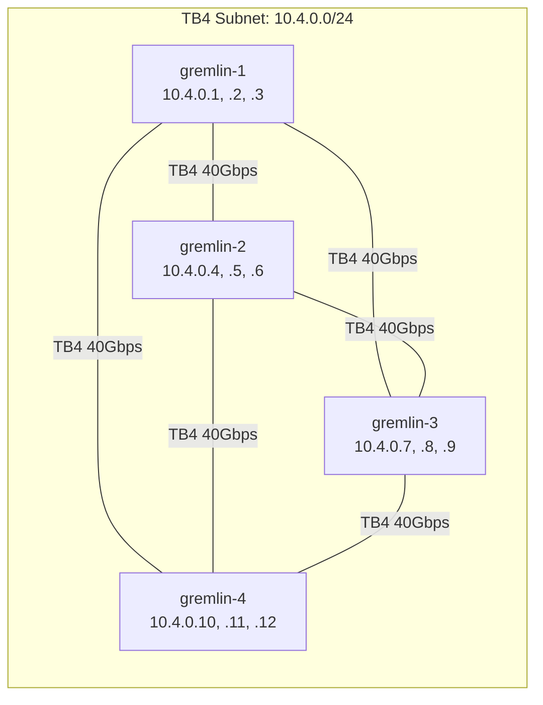

# Design Document: Tensor Parallelism for PyTorch XPU over Thunderbolt 4

## Overview

This design adds tensor parallelism to the existing pipeline-parallel PyTorch XPU inference system. Instead of splitting model layers across nodes (pipeline parallelism), tensor parallelism splits weight matrices *within* each layer across all 4 gremlin nodes. Every node processes the same token simultaneously and synchronizes via all-reduce after each parallel computation.

**Key architectural change:** Pipeline parallelism uses point-to-point `send_activation`/`recv_activation` (sequential). Tensor parallelism uses `torch.distributed.all_reduce` (collective, all nodes active simultaneously). The interconnect shifts from 2.5 Gbps ethernet to 40 Gbps Thunderbolt 4.

**Scope of changes:**
1. New NixOS module for TB4 networking (`nix/thunderbolt-net.nix`)
2. New topology discovery module (`src/exo/worker/engines/pytorch_xpu/tb4_topology.py`)
3. New tensor-parallel shard class (`src/exo/worker/engines/pytorch_xpu/tensor_parallel_shard.py`)
4. New tensor-parallel generation pipeline (`src/exo/worker/engines/pytorch_xpu/tensor_parallel_generator.py`)
5. Extended `distributed.py` with process group management for TB4
6. Extended runner dispatch for tensor-parallel instances
7. Model card updates for `supports_tensor` validation

**What stays the same:** The existing pipeline-parallel code (`distributed_generator.py`, `TransformerShard`) remains untouched. Tensor parallelism is a parallel code path selected at instance placement time.

## Architecture

### System Overview



### Tensor-Parallel Forward Pass (Single Layer)



### Generation Pipeline (Tensor Parallel)



### TB4 Network Topology (Full Mesh)



## Components and Interfaces

### 1. TB4 Topology Discoverer

**File:** `src/exo/worker/engines/pytorch_xpu/tb4_topology.py`

Discovers which nodes are reachable over Thunderbolt 4 interfaces and determines the topology type.

```python
from dataclasses import dataclass
from typing import Literal

@dataclass(frozen=True)
class TB4Peer:
    """A peer node reachable over Thunderbolt 4."""
    node_ip: str          # TB4 subnet IP of the peer
    interface_name: str   # Local TB4 interface used to reach this peer
    bandwidth_gbps: float # Measured or theoretical bandwidth (40.0 for TB4)

@dataclass(frozen=True)
class TB4Topology:
    """Discovered Thunderbolt 4 topology for this node."""
    topology_type: Literal["mesh", "ring", "partial", "unavailable"]
    local_interfaces: list[str]        # TB4 interface names on this node
    local_ips: list[str]               # TB4 IPs assigned to this node
    peers: list[TB4Peer]               # Reachable peers
    all_node_ips: dict[str, list[str]] # node_hostname -> list of TB4 IPs
    
    @property
    def is_available(self) -> bool:
        """True if at least 2 nodes are reachable over TB4."""
        return self.topology_type != "unavailable"
    
    @property
    def world_size(self) -> int:
        """Number of nodes in the TB4 group (including self)."""
        return len(self.all_node_ips)

async def discover_tb4_topology(
    tb4_subnet: str = "10.4.0.0/24",
    expected_nodes: dict[str, list[str]] | None = None,
    probe_timeout_seconds: float = 2.0,
) -> TB4Topology:
    """
    Discover TB4 topology by probing configured subnet addresses.
    
    Args:
        tb4_subnet: The TB4 subnet to scan
        expected_nodes: Optional mapping of hostname -> expected TB4 IPs
        probe_timeout_seconds: Timeout for each reachability probe
    
    Returns:
        TB4Topology describing the discovered network
    """
    ...

def select_tb4_interface(topology: TB4Topology) -> str | None:
    """
    Select the best TB4 interface for GLOO_SOCKET_IFNAME.
    
    For mesh topology: any TB4 interface works (Gloo handles routing).
    For ring topology: select interface connected to the most peers.
    
    Returns None if TB4 is unavailable.
    """
    ...
```

### 2. Tensor-Parallel Process Group Manager

**File:** Extended in `src/exo/worker/engines/pytorch_xpu/distributed.py`

Adds tensor-parallel process group initialization alongside the existing pipeline-parallel support.

```python
@dataclass(frozen=True)
class TensorParallelGroupConfig:
    """Configuration for tensor-parallel process group over TB4."""
    rank: int
    world_size: int
    master_addr: str          # TB4 IP of rank 0
    master_port: int          # Ephemeral port for TP group
    tb4_interface_name: str   # Interface name for GLOO_SOCKET_IFNAME
    backend: Literal["gloo"] = "gloo"
    init_timeout_seconds: int = 60  # Shorter than ethernet (TB4 is local)
    allreduce_timeout_seconds: int = 30

def init_tensor_parallel_group(config: TensorParallelGroupConfig) -> None:
    """
    Initialize a Gloo process group for tensor parallelism over TB4.
    
    Sets GLOO_SOCKET_IFNAME to the TB4 interface so all collective
    operations route over the high-bandwidth TB4 links.
    
    After initialization, performs a verification all-reduce:
    sum of all rank IDs should equal world_size * (world_size - 1) / 2.
    """
    ...

def verify_tensor_parallel_group(world_size: int) -> bool:
    """
    Verify TP group connectivity with a test all-reduce.
    
    Each rank contributes its rank ID. The sum should equal
    world_size * (world_size - 1) / 2.
    
    Returns True if verification passes.
    """
    ...
```

### 3. TensorParallelShard

**File:** `src/exo/worker/engines/pytorch_xpu/tensor_parallel_shard.py`

The core component that holds sharded weights and executes the tensor-parallel forward pass with all-reduce synchronization.

```python
from dataclasses import dataclass
from typing import Any, Optional

@dataclass(frozen=True)
class TPShardConfig:
    """Configuration for tensor-parallel weight sharding."""
    rank: int
    world_size: int
    hidden_size: int          # 2560 for Qwen3.5-4B
    num_attention_heads: int  # 32 for Qwen3.5-4B
    head_dim: int             # 256 for Qwen3.5-4B (hidden_size * 2 / num_heads for GQA)
    intermediate_size: int    # MLP intermediate dimension
    num_key_value_heads: int  # For GQA models
    allreduce_timeout_seconds: int = 30

class TensorParallelShard:
    """
    Tensor-parallel model wrapper.
    
    Unlike TransformerShard (which holds a subset of layers),
    TensorParallelShard holds ALL layers but with sharded weights
    within each layer. Each rank holds:
    - Full embedding table (redundant)
    - 1/world_size of each attention head group
    - 1/world_size of each MLP intermediate dimension
    - Full layer norms (redundant)
    - Full lm_head (redundant) OR sharded lm_head with all-gather
    """
    
    def __init__(
        self,
        model: Any,
        config: TPShardConfig,
        device: str,
    ) -> None:
        """
        Initialize with sharded weights extracted from the full model.
        
        The model is loaded fully on CPU first, then only this rank's
        weight slices are moved to the target device. The rest is discarded.
        """
        ...
    
    def shard_weights(self, model: Any) -> None:
        """
        Extract this rank's portion of each weight matrix.
        
        For each transformer layer:
        - QKV weights: slice along output dim (heads_per_rank heads)
        - Attention output: slice along input dim (head_dim * heads_per_rank cols)
        - MLP gate/up: slice along output dim (intermediate_per_rank cols)
        - MLP down: slice along input dim (intermediate_per_rank cols)
        
        Biases are sliced correspondingly where present.
        """
        ...
    
    def forward(
        self,
        input_data: Any,
        attention_mask: Optional[Any] = None,
        past_key_values: Optional[Any] = None,
    ) -> tuple[Any, Optional[Any]]:
        """
        Tensor-parallel forward pass through all layers.
        
        For each layer:
        1. LayerNorm (redundant, all ranks compute same result)
        2. QKV projection with column-parallel weights → local attention
        3. Output projection with row-parallel weights → all_reduce
        4. Residual + LayerNorm (redundant)
        5. MLP gate/up with column-parallel weights → activation
        6. MLP down with row-parallel weights → all_reduce
        7. Residual
        
        Returns (logits_or_hidden_states, kv_cache)
        """
        ...
    
    def _column_parallel_linear(
        self, input: Any, weight: Any, bias: Optional[Any] = None
    ) -> Any:
        """F.linear with column-parallel weight shard. No communication needed."""
        ...
    
    def _row_parallel_linear(
        self, input: Any, weight: Any, bias: Optional[Any] = None
    ) -> Any:
        """F.linear with row-parallel weight shard, followed by all_reduce."""
        ...
    
    def _all_reduce(self, tensor: Any) -> Any:
        """
        In-place all-reduce (sum) over the tensor-parallel group.
        
        Uses torch.distributed.all_reduce with the TP process group.
        Raises RuntimeError with layer context on timeout.
        """
        ...
```

### 4. Tensor-Parallel Generation Pipeline

**File:** `src/exo/worker/engines/pytorch_xpu/tensor_parallel_generator.py`

Orchestrates autoregressive generation with tensor parallelism. Unlike pipeline parallelism where only rank 0 drives generation, here all ranks compute simultaneously and rank 0 handles token sampling.

```python
def tensor_parallel_generate(
    model: TensorParallelShard,
    tokenizer: Any,
    prompt: str,
    device: str,
    rank: int,
    world_size: int,
    max_tokens: int = 100,
    temperature: float = 1.0,
    top_k: int | None = None,
    top_p: float | None = None,
    model_id: str = "",
) -> Generator[GenerationResponse, None, None]:
    """
    Tensor-parallel generation (rank 0 only).
    
    All ranks execute the forward pass simultaneously via all-reduce.
    Rank 0 samples tokens and broadcasts to other ranks.
    """
    ...

def tensor_parallel_worker_loop(
    model: TensorParallelShard,
    device: str,
    rank: int,
    world_size: int,
) -> None:
    """
    Worker loop for non-rank-0 nodes in tensor-parallel generation.
    
    Receives token broadcasts from rank 0, executes forward pass
    (which includes all-reduce internally), and waits for next token.
    
    Much simpler than pipeline worker loop since all-reduce happens
    inside the forward pass — no explicit activation sending needed.
    """
    ...
```

### 5. NixOS Thunderbolt 4 Networking Module

**File:** `nix/thunderbolt-net.nix`

Declarative NixOS module for TB4 network configuration.

```nix
# Key options:
services.exo.thunderbolt = {
  enable = true;
  subnet = "10.4.0.0/24";
  nodeAssignments = {
    # hostname -> list of TB4 IPs (one per active port)
    "gremlin-1" = [ "10.4.0.1" "10.4.0.2" "10.4.0.3" ];
    "gremlin-2" = [ "10.4.0.4" "10.4.0.5" "10.4.0.6" ];
    "gremlin-3" = [ "10.4.0.7" "10.4.0.8" "10.4.0.9" ];
    "gremlin-4" = [ "10.4.0.10" "10.4.0.11" "10.4.0.12" ];
  };
  firewallPorts = { from = 49152; to = 65535; };  # Gloo ephemeral range
};
```

### 6. Extended Runner Dispatch

The runner's `ConnectToGroup` handler gains a new branch for tensor-parallel instances:

```python
# In runner.py, ConnectToGroup handler:
case ConnectToGroup() if isinstance(instance, TensorParallelInstance):
    # 1. Discover TB4 topology
    # 2. Select TB4 interface
    # 3. Initialize TP process group over TB4
    # 4. Verify with test all-reduce
    # 5. Transition to RunnerConnected
```

## Data Models

### Sharded Weight Layout

For Qwen3.5-4B with `world_size=4`:

| Component | Full Shape | Per-Rank Shape | Split Dimension |
|-----------|-----------|----------------|-----------------|
| `embed_tokens` | (151936, 2560) | (151936, 2560) | Not split (redundant) |
| `q_proj` weight | (2560, 2560) | (640, 2560) | Output dim (8 heads/rank) |
| `k_proj` weight | (512, 2560) | (128, 2560) | Output dim (2 KV heads/rank) |
| `v_proj` weight | (512, 2560) | (128, 2560) | Output dim (2 KV heads/rank) |
| `o_proj` weight | (2560, 2560) | (2560, 640) | Input dim |
| `gate_proj` weight | (6912, 2560) | (1728, 2560) | Output dim |
| `up_proj` weight | (6912, 2560) | (1728, 2560) | Output dim |
| `down_proj` weight | (2560, 6912) | (2560, 1728) | Input dim |
| `layer_norm` | (2560,) | (2560,) | Not split (redundant) |
| `lm_head` | (151936, 2560) | (151936, 2560) | Not split (redundant) |

**Memory per node:** ~1.0 GB for sharded weights (vs ~4.0 GB for full model in bf16). Embedding and lm_head are replicated (~0.74 GB each) since they're accessed infrequently relative to the per-layer computation.

### KV Cache Layout (Head-Parallel)

Each rank maintains KV cache only for its assigned attention heads:

```python
# Per rank, per layer:
key_cache: Tensor[batch, heads_per_rank, seq_len, head_dim]
# For Qwen3.5-4B with world_size=4:
# key_cache shape: [1, 8, seq_len, 256]  (8 heads per rank out of 32 total)
# value_cache shape: [1, 8, seq_len, 256]
```

### Communication Protocol

**All-reduce payload per layer (decode phase):**
- After attention output projection: `[1, 1, 2560]` = 5120 bytes (bf16)
- After MLP down projection: `[1, 1, 2560]` = 5120 bytes (bf16)
- Total per layer: 10240 bytes
- Total per token (32 layers): 327,680 bytes ≈ 320 KB

**All-reduce payload per layer (prefill phase, seq_len=S):**
- After attention output projection: `[1, S, 2560]` = 5120×S bytes
- After MLP down projection: `[1, S, 2560]` = 5120×S bytes
- Total per token position: 10240×S bytes per layer

**Token broadcast (rank 0 → all):**
- Single int64 token ID: 8 bytes per rank
- Uses `torch.distributed.broadcast` from rank 0

### Instance Type

```python
@dataclass(frozen=True)
class TensorParallelInstance:
    """Instance configuration for tensor-parallel inference."""
    instance_id: str
    model_id: ModelId
    tp_world_size: int                    # Number of TP ranks (4 for full cluster)
    tb4_master_addr: str                  # TB4 IP of rank 0
    tb4_master_port: int                  # Ephemeral port for TP group
    rank_assignments: dict[NodeId, int]   # node -> TP rank
    tb4_interface_by_node: dict[NodeId, str]  # node -> TB4 interface name
    # Optional pipeline parallelism fields for hybrid mode:
    pipeline_group_id: str | None = None
    pipeline_rank: int | None = None
    pipeline_world_size: int | None = None
```

### Performance Metrics

```python
@dataclass
class TPPerformanceMetrics:
    """Metrics collected during tensor-parallel generation."""
    allreduce_latencies_ms: list[float]   # Per all-reduce operation
    prefill_time_seconds: float
    decode_tokens_per_second: float
    tb4_bandwidth_utilization: float       # Fraction of theoretical 40 Gbps
    total_allreduce_bytes: int
    total_allreduce_time_seconds: float
    
    @property
    def mean_allreduce_ms(self) -> float:
        return sum(self.allreduce_latencies_ms) / len(self.allreduce_latencies_ms)
    
    @property
    def p99_allreduce_ms(self) -> float:
        sorted_latencies = sorted(self.allreduce_latencies_ms)
        idx = int(len(sorted_latencies) * 0.99)
        return sorted_latencies[min(idx, len(sorted_latencies) - 1)]
```


## Correctness Properties

*A property is a characteristic or behavior that should hold true across all valid executions of a system — essentially, a formal statement about what the system should do. Properties serve as the bridge between human-readable specifications and machine-verifiable correctness guarantees.*

### Property 1: Topology Classification Correctness

*For any* reachability graph over N nodes (where each node pair is either connected or not), the topology discoverer SHALL classify the topology as:
- "mesh" if and only if all node pairs are directly connected
- "ring" if and only if each node has exactly 2 neighbors and the graph forms a single cycle
- "partial" if and only if at least 2 nodes are reachable but the graph is neither mesh nor ring
- "unavailable" if and only if fewer than 2 nodes are reachable

**Validates: Requirements 2.1, 2.2, 2.3, 2.4, 2.6**

### Property 2: Weight Shard Shape Correctness

*For any* valid model configuration (hidden_size, num_attention_heads, head_dim, intermediate_size, num_key_value_heads) and *for any* valid (rank, world_size) pair where num_attention_heads is divisible by world_size, the weight sharding function SHALL produce tensors with the following shapes:
- QKV projection: `(num_attention_heads / world_size * head_dim, hidden_size)` for Q, `(num_key_value_heads / world_size * head_dim, hidden_size)` for K and V
- Attention output projection: `(hidden_size, num_attention_heads / world_size * head_dim)`
- MLP gate/up projection: `(intermediate_size / world_size, hidden_size)`
- MLP down projection: `(hidden_size, intermediate_size / world_size)`

**Validates: Requirements 3.1, 3.2, 3.3, 3.4, 3.5**

### Property 3: Divisibility Validation

*For any* (num_attention_heads, world_size) pair where `num_attention_heads % world_size != 0`, the TensorParallelShard initialization SHALL raise a ValueError. Conversely, *for any* pair where `num_attention_heads % world_size == 0`, initialization SHALL NOT raise a ValueError due to head count incompatibility.

**Validates: Requirements 3.6, 7.2**

### Property 4: Tensor-Parallel Forward Pass Equivalence

*For any* input tensor of shape `[batch, seq_len, hidden_size]` and *for any* valid weight matrices for a single transformer layer, the sum of all ranks' row-parallel partial outputs (simulating all-reduce with SUM) SHALL equal the output of the full (non-sharded) linear computation. Specifically:
- For column-parallel followed by row-parallel attention: `sum(rank_outputs) == full_attention_output`
- For column-parallel followed by row-parallel MLP: `sum(rank_outputs) == full_mlp_output`

This ensures that tensor-parallel inference produces mathematically identical results to single-node inference.

**Validates: Requirements 5.1, 5.2, 5.3, 5.4, 6.2**

### Property 5: Symmetric Tensor-Parallel Group Validation

*For any* set of proposed tensor-parallel groups, the placement validator SHALL accept the configuration if and only if all groups have the same number of nodes. *For any* configuration where group sizes differ, the validator SHALL reject it.

**Validates: Requirements 8.4**

### Property 6: Rank Derivation Consistency

*For any* TensorParallelInstance configuration with N nodes and rank assignments, the rank derivation function SHALL:
- Assign exactly one unique rank in [0, N) to each node
- Designate rank 0's TB4 IP as the MASTER_ADDR
- Produce the same rank for a given node regardless of which node performs the derivation

**Validates: Requirements 9.2**

## Error Handling

### All-Reduce Timeout

When `torch.distributed.all_reduce` exceeds the configured timeout (default 30 seconds):
1. The `TensorParallelShard._all_reduce()` method catches the timeout exception
2. Raises `RuntimeError` with context: layer index, tensor shape, timeout value, and rank
3. The generation pipeline catches this and transitions to error state
4. Rank 0 broadcasts `TERMINATION_SENTINEL` to all other ranks (best-effort)
5. All ranks release KV cache and exit their loops

### TB4 Link Failure During Generation

When a TB4 link goes down mid-generation:
1. The next `all_reduce` call will fail with a Gloo transport error
2. The `TensorParallelShard` catches the error and logs it with full context
3. The generation pipeline yields a `GenerationResponse` with `finish_reason="error"`
4. The instance transitions to a failed state
5. The master can re-place the model using pipeline parallelism over ethernet

### Process Group Initialization Failure

When TB4 process group init fails (timeout, unreachable peer):
1. The runner catches the initialization error
2. Attempts fallback: re-initialize with ethernet interface (GLOO_SOCKET_IFNAME unset or set to ethernet)
3. If fallback succeeds, logs warning about degraded performance
4. If fallback also fails, transitions to `RunnerFailed` with descriptive error

### Weight Sharding Errors

When model dimensions are incompatible:
1. `TensorParallelShard.__init__` validates divisibility before any weight slicing
2. Raises `ValueError` with specific message: which dimension, what values, what world_size
3. The runner catches this during `LoadModel` and transitions to `RunnerFailed`
4. The master receives the failure event and can retry with pipeline parallelism

### Graceful Shutdown

When generation is interrupted or the service stops:
1. Rank 0 broadcasts `TERMINATION_SENTINEL` to all ranks
2. Each rank's worker loop exits cleanly on receiving the sentinel
3. `destroy_process_group` is called with a 5-second timeout (reusing existing logic)
4. KV caches are released

## Testing Strategy

### Property-Based Tests (Hypothesis)

Property-based testing is appropriate for this feature because the core logic involves:
- Pure mathematical operations (weight slicing, linear algebra equivalence)
- Input validation with large input spaces (model configs, topology graphs)
- Classification algorithms (topology type determination)

**Library:** Hypothesis (already used in the project — `.hypothesis/` directory exists)

**Configuration:** Minimum 100 iterations per property test.

Each property test references its design document property with a tag comment:
```python
# Feature: tensor-parallelism-xpu, Property 1: Topology classification correctness
```

**Property tests to implement:**

1. **Topology classification** — Generate random adjacency matrices for 2-8 nodes, verify classification matches the graph structure definition.

2. **Weight shard shapes** — Generate random valid model configs (hidden_size ∈ [64, 8192], num_heads ∈ [4, 128], world_size ∈ [2, 8], constrained to divisibility), verify all shard shapes match the formula.

3. **Divisibility validation** — Generate random (num_heads, world_size) pairs, verify ValueError is raised iff num_heads % world_size != 0.

4. **TP forward pass equivalence** — Generate random input tensors and weight matrices, compute both the full linear operation and the sharded+summed operation, verify they produce the same result (within floating-point tolerance for bf16).

5. **Symmetric group validation** — Generate random lists of group sizes, verify acceptance iff all sizes are equal.

6. **Rank derivation consistency** — Generate random instance configs with N nodes, verify rank assignments are unique, complete, and rank 0 maps to MASTER_ADDR.

### Unit Tests (Example-Based)

- All-reduce timeout produces RuntimeError with layer context
- TERMINATION_SENTINEL broadcast on EOS/max_tokens
- Fallback from TB4 to ethernet on init failure
- Model card `supports_tensor` field validation
- KV cache shape matches head-parallel assignment
- Performance metrics calculation (bandwidth utilization formula)
- Token broadcast from rank 0 to all other ranks

### Integration Tests

- Multi-process tensor-parallel forward pass (4 processes, verify identical outputs)
- TB4 process group initialization with real Gloo backend (2+ processes)
- Hybrid parallelism: TP group all-reduce + PP group send/recv coexistence
- End-to-end generation with tensor parallelism (small model, 4 processes)
- TB4 link failure detection and error propagation

### NixOS Module Tests

- Module evaluation with valid configuration (nix-instantiate)
- Kernel module declarations present
- Firewall rules include Gloo port range
- systemd-networkd configuration generated for TB4 interfaces
- Service dependency ordering (TB4 interfaces before exo service)

### Performance Benchmarks (Manual)

- All-reduce latency measurement over TB4 (target: <5ms for decode-phase tensors)
- Tokens-per-second comparison: tensor parallel vs pipeline parallel
- TB4 bandwidth utilization during generation
- Prefill throughput scaling with sequence length
