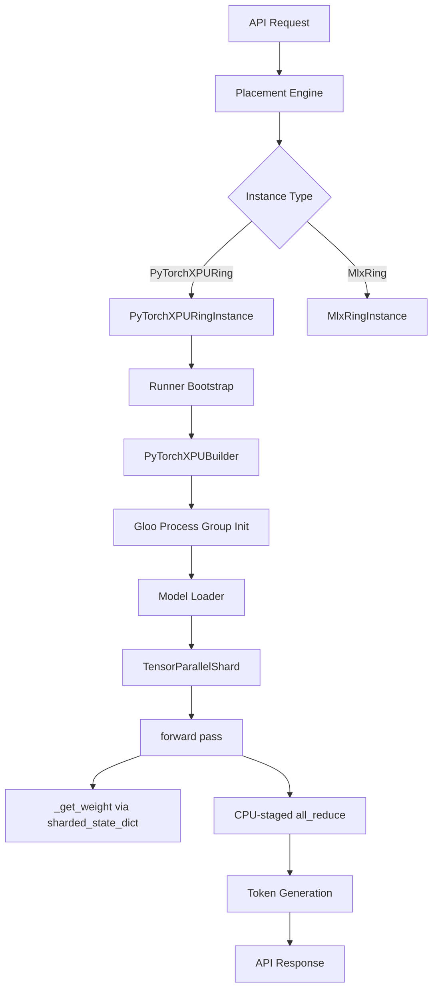
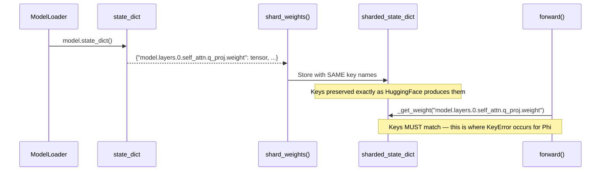

# Design Document: XPU Inference End-to-End

## Overview

This design addresses three bugs preventing end-to-end inference on the 4-node gremlin cluster with Intel Arc Meteor Lake-P iGPUs, plus the validation workflow to confirm the fixes work across three model architectures.

**Bug 1 — Weight Key Mapping**: `TensorParallelShard.forward()` constructs weight keys using hardcoded patterns (e.g., `f"model.layers.{layer_idx}.self_attn.q_proj.weight"`). These match Qwen/Llama naming but fail for Phi models which use `qkv_proj` (fused) and different bias patterns. The fix: make `forward()` architecture-aware by detecting the model's key naming convention from the actual keys stored in `sharded_state_dict`.

**Bug 2 — Placement Override**: `placement.py` line 206–211 unconditionally forces `InstanceMeta.MlxRing` + `Sharding.Pipeline` for single-node placements. This clobbers `PyTorchXPURing` even when explicitly requested. The fix: condition the override to only apply when the requested instance_meta is NOT `PyTorchXPURing`.

**Bug 3 — Model Cards Missing**: The three validation models (`Qwen/Qwen3.5-4B`, `microsoft/Phi-4`, `Qwen/Qwen2.5-7B-Instruct`) lack TOML model cards in `resources/inference_model_cards/`, so the placement engine cannot find them. The fix: create model cards with `supports_tensor = true` and `min_nodes = 4`.

## Architecture



The critical path for the weight key bug:



## Components and Interfaces

### 1. TensorParallelShard (Weight Key Fix)

**File**: `src/exo/worker/engines/pytorch_xpu/tensor_parallel_shard.py`

**Current behavior**: `shard_weights()` iterates `state_dict.items()` and stores each key as-is in `sharded_state_dict`. The `forward()` method constructs keys using hardcoded f-strings like `f"model.layers.{layer_idx}.self_attn.q_proj.weight"`. This works for Qwen/Llama but fails for Phi (which uses `qkv_proj.weight` fused).

**Fix approach**: Add architecture detection in `__init__` that inspects the stored keys to determine the model family. Then `forward()` uses the detected architecture to construct the correct key patterns. Specifically:

1. After `shard_weights()` completes, scan `sharded_state_dict` keys to detect:
   - **Qwen/Llama**: Has `self_attn.q_proj.weight`, `self_attn.k_proj.weight`, `self_attn.v_proj.weight` (separate QKV)
   - **Phi**: Has `self_attn.qkv_proj.weight` (fused QKV) or `self_attn.q_proj.weight` with different MLP naming

2. For Phi's fused QKV: during `shard_weights()`, detect `qkv_proj.weight` and split it into separate `q_proj.weight`, `k_proj.weight`, `v_proj.weight` entries in `sharded_state_dict` (already sharded). This way `forward()` can use the same key patterns for all architectures.

3. Add a `_detect_architecture()` method that returns an enum (`"qwen"`, `"llama"`, `"phi"`) based on key patterns.

4. For normalization: detect `input_layernorm.weight` (RMSNorm for Qwen/Llama) vs `input_layernorm.weight` + `input_layernorm.bias` (LayerNorm for Phi). Apply the correct norm function.

**Key invariant**: After `shard_weights()` completes (including any fused-weight splitting), every key that `forward()` will access via `_get_weight()` MUST exist in `sharded_state_dict`.

**Error handling improvement**: `_get_weight()` currently does a bare dict lookup (`self.sharded_state_dict[key]`). Change it to raise a descriptive `KeyError` that includes the missing key and a list of keys with the same layer prefix.

### 2. Placement Engine (Instance Type Fix)

**File**: `src/exo/master/placement.py`

**Current behavior** (lines 206–211):
```python
if len(selected_cycle) == 1:
    command = command.model_copy(
        update={
            "instance_meta": InstanceMeta.MlxRing,
            "sharding": Sharding.Pipeline,
        }
    )
```

This unconditionally overrides the instance type to MlxRing for single-node placements.

**Fix**: Condition the override to preserve PyTorchXPURing:
```python
if len(selected_cycle) == 1:
    if command.instance_meta != InstanceMeta.PyTorchXPURing:
        command = command.model_copy(
            update={
                "instance_meta": InstanceMeta.MlxRing,
                "sharding": Sharding.Pipeline,
            }
        )
    else:
        command = command.model_copy(
            update={
                "sharding": Sharding.Pipeline,
            }
        )
```

Note: For the 4-node cluster validation (this spec), all models use `min_nodes=4` so the single-node path won't trigger. But the fix is needed for correctness and future single-node XPU testing.

### 3. Model Cards

**Directory**: `resources/inference_model_cards/`

Three new TOML model cards:

- `Qwen--Qwen3.5-4B.toml` — Qwen architecture, 36 layers, hidden_size=2560, 32 attention heads, 4 KV heads
- `microsoft--Phi-4.toml` — Phi architecture, 40 layers, hidden_size=6144, 40 attention heads, 10 KV heads
- `Qwen--Qwen2.5-7B-Instruct.toml` — Qwen architecture, 28 layers, hidden_size=3584, 28 attention heads, 4 KV heads

All cards set `supports_tensor = true` to enable tensor-parallel placement.

### 4. Deployment and Validation

**Deploy**: `bash deploy_cluster.sh` pushes code, rebuilds NixOS on all 4 nodes, restarts exo service.

**Validation sequence** (per model):
1. Deploy code changes
2. Wait for cluster to reach ready state (4 nodes in topology)
3. Submit inference request via curl to `http://10.1.1.12:52415/v1/chat/completions`
4. Verify response contains coherent text with ≥10 tokens
5. Verify instance type shows "PyTorchXPURing" in `/state` API

## Data Models

### TPShardConfig (unchanged)

```python
@dataclass(frozen=True)
class TPShardConfig:
    rank: int
    world_size: int
    hidden_size: int
    num_attention_heads: int
    head_dim: int
    intermediate_size: int
    num_key_value_heads: int
    allreduce_timeout_seconds: int = 30
```

### Model Card TOML Schema (for new cards)

```toml
model_id = "Qwen/Qwen3.5-4B"
n_layers = 36
hidden_size = 2560
num_key_value_heads = 4
supports_tensor = true
tasks = ["TextGeneration"]
family = "qwen"
base_model = "Qwen3.5 4B"
capabilities = ["text"]
context_length = 32768

[storage_size]
in_bytes = 9200000000
```

### Architecture Detection Enum

```python
class ModelArchitecture(str, Enum):
    QWEN_LLAMA = "qwen_llama"  # Separate Q, K, V projections, RMSNorm
    PHI = "phi"                 # Fused QKV or separate with LayerNorm + biases
```

## Correctness Properties

*A property is a characteristic or behavior that should hold true across all valid executions of a system — essentially, a formal statement about what the system should do. Properties serve as the bridge between human-readable specifications and machine-verifiable correctness guarantees.*

### Property 1: Key Preservation in shard_weights()

*For any* valid state dict produced by a HuggingFace model's `state_dict()` method, after `shard_weights()` completes, the set of keys in `sharded_state_dict` SHALL be a superset of the input state dict keys (superset because fused weight splitting may add synthetic keys).

**Validates: Requirements 1.5**

### Property 2: Forward/Shard Key Consistency

*For any* valid state dict of a supported architecture (Qwen, Llama, or Phi), after `shard_weights()` completes, every key accessed by `forward()` via `_get_weight()` or `_get_weight_optional()` SHALL exist in `sharded_state_dict` (i.e., no KeyError is raised during a complete forward pass).

**Validates: Requirements 1.1, 1.2, 1.3, 1.4, 7.1**

### Property 3: Fused QKV Split Round-Trip

*For any* fused QKV weight tensor of shape `[(num_heads + 2 * num_kv_heads) * head_dim, hidden_size]`, splitting into separate Q, K, V shards and concatenating the shards from all ranks SHALL reconstruct the original fused weight tensor.

**Validates: Requirements 7.2**

### Property 4: Bias Shard Dimension Consistency

*For any* weight-bias pair where the weight is column-parallel sharded, the bias shard's dimension 0 SHALL equal the weight shard's dimension 0 (output dimension). For row-parallel weights, the bias SHALL NOT be sharded (full copy on each rank).

**Validates: Requirements 7.3**

## Error Handling

### Weight Key Missing

When `_get_weight(key)` fails to find a key:
- Raise `KeyError` with message: `f"Weight key '{key}' not found in sharded_state_dict. Available keys with prefix '{prefix}': {similar_keys}"`
- The prefix is extracted as everything up to the last `.` in the key
- This enables rapid debugging of architecture mismatches

### Process Group Initialization Failure

If Gloo process group fails to initialize (timeout, network error):
- Log the master_addr, master_port, rank, world_size
- Raise `RuntimeError` with connection details
- The runner catches this and reports `RunnerFailed` to the master

### Model Card Not Found

If a model has no TOML card in `resources/inference_model_cards/`:
- The API returns HTTP 400 with `"Failed to load model card: ..."`
- Fix: create the model card (this spec adds 3 new cards)

### All-Reduce Timeout

If `_all_reduce()` times out (default 30s):
- Log layer_index, tensor_shape, device, rank
- Raise `RuntimeError` with context for debugging which layer stalled

## Testing Strategy

### Unit Tests

- **Architecture detection**: Test `_detect_architecture()` with synthetic state dicts for each supported architecture
- **Fused QKV splitting**: Test that splitting a fused weight produces correct shapes
- **Key consistency**: Test that after shard_weights(), forward() can access all needed keys (mock the actual computation)
- **Placement override**: Test that single-node placement preserves PyTorchXPURing
- **Error messages**: Test that missing key errors include helpful context

### Property-Based Tests

Property-based testing applies to the weight sharding logic (pure functions with clear input/output behavior, large input space of possible state dicts).

- **Library**: Hypothesis (Python)
- **Minimum iterations**: 100 per property
- **Tag format**: `Feature: xpu-inference-e2e, Property {N}: {description}`

Properties to implement:
1. Key preservation — generate random state dicts, verify key set preservation
2. Forward/shard consistency — generate architecture-specific state dicts, verify no KeyError
3. Fused QKV round-trip — generate random fused weights, verify split+concat = original
4. Bias dimension consistency — generate weight+bias pairs, verify shard dimensions match

### Integration Tests (Cluster Validation)

These run on the live gremlin cluster after deployment:

1. **Qwen3.5-4B**: curl API, verify text response with ≥10 tokens
2. **Phi-4**: curl API, verify text response with ≥10 tokens
3. **Qwen2.5-7B-Instruct**: curl API, verify text response with ≥10 tokens
4. **Instance type verification**: Query /state API, verify "PyTorchXPURing"
5. **Topology verification**: Query /state API, verify 4 nodes present
