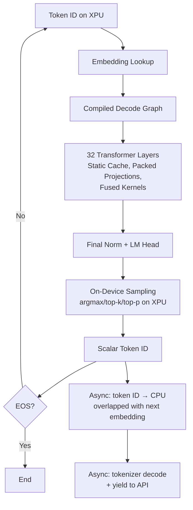
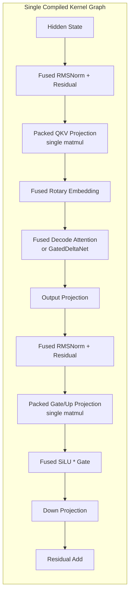
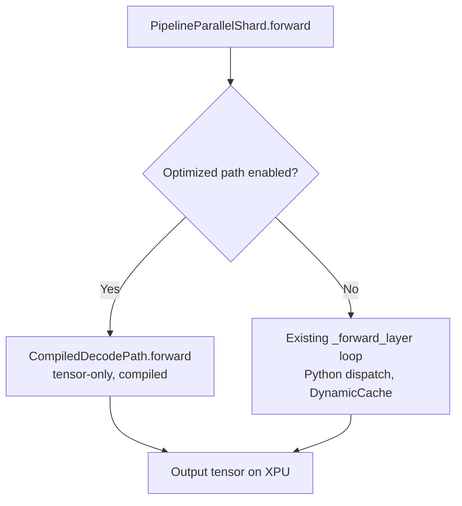

# Design Document: XPU Kernel Launch Optimization

## Overview

This design eliminates the CPU-side dispatch bottleneck that causes 48% GPU idle time during autoregressive decode on Intel Arc Meteor Lake-P iGPUs. The current pipeline calls `model.forward()` through Python for each of 32 transformer layers per token, with implicit synchronization points (`.item()`, `.cpu()`, dynamic cache allocation) creating kernel launch gaps that starve the GPU.

The optimized decode path replaces this with:
1. A **static KV cache** that pre-allocates all memory at generation start
2. A **tensor-only decode wrapper** that passes all state as tensor arguments (no Python object mutation)
3. A **torch.compile()** compiled graph that fuses the entire 32-layer stack into a single dispatch
4. **Packed projections** (QKV, gate/up) reducing kernel launches per layer from 5 to 3
5. **Fused pointwise kernels** (RMSNorm+residual, SiLU*gate, rotary) via Inductor
6. **On-device sampling** keeping logits on XPU until a single scalar token ID is extracted
7. **Async output streaming** that overlaps tokenizer decode with the next forward pass

Target: 10+ tok/s sustained decode throughput, <15% GPU idle, zero per-token CPU-GPU sync.


## Architecture

### High-Level Decode Path (Optimized)



### Layer Structure (Per Transformer Layer, Optimized)




### Integration with Existing Pipeline

The optimized decode path integrates alongside the existing `PipelineParallelShard` without replacing it. The optimization is activated via configuration flags in `PytorchXpuOptimizationConfiguration`:



The `CompiledDecodePath` is a new module created during model loading that:
1. Extracts layers from the loaded HuggingFace model
2. Packs QKV and gate/up projection weights
3. Creates the static KV cache
4. Wraps the decode function for `torch.compile()`

## Components and Interfaces

### 1. StaticKVCache

**Location:** `src/exo/worker/engines/pytorch_xpu/static_kv_cache.py`

Replaces `DynamicCache` for the optimized decode path. Pre-allocates fixed-size tensors at generation start.

```python
@final
class StaticKVCache:
    """Pre-allocated KV cache for zero-allocation decode."""

    def __init__(
        self,
        num_layers: int,
        num_kv_heads: int,
        head_dim: int,
        max_seq_len: int,
        device: torch.device,
        dtype: torch.dtype = torch.bfloat16,
    ) -> None: ...

    def update(
        self,
        layer_idx: int,
        key: torch.Tensor,   # [batch, 1, num_kv_heads, head_dim]
        value: torch.Tensor, # [batch, 1, num_kv_heads, head_dim]
    ) -> tuple[torch.Tensor, torch.Tensor]:
        """Write K/V at current position, return full K/V up to position."""
        ...

    @property
    def position(self) -> int:
        """Current sequence position (advances by 1 per decode step)."""
        ...

    def reset(self) -> None:
        """Reset position to 0 for next request (no deallocation)."""
        ...
```


**Design decisions:**
- Uses a single contiguous tensor per layer of shape `[max_seq_len, num_kv_heads, head_dim]` rather than growing lists. This avoids `torch.cat()` allocations that trigger GPU sync.
- Position is tracked as a Python int (not a tensor) since it only advances by 1 and is used for slice indexing. The position value is passed to the compiled graph as a scalar argument.
- For GatedDeltaNet layers (24 of 32 in Qwen3.5-4B), the cache stores `conv_state` and `recurrent_state` in pre-allocated slots alongside the standard KV entries. The existing `GatedDeltaNetPersistentState` containers are reused but backed by static tensors.

### 2. TensorOnlyDecodeWrapper

**Location:** `src/exo/worker/engines/pytorch_xpu/tensor_only_decode.py`

A pure-tensor function that `torch.compile()` can trace without graph breaks.

```python
def decode_one_token(
    token_id: torch.Tensor,          # [1] int64 on XPU
    position: torch.Tensor,          # [1] int64 (current seq position)
    cache_keys: torch.Tensor,        # [num_layers, max_seq, num_kv_heads, head_dim]
    cache_values: torch.Tensor,      # [num_layers, max_seq, num_kv_heads, head_dim]
    # GatedDeltaNet state tensors (pre-allocated)
    conv_states: torch.Tensor,       # [num_gdn_layers, conv_size, hidden]
    recurrent_states: torch.Tensor,  # [num_gdn_layers, head, head_dim, head_dim]
    # Model weights (frozen)
    packed_qkv_weights: list[torch.Tensor],
    packed_gate_up_weights: list[torch.Tensor],
    # ... other weight tensors
) -> tuple[torch.Tensor, torch.Tensor, torch.Tensor, torch.Tensor]:
    """
    Returns: (logits, updated_cache_keys, updated_cache_values, updated_position)

    All inputs and outputs are tensors. No Python object mutation.
    """
    ...
```

**Design decisions:**
- The function signature uses only tensors and lists of tensors (which `torch.compile` handles). No dataclass fields, no dict mutations, no DynamicCache object.
- Cache updates are expressed as in-place slice assignments (`cache_keys[layer, pos, :, :] = new_key`) which `torch.compile` traces as `index_put_` operations without graph breaks.
- The wrapper is created once during model loading by extracting weights from the HuggingFace model and repacking them.


### 3. CompiledDecodePath

**Location:** `src/exo/worker/engines/pytorch_xpu/compiled_decode_path.py`

Orchestrates compilation and provides the entry point for the optimized decode.

```python
@final
class CompiledDecodePath:
    """Compiled decode path wrapping torch.compile() for the XPU Inductor backend."""

    def __init__(
        self,
        layers: torch.nn.ModuleList,
        embed_tokens: torch.nn.Embedding,
        lm_head: torch.nn.Linear,
        final_norm: torch.nn.Module,
        config: PipelineStageConfig,
        optimization_config: PytorchXpuOptimizationConfiguration,
    ) -> None:
        """
        Extract weights, pack projections, create static cache,
        compile decode function.
        """
        ...

    def forward(self, token_id: torch.Tensor, position: int) -> torch.Tensor:
        """
        Execute one decode step through the compiled graph.
        Returns logits tensor on XPU device.
        """
        ...

    def reset(self) -> None:
        """Reset cache for new generation request."""
        ...
```

**Compilation strategy:**
- `torch.compile(decode_one_token, backend="inductor", mode="max-autotune")` is called once during `__init__`.
- The first invocation triggers JIT compilation (warmup). Subsequent calls execute the compiled graph directly.
- If compilation fails (unsupported op, XPU backend limitation), the system logs at ERROR level and falls back to the existing `PipelineParallelShard.forward()` path.
- `mode="max-autotune"` enables Inductor's autotuning for XPU kernel selection, which is critical for the Xe-core architecture.

### 4. PackedProjections

**Location:** `src/exo/worker/engines/pytorch_xpu/packed_projections.py`

Weight packing utilities applied during model loading.

```python
def pack_qkv_weights(
    q_weight: torch.Tensor,  # [q_dim, hidden_size]
    k_weight: torch.Tensor,  # [k_dim, hidden_size]
    v_weight: torch.Tensor,  # [v_dim, hidden_size]
) -> torch.Tensor:
    """Pack Q, K, V weights into [q_dim + k_dim + v_dim, hidden_size]."""
    return torch.cat([q_weight, k_weight, v_weight], dim=0)

def unpack_qkv_output(
    packed_output: torch.Tensor,  # [batch, seq, q_dim + k_dim + v_dim]
    q_dim: int,
    k_dim: int,
    v_dim: int,
) -> tuple[torch.Tensor, torch.Tensor, torch.Tensor]:
    """Split packed QKV output into separate Q, K, V tensors."""
    return packed_output.split([q_dim, k_dim, v_dim], dim=-1)

def pack_gate_up_weights(
    gate_weight: torch.Tensor,  # [intermediate_size, hidden_size]
    up_weight: torch.Tensor,    # [intermediate_size, hidden_size]
) -> torch.Tensor:
    """Pack gate and up weights into [2 * intermediate_size, hidden_size]."""
    return torch.cat([gate_weight, up_weight], dim=0)
```


**Qwen3.5-4B dimensions:**
- `hidden_size = 2560`
- `num_heads = 32`, `head_dim = 80`
- `num_kv_heads = 4` (GQA with 8:1 ratio)
- Q projection: `[2560, 2560]` (32 heads × 80 dim)
- K projection: `[320, 2560]` (4 heads × 80 dim)
- V projection: `[320, 2560]` (4 heads × 80 dim)
- Packed QKV: `[3200, 2560]` — single matmul replaces 3 separate ones
- `intermediate_size = 9728`
- Gate projection: `[9728, 2560]`
- Up projection: `[9728, 2560]`
- Packed gate/up: `[19456, 2560]` — single matmul replaces 2 separate ones

**Kernel launch reduction per layer:** From 5 matmuls (Q, K, V, gate, up) to 3 (packed_QKV, packed_gate_up, down_proj). Over 32 layers, this eliminates 64 kernel launches per token.

### 5. FusedKernels

**Location:** `src/exo/worker/engines/pytorch_xpu/fused_kernels.py`

These are reference implementations that `torch.compile()` with Inductor will auto-fuse. They serve as:
1. Correctness reference for testing
2. Fallback if Inductor fails to fuse

```python
def fused_rmsnorm_residual(
    hidden_states: torch.Tensor,
    residual: torch.Tensor,
    weight: torch.Tensor,
    eps: float = 1e-6,
) -> tuple[torch.Tensor, torch.Tensor]:
    """RMSNorm(hidden_states) + residual, returns (normed, new_residual)."""
    ...

def fused_silu_gate(
    gate: torch.Tensor,
    up: torch.Tensor,
) -> torch.Tensor:
    """SiLU(gate) * up in a single pass."""
    return torch.nn.functional.silu(gate) * up

def fused_rotary_embedding(
    query: torch.Tensor,
    key: torch.Tensor,
    cos: torch.Tensor,
    sin: torch.Tensor,
) -> tuple[torch.Tensor, torch.Tensor]:
    """Apply rotary position embedding to Q and K in-place."""
    ...
```

**Design decision:** Rather than writing custom SYCL kernels, we rely on `torch.compile()`'s Inductor backend to fuse these operations automatically. The Inductor backend generates optimized SYCL code for XPU targets. The Python implementations above are written in a fusion-friendly style (no intermediate tensor names that would prevent fusion, no control flow).


### 6. OnDeviceSampler

**Location:** `src/exo/worker/engines/pytorch_xpu/on_device_sampling.py`

Extends the existing `sampling.py` module to keep all operations on XPU.

```python
@final
class OnDeviceSampler:
    """Token sampling that executes entirely on XPU device."""

    def __init__(self, device: torch.device) -> None:
        self._device = device

    def sample(
        self,
        logits: torch.Tensor,  # [1, vocab_size] on XPU
        temperature: float = 1.0,
        top_k: int | None = None,
        top_p: float | None = None,
    ) -> torch.Tensor:
        """
        Sample next token ID on XPU. Returns [1] int64 tensor on XPU.
        No CPU transfer occurs here.
        """
        ...

    def transfer_token_to_cpu_async(
        self,
        token_id_xpu: torch.Tensor,
    ) -> torch.Tensor:
        """
        Non-blocking copy of scalar token ID to CPU.
        Returns a CPU tensor that will be populated when the XPU stream completes.
        The caller can launch the next forward pass before reading this value.
        """
        cpu_tensor = torch.empty(1, dtype=torch.long, device="cpu", pin_memory=True)
        cpu_tensor.copy_(token_id_xpu, non_blocking=True)
        return cpu_tensor
```

**Design decisions:**
- Greedy sampling (argmax) stays on XPU — `torch.argmax` on XPU returns an XPU tensor.
- Top-k uses `torch.topk` on XPU followed by `torch.multinomial` on XPU.
- Top-p uses `torch.sort` + `torch.cumsum` + `torch.multinomial` all on XPU.
- The only CPU transfer is a single int64 scalar via `non_blocking=True` copy to pinned memory. This overlaps with the next embedding lookup.
- EOS checking reads the CPU tensor after the next forward pass has been launched (not before).

### 7. AsyncOutputStreamer

**Location:** `src/exo/worker/engines/pytorch_xpu/async_output_streamer.py`

Decouples token output from the decode loop using an asyncio queue.

```python
@final
class AsyncOutputStreamer:
    """Async queue between decode loop and API response stream."""

    def __init__(self, max_pending: int = 32, resume_threshold: int = 16) -> None:
        self._queue: asyncio.Queue[int | None] = asyncio.Queue(maxsize=0)
        self._pending: int = 0
        self._max_pending = max_pending
        self._resume_threshold = resume_threshold
        self._paused = False

    def put_token(self, token_id: int) -> bool:
        """
        Enqueue a token for output. Returns False if backpressure is active.
        Non-blocking — does not wait for consumer.
        """
        ...

    async def get_token(self) -> int | None:
        """Get next token for API output. None signals end of generation."""
        ...

    @property
    def should_pause(self) -> bool:
        """Whether the decode loop should pause (queue > max_pending)."""
        return self._pending >= self._max_pending

    @property
    def should_resume(self) -> bool:
        """Whether the decode loop should resume (queue < resume_threshold)."""
        return self._paused and self._pending < self._resume_threshold
```


### 8. Configuration Integration

New flags added to `PytorchXpuOptimizationConfiguration`:

```python
# --- Kernel launch optimization flags ---

enable_static_kv_cache: bool = False
"""Use pre-allocated static KV cache instead of DynamicCache."""

enable_torch_compile: bool = False
"""Compile decode path with torch.compile(backend='inductor')."""

enable_packed_projections: bool = False
"""Pack QKV and gate/up projections into single matmuls."""

enable_fused_kernels: bool = False
"""Use fused pointwise kernels (RMSNorm+residual, SiLU*gate, rotary)."""

enable_on_device_sampling: bool = False
"""Perform sampling on XPU without transferring logits to CPU."""

enable_async_output: bool = False
"""Decouple token output from decode loop via async queue."""

enable_sync_removal: bool = False
"""Remove all implicit synchronization from the decode hot path."""

# --- Compile configuration ---

torch_compile_mode: Literal["default", "reduce-overhead", "max-autotune"] = "max-autotune"
"""torch.compile optimization mode for XPU Inductor."""

static_cache_max_seq_len: int = 2048
"""Maximum sequence length for static KV cache pre-allocation."""

async_output_max_pending: int = 32
"""Maximum pending tokens before backpressure activates."""

async_output_resume_threshold: int = 16
"""Queue depth at which generation resumes after backpressure."""
```

All flags default to `False` (disabled) for backward compatibility. Each can be enabled independently, though the full performance benefit requires all flags enabled together.

## Data Models

### StaticKVCache Tensor Layout

```
Per full-attention layer (8 layers in Qwen3.5-4B):
  key_cache:   [1, max_seq_len, num_kv_heads, head_dim]  = [1, 2048, 4, 80]
  value_cache: [1, max_seq_len, num_kv_heads, head_dim]  = [1, 2048, 4, 80]

Per GatedDeltaNet layer (24 layers in Qwen3.5-4B):
  conv_state:      [1, conv_size, hidden_size]  (pre-allocated)
  recurrent_state: [1, num_heads, head_dim, head_dim]  (pre-allocated, fp32)

Total static allocation for Qwen3.5-4B at max_seq_len=2048:
  Full-attention KV: 8 layers × 2 × (2048 × 4 × 80) × 2 bytes = ~20 MB
  GatedDeltaNet state: 24 layers × (conv + recurrent) ≈ ~50 MB
  Total: ~70 MB pre-allocated on XPU (from shared system memory)
```

### Packed Weight Tensors

```
Per layer (packed at model load time):
  packed_qkv:     [3200, 2560] bf16  (Q:2560 + K:320 + V:320 = 3200 output dim)
  packed_gate_up: [19456, 2560] bf16 (gate:9728 + up:9728 = 19456 output dim)
  down_proj:      [2560, 9728] bf16  (unchanged)
  o_proj:         [2560, 2560] bf16  (unchanged)

Memory overhead: zero — packed weights replace the originals, same total bytes.
```


### Decode Step State Flow

```
Input state (all tensors, no Python objects):
  token_id:        int64 [1]           — current token to decode
  position:        int64 scalar        — current sequence position
  cache_keys:      bf16 [8, 2048, 4, 80]  — full-attention K cache
  cache_values:    bf16 [8, 2048, 4, 80]  — full-attention V cache
  conv_states:     bf16 [24, conv, hidden] — GatedDeltaNet conv state
  recurrent_states: fp32 [24, heads, dim, dim] — GatedDeltaNet recurrent state

Output state:
  logits:          bf16 [1, vocab_size] — on XPU, fed to on-device sampler
  cache_keys:      bf16 (updated in-place at position)
  cache_values:    bf16 (updated in-place at position)
  conv_states:     bf16 (updated in-place)
  recurrent_states: fp32 (updated in-place)
  position:        int64 (incremented by 1)
```

## Correctness Properties

*A property is a characteristic or behavior that should hold true across all valid executions of a system — essentially, a formal statement about what the system should do. Properties serve as the bridge between human-readable specifications and machine-verifiable correctness guarantees.*

### Property 1: Zero-Synchronization Decode Step

*For any* valid token ID and sequence position, executing a decode step through the optimized path SHALL produce zero implicit synchronization events (no `.item()`, `.cpu()`, `.numpy()`, or boolean tensor evaluation) between the embedding lookup and the logits output.

**Validates: Requirements 1.1, 1.2, 1.3, 10.3**

### Property 2: On-Device Tensor Retention

*For any* decode step with any valid input token, all intermediate tensors and the output logits tensor SHALL remain on the XPU device. The only tensor that crosses the device boundary is a single int64 scalar (the sampled token ID), transferred asynchronously after the next forward pass is launched.

**Validates: Requirements 1.3, 8.1, 8.2, 8.3, 8.4**

### Property 3: Static Cache In-Place Invariant

*For any* sequence of N decode steps (1 ≤ N ≤ max_seq_len), the static KV cache tensor `data_ptr()` SHALL remain constant (no reallocation), and the position index SHALL equal N after the N-th step. After `reset()`, the position SHALL equal 0 and the same tensor storage SHALL be reused.

**Validates: Requirements 2.1, 2.2, 2.3, 2.4**


### Property 4: Packed Projection Numerical Equivalence

*For any* valid input tensor of shape `[1, 1, hidden_size]` with bf16 values, the packed QKV projection output (single matmul followed by split) SHALL be numerically equivalent to the three separate Q, K, V projections within a relative error tolerance of 1e-2. The same equivalence SHALL hold for packed gate/up projections.

**Validates: Requirements 5.1, 5.2, 5.3, 5.4, 5.5**

### Property 5: Fused Kernel Numerical Equivalence

*For any* valid input tensors with bf16 values, the fused kernel outputs SHALL be numerically equivalent to the sequential unfused operations within a relative error tolerance of 1e-2. This applies to: (a) fused RMSNorm + residual, (b) fused SiLU * gate, (c) fused rotary embedding.

**Validates: Requirements 6.1, 6.2, 6.3, 6.4**

### Property 6: Fused Decode Attention Numerical Equivalence

*For any* valid query tensor of shape `[1, 1, num_heads, head_dim]` and key/value cache of shape `[1, seq_len, num_kv_heads, head_dim]` where 1 ≤ seq_len ≤ max_seq_len, the fused decode attention output SHALL be numerically equivalent to the unfused multi-step attention (Q×K^T scaling, softmax, V multiply) within a relative error tolerance of 1e-2.

**Validates: Requirements 7.1, 7.3**

### Property 7: Minimal Device-to-Host Transfer

*For any* decode step with any vocabulary size, the total data transferred from XPU to CPU SHALL be exactly 8 bytes (one int64 token ID). The full logits tensor (vocab_size × 2 bytes for bf16) SHALL never be transferred to CPU during the decode hot path.

**Validates: Requirements 8.4**

### Property 8: Backpressure Queue Bounds

*For any* sequence of token productions, when the output queue depth exceeds `max_pending` (32), the decode loop SHALL pause. When the queue depth drops below `resume_threshold` (16) after a pause, the decode loop SHALL resume. The queue depth SHALL never exceed `max_pending + 1` (accounting for the token that triggered the pause check).

**Validates: Requirements 9.4**

### Property 9: Disabled-Optimization Output Equivalence

*For any* prompt string and fixed random seed, when all optimization flags are set to False, the optimized code path SHALL produce byte-identical output tokens to the existing unoptimized `PipelineParallelShard.forward()` path at the same temperature and seed.

**Validates: Requirements 11.2**


## Error Handling

### Compilation Failures

| Failure Mode | Detection | Recovery | Log Level |
|---|---|---|---|
| `torch.compile()` raises exception | try/except around compile call | Fall back to eager `PipelineParallelShard.forward()` | ERROR |
| Graph break detected during tracing | `torch._dynamo.utils.counters["graph_break"]` | Log break location, continue with split graphs | WARNING |
| XPU Inductor backend unavailable | Check `torch._inductor.config.xpu` availability | Fall back to eager execution | ERROR |
| Packed projection shape mismatch | Validate shapes during weight packing | Skip packing, use original separate weights | WARNING |
| Static cache OOM (max_seq_len too large) | Catch `torch.cuda.OutOfMemoryError` equivalent for XPU | Reduce max_seq_len or fall back to DynamicCache | ERROR |

### Runtime Failures

| Failure Mode | Detection | Recovery | Log Level |
|---|---|---|---|
| Fused kernel produces NaN | Optional validation check (disabled in production) | Fall back to unfused sequential ops | WARNING |
| On-device sampling multinomial failure | try/except around `torch.multinomial` | Fall back to argmax on device | WARNING |
| Async output queue full beyond max_pending | `should_pause` property check | Backpressure: pause generation | DEBUG |
| Token ID CPU transfer timeout | Timeout on `torch.xpu.synchronize()` after N ms | Force sync and continue | WARNING |

### Fallback Chain

Each optimization has an independent fallback:

```
torch.compile → eager Python dispatch (existing path)
static KV cache → DynamicCache (existing path)
packed projections → separate Q/K/V and gate/up matmuls
fused kernels → sequential unfused operations
on-device sampling → CPU sampling (existing path)
async output → synchronous yield (existing path)
sync removal → allow sync operations (existing path)
```

The fallback is per-optimization, not all-or-nothing. If `torch.compile` fails but packed projections succeed, the system uses packed projections in eager mode (still reduces kernel launches, just without the compiled graph fusion).

## Testing Strategy

### Property-Based Testing (PBT)

PBT is appropriate for this feature because:
- The core operations (projections, fusions, attention) are pure functions with clear input/output behavior
- Numerical equivalence properties must hold across a wide range of input shapes and values
- The input space (tensor shapes, values, sequence lengths) is large
- Edge cases (near-zero values, large magnitudes, special positions) are best discovered by random generation

**Library:** `hypothesis` with `hypothesis[numpy]` for tensor generation strategies.

**Configuration:**
- Minimum 100 iterations per property test
- Each test tagged with: `Feature: xpu-kernel-launch-optimization, Property {N}: {title}`
- Tests run on CPU (mocking XPU device) for CI, with optional XPU hardware tests gated by `@pytest.mark.xpu`


### Unit Tests (Example-Based)

| Test | Validates | Strategy |
|---|---|---|
| Static cache reset returns position 0 | Req 2.4 | Create cache, advance N steps, reset, verify position == 0 |
| Graph break logging | Req 3.4 | Introduce deliberate break, verify WARNING log |
| Compile fallback on failure | Req 4.4 | Mock compile failure, verify ERROR log + eager fallback |
| Fused attention with Qwen3.5-4B dims | Req 7.4 | Run with hidden=2560, heads=32, kv_heads=4 |
| Config flags exist and default False | Req 11.1 | Instantiate config, verify all new flags are False |
| Runtime fallback logging | Req 11.3 | Inject failure, verify WARNING + fallback |

### Integration Tests

| Test | Validates | Strategy |
|---|---|---|
| Tokenizer decode ordering | Req 1.4, 9.1 | Instrument timestamps, verify forward launches before decode |
| GatedDeltaNet static state | Req 2.5 | Run GatedDeltaNet layer with static cache, verify no allocation |
| End-to-end compiled decode | Req 4.2 | Run 10 decode steps through compiled path, verify coherent output |
| Async output non-blocking | Req 9.2, 9.3 | Slow consumer, verify decode loop continues |

### Performance Tests (Hardware-Gated)

| Test | Validates | Strategy |
|---|---|---|
| 10+ tok/s on Meteor Lake-P | Req 10.1 | 50-token generation, measure sustained throughput |
| GPU idle < 15% | Req 10.2 | Monitor via sysfs during generation |
| Throughput stability CV < 20% | Req 10.4 | Measure per-token latencies, compute coefficient of variation |

### Test File Organization

```
src/exo/worker/engines/pytorch_xpu/tests/
├── test_static_kv_cache_properties.py      # PBT: Properties 3, 7
├── test_packed_projections_properties.py   # PBT: Property 4
├── test_fused_kernels_properties.py        # PBT: Property 5
├── test_fused_attention_properties.py      # PBT: Property 6
├── test_on_device_sampling_properties.py   # PBT: Property 2
├── test_backpressure_properties.py         # PBT: Property 8
├── test_output_equivalence_properties.py   # PBT: Property 9
├── test_sync_removal_properties.py         # PBT: Property 1
├── test_compiled_decode_integration.py     # Integration tests
├── test_config_flags.py                    # Unit tests for configuration
└── test_performance_xpu.py                 # Hardware-gated performance tests
```
