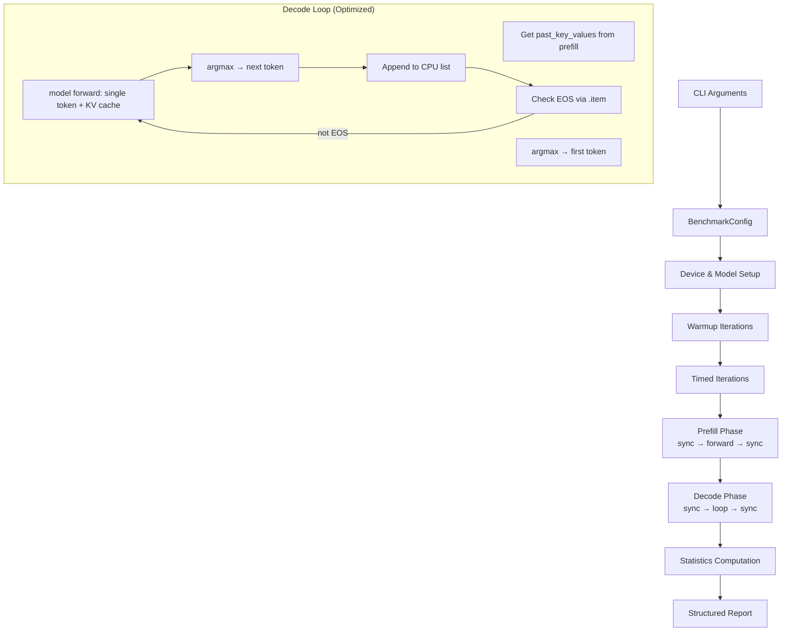

# Design Document: XPU Performance Benchmark

## Overview

A standalone Python benchmark script (`src/exo/worker/engines/pytorch_xpu/bench_xpu.py`) that measures Qwen3.5-4B inference performance on Intel Arc iGPUs (Meteor Lake-P). The script provides accurate timing of prefill and decode phases using proper device synchronization, implements an optimized decode loop that avoids common performance pitfalls, and reports structured results with performance target classification.

The benchmark operates independently of the exo service, loading models directly via HuggingFace's `AutoModelForCausalLM` for isolation. It deploys to gremlin-1 via the existing NixOS deployment pipeline and is runnable via SSH.

### Design Rationale

- **Standalone script over integrated benchmark**: Isolates measurement from exo's runtime overhead (event loop, networking, distributed coordination). Produces clean numbers attributable to the model + XPU backend alone.
- **Direct HuggingFace loading over exo model_loader**: The exo `ModelLoader` adds sharding, `TransformerShard` wrapping, and pipeline logic. For single-node benchmarking, we want raw model performance without those layers.
- **Greedy decoding over sampling**: Eliminates variance from random sampling, making results reproducible and comparable across runs.
- **`torch.xpu.synchronize()` bracketing**: XPU operations are asynchronous. Without explicit sync, `perf_counter()` measures submission time, not execution time.

## Architecture



### Execution Flow

1. Parse CLI arguments into `BenchmarkConfig` dataclass
2. Detect XPU devices, exit with error if none available
3. Set random seed for reproducibility
4. Load model in specified dtype onto XPU device
5. Construct fixed-length prompt
6. Run warmup iterations (untimed)
7. Run N timed iterations, each measuring:
   - Prefill time (sync-bracketed)
   - Decode throughput (sync-bracketed)
8. Compute mean/stddev across iterations
9. Classify results against performance targets
10. Print structured report

## Components and Interfaces

### BenchmarkConfig (dataclass)

```python
@dataclass(frozen=True)
class BenchmarkConfig:
    model_id: str           # HuggingFace model ID (default: "Qwen/Qwen3.5-4B")
    device: str             # XPU device string (default: "xpu:0")
    dtype: str              # "bf16" or "fp16" (default: "bf16")
    prompt_tokens: int      # Target prompt length in tokens (default: 256)
    gen_tokens: int         # Number of tokens to generate (default: 128)
    warmup: int             # Warmup iteration count (default: 2)
    iterations: int         # Timed iteration count (default: 3)
    seed: int               # Random seed (default: 42)
    compile: bool           # Apply torch.compile (default: False)
    report_sdpa: bool       # Report SDPA backend info (default: False)
```

### BenchmarkResult (dataclass)

```python
@dataclass(frozen=True)
class BenchmarkResult:
    ttft_seconds: float         # Time to first token (prefill + first decode step)
    prefill_tps: float          # Prefill tokens per second
    decode_tps: float           # Decode tokens per second (excluding first token)
    total_time_seconds: float   # Total generation wall-clock time
    tokens_generated: int       # Actual tokens generated (may be < gen_tokens if EOS)
    generated_text: str         # Decoded output text (for verification)
```

### Key Functions

| Function | Signature | Purpose |
|----------|-----------|---------|
| `parse_args` | `() -> BenchmarkConfig` | Parse CLI arguments via argparse |
| `build_prompt` | `(tokenizer, target_tokens: int) -> tuple[str, torch.Tensor]` | Construct fixed-length prompt |
| `run_benchmark_iteration` | `(model, tokenizer, config: BenchmarkConfig) -> BenchmarkResult` | Single timed iteration |
| `greedy_decode` | `(model, prompt_ids: Tensor, gen_tokens: int, eos_id: int) -> tuple[list[int], float, float]` | Optimized decode loop returning (token_ids, prefill_time, decode_time) |
| `compute_stats` | `(results: list[BenchmarkResult]) -> BenchmarkStats` | Mean/stddev computation |
| `classify_performance` | `(decode_tps: float, ttft: float) -> PerformanceClassification` | Threshold classification |
| `format_report` | `(stats: BenchmarkStats, config: BenchmarkConfig, env: EnvironmentInfo) -> str` | Structured output |
| `detect_sdpa_backend` | `(device: str) -> str` | Run diagnostic SDPA operation |

### PerformanceClassification

```python
@dataclass(frozen=True)
class PerformanceClassification:
    meets_minimum: bool      # decode_tps >= 5
    meets_stretch: bool      # decode_tps >= 10
    is_critical: bool        # decode_tps < 2
    ttft_acceptable: bool    # ttft < 5.0 (for 256-token prompt)
```

### Decode Loop Design (Critical Path)

The decode loop is the performance-critical section. The optimized design:

```python
@torch.inference_mode()
def greedy_decode(
    model, prompt_ids: torch.Tensor, gen_tokens: int, eos_id: int, device: str
) -> tuple[list[int], float, float]:
    """Returns (generated_token_ids, prefill_seconds, decode_seconds)."""
    
    # --- Prefill ---
    torch.xpu.synchronize()
    t0 = time.perf_counter()
    outputs = model(input_ids=prompt_ids, use_cache=True)
    torch.xpu.synchronize()
    prefill_time = time.perf_counter() - t0
    
    past_key_values = outputs.past_key_values
    logits = outputs.logits
    
    # First token via argmax
    first_token = logits[:, -1, :].argmax(dim=-1)
    token_ids: list[int] = [first_token.item()]
    
    if token_ids[0] == eos_id:
        return token_ids, prefill_time, 0.0
    
    # --- Decode loop ---
    cur_token = first_token.unsqueeze(0)  # shape: [1, 1]
    
    torch.xpu.synchronize()
    t1 = time.perf_counter()
    
    for _ in range(gen_tokens - 1):
        outputs = model(
            input_ids=cur_token,
            past_key_values=past_key_values,
            use_cache=True,
        )
        past_key_values = outputs.past_key_values
        next_token = outputs.logits[:, -1, :].argmax(dim=-1)
        
        token_id = next_token.item()  # sync point for EOS check
        token_ids.append(token_id)
        
        if token_id == eos_id:
            break
        
        cur_token = next_token.unsqueeze(0)
    
    torch.xpu.synchronize()
    decode_time = time.perf_counter() - t1
    
    return token_ids, prefill_time, decode_time
```

**Key optimizations:**
1. No `torch.cat` — only the single current token tensor is on XPU
2. Token IDs accumulated in a Python list (CPU, zero-cost)
3. No `tokenizer.decode()` during timed loop
4. KV cache (`past_key_values`) reused across steps via `use_cache=True`
5. `torch.inference_mode()` eliminates autograd overhead
6. `.item()` only for EOS check (unavoidable sync point)

## Data Models

### CLI Argument Mapping

| Argument | Type | Default | Maps to |
|----------|------|---------|---------|
| `--model_id` | str | `Qwen/Qwen3.5-4B` | `BenchmarkConfig.model_id` |
| `--device` | str | `xpu:0` | `BenchmarkConfig.device` |
| `--dtype` | str | `bf16` | `BenchmarkConfig.dtype` |
| `--prompt_tokens` | int | `256` | `BenchmarkConfig.prompt_tokens` |
| `--gen_tokens` | int | `128` | `BenchmarkConfig.gen_tokens` |
| `--warmup` | int | `2` | `BenchmarkConfig.warmup` |
| `--iterations` | int | `3` | `BenchmarkConfig.iterations` |
| `--seed` | int | `42` | `BenchmarkConfig.seed` |
| `--compile` | flag | `False` | `BenchmarkConfig.compile` |
| `--report-sdpa` | flag | `False` | `BenchmarkConfig.report_sdpa` |

### BenchmarkStats

```python
@dataclass(frozen=True)
class BenchmarkStats:
    ttft_mean: float
    ttft_std: float
    decode_tps_mean: float
    decode_tps_std: float
    prefill_tps_mean: float
    prefill_tps_std: float
    total_time_mean: float
    total_time_std: float
    is_unstable: bool  # True if any CV > 0.2
```

### EnvironmentInfo

```python
@dataclass(frozen=True)
class EnvironmentInfo:
    pytorch_version: str      # e.g., "2.11.0+xpu"
    xpu_device_name: str      # e.g., "Intel Arc Graphics"
    driver_version: str       # Level Zero driver version
    model_id: str
    dtype: str
    compile_status: str | None  # "success", "fallback", or None
    sdpa_backend: str | None    # "flash", "math", "efficient", or None
```

### Prompt Construction Strategy

The `build_prompt` function constructs a fixed-length prompt by repeating a known sentence pattern and trimming to the target token count:

```python
def build_prompt(tokenizer, target_tokens: int) -> tuple[str, torch.Tensor]:
    """Build a prompt of approximately target_tokens length.
    
    Strategy: Repeat a fixed sentence, encode, truncate to target_tokens,
    then decode back to get the actual prompt text.
    """
    base_sentence = "The quick brown fox jumps over the lazy dog. "
    # Over-generate then truncate
    repeated = base_sentence * (target_tokens // 5 + 10)
    token_ids = tokenizer.encode(repeated)
    truncated = token_ids[:target_tokens]
    prompt_text = tokenizer.decode(truncated)
    prompt_tensor = torch.tensor([truncated], dtype=torch.long)
    return prompt_text, prompt_tensor
```

## Correctness Properties

*A property is a characteristic or behavior that should hold true across all valid executions of a system — essentially, a formal statement about what the system should do. Properties serve as the bridge between human-readable specifications and machine-verifiable correctness guarantees.*

### Property 1: CLI argument parsing accepts valid configurations

*For any* valid combination of model_id (non-empty string), device (matching pattern `xpu:\d+`), dtype (one of `bf16`, `fp16`), prompt_tokens (positive int), gen_tokens (positive int), warmup (non-negative int), iterations (positive int), and seed (non-negative int), the argument parser SHALL produce a `BenchmarkConfig` with matching field values.

**Validates: Requirements 1.1**

### Property 2: Decode TPS calculation

*For any* positive integer `gen_tokens` and positive float `elapsed_seconds`, the computed `decode_tps` SHALL equal `gen_tokens / elapsed_seconds` (within floating-point tolerance).

**Validates: Requirements 1.5**

### Property 3: Greedy decoding selects argmax

*For any* 2D logits tensor of shape `[1, vocab_size]` with a unique maximum value, greedy decoding SHALL select the index of the maximum value.

**Validates: Requirements 1.6, 5.2**

### Property 4: Prompt construction produces target token count

*For any* target token count between 1 and 4096, the `build_prompt` function SHALL produce a token tensor whose length equals exactly the target count.

**Validates: Requirements 1.7**

### Property 5: Report contains all required fields

*For any* valid `BenchmarkStats`, `BenchmarkConfig`, and `EnvironmentInfo`, the formatted report string SHALL contain substrings for TTFT, prefill TPS, decode TPS, total time, device name, dtype, and PyTorch version.

**Validates: Requirements 1.8, 5.3**

### Property 6: Optimized decode loop produces identical tokens to naive implementation

*For any* sequence of logits outputs from a model (mocked), the optimized decode loop (single-token input + KV cache reuse + CPU list accumulation) SHALL produce the same token ID sequence as a naive implementation (full input_ids concatenation + no cache).

**Validates: Requirements 2.2**

### Property 7: EOS terminates decode at correct position

*For any* model that produces an EOS token at step N (where 1 ≤ N ≤ gen_tokens), the decode loop SHALL return exactly N token IDs with the last being the EOS token.

**Validates: Requirements 2.4**

### Property 8: Performance threshold classification

*For any* positive float `decode_tps`, the `classify_performance` function SHALL set `is_critical = True` iff `decode_tps < 2.0`, `meets_minimum = True` iff `decode_tps >= 5.0`, and `meets_stretch = True` iff `decode_tps >= 10.0`.

**Validates: Requirements 3.1, 3.3, 3.4**

### Property 9: TTFT threshold classification

*For any* positive float `ttft`, the `classify_performance` function SHALL set `ttft_acceptable = True` iff `ttft < 5.0`.

**Validates: Requirements 3.2**

### Property 10: Statistical computation correctness

*For any* list of 2 or more positive floats representing measurements, the `compute_stats` function SHALL produce a mean equal to `sum(values) / len(values)` and a standard deviation equal to the population or sample stddev (within floating-point tolerance).

**Validates: Requirements 5.4**

### Property 11: Instability warning fires on high variance

*For any* list of 2 or more positive measurements, the `is_unstable` flag SHALL be `True` iff the standard deviation divided by the mean (coefficient of variation) exceeds 0.2.

**Validates: Requirements 5.5**

## Error Handling

| Error Condition | Handling | User-Facing Message |
|----------------|----------|---------------------|
| No XPU device available | Exit with code 1 | "ERROR: No XPU devices detected. Ensure Intel GPU drivers and PyTorch XPU are installed." |
| Model not found (network error) | Exit with code 1 | "ERROR: Failed to download model '{model_id}': {error}" |
| Model loading OOM | Exit with code 1 | "ERROR: Out of memory loading model. Try a smaller model or fp16 dtype." |
| torch.compile failure | Warn and continue in eager mode | "WARNING: torch.compile failed ({error}), falling back to eager mode." |
| SDPA diagnostic failure | Warn and skip | "WARNING: SDPA backend detection failed: {error}" |
| Forward pass error during warmup | Exit with code 1 | "ERROR: Model forward pass failed during warmup: {error}" |
| Forward pass error during timing | Report partial results | "WARNING: Iteration {n} failed: {error}. Reporting results from {n-1} successful iterations." |
| Invalid CLI arguments | Exit with argparse error | Standard argparse error messages |
| Unstable measurements (CV > 20%) | Warn in report | "⚠ WARNING: High variance detected (CV={cv:.1%}). Consider increasing --warmup count." |

## Testing Strategy

### Property-Based Tests (Hypothesis)

The benchmark's pure logic functions are tested with property-based tests using the `hypothesis` library (already in the project's test dependencies). Each property test runs a minimum of 100 iterations.

**Test file**: `src/exo/worker/engines/pytorch_xpu/tests/test_bench_xpu_properties.py`

Properties to implement:
- Property 1: CLI parsing (generate valid arg combinations → verify config)
- Property 2: TPS calculation (generate tokens/time → verify formula)
- Property 3: Greedy argmax (generate random logits → verify argmax selection)
- Property 4: Prompt construction (generate target counts → verify token length)
- Property 5: Report completeness (generate results → verify all fields present)
- Property 6: Decode equivalence (mock model outputs → verify identical tokens)
- Property 7: EOS termination (mock model with EOS at position N → verify N tokens)
- Property 8: Performance classification (generate TPS values → verify thresholds)
- Property 9: TTFT classification (generate TTFT values → verify threshold)
- Property 10: Stats computation (generate measurement lists → verify mean/stddev)
- Property 11: Instability detection (generate measurements → verify CV threshold)

**Configuration:**
- Library: `hypothesis` (Python)
- Min iterations: 100 per property (`@settings(max_examples=100)`)
- Tag format: `# Feature: xpu-performance-benchmark, Property N: <description>`

### Unit Tests (Example-Based)

**Test file**: `src/exo/worker/engines/pytorch_xpu/tests/test_bench_xpu.py`

- Device detection with mocked `torch.xpu.is_available()`
- torch.compile fallback reporting with mocked compile failure
- Report format verification with known inputs
- Warmup execution count verification

### Integration Tests (On-Hardware)

Run manually on gremlin-1 via SSH:

```bash
ssh root@10.1.1.12 "cd /path/to/exo && python -m exo.worker.engines.pytorch_xpu.bench_xpu \
  --model_id Qwen/Qwen3.5-4B --device xpu:0 --gen_tokens 64 --iterations 1"
```

Integration tests verify:
- Model loads onto XPU in bf16
- Forward pass completes without error
- Timing numbers are reasonable (not zero, not negative)
- Generated text is coherent (manual inspection)
- `--compile` flag works or gracefully falls back
- `--report-sdpa` detects the active backend
