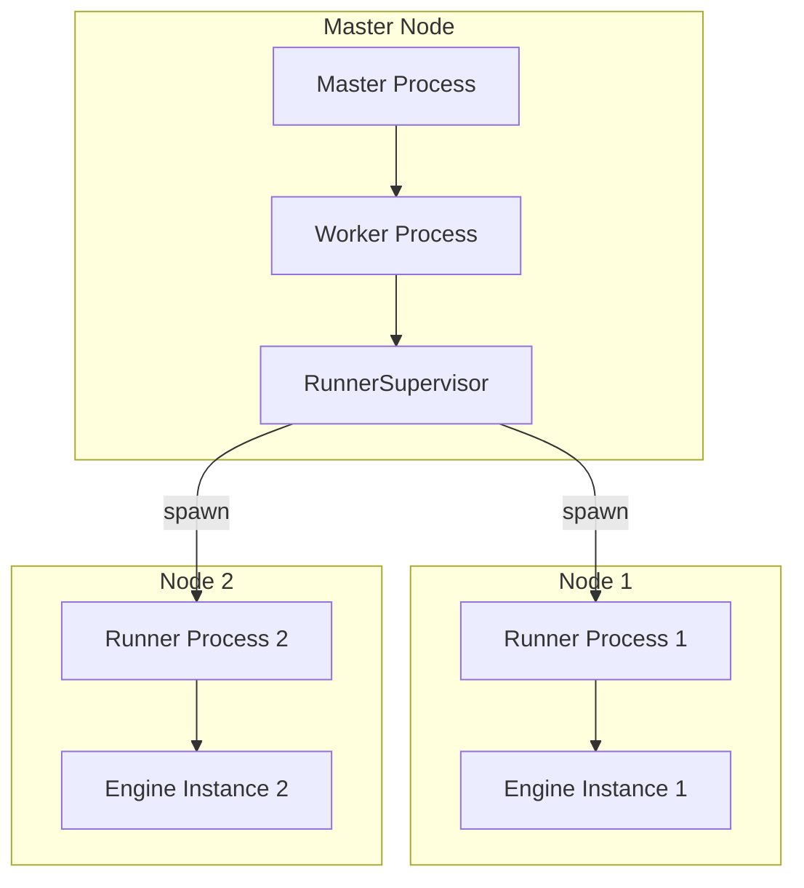
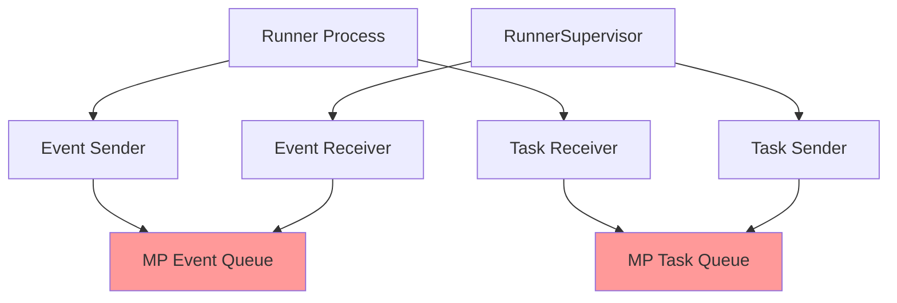

# EXO Multiprocessing Architecture Documentation

## Overview

EXO uses a multiprocessing architecture where a `RunnerSupervisor` manages multiple `Runner` processes for distributed inference across nodes.

## Process Hierarchy



## Communication Channels

### Channel Types

1. **Event Channels**: Runner → Supervisor communication
2. **Task Channels**: Supervisor → Runner communication  
3. **Inter-Runner Channels**: Runner ↔ Runner coordination (for distributed inference)

### Channel Implementation

**File**: `src/exo/utils/channels.py`

```python
# Creates bidirectional multiprocessing channels
def mp_channel[T]() -> tuple[MpSender[T], MpReceiver[T]]:
    state = MpState[T](max_buffer_size)
    return MpSender(_state=state), MpReceiver(_state=state)

class MpState[T]:
    def __init__(self, max_buffer_size: float):
        self.buffer: mp.Queue[T | _MpEndOfStream] = mp.Queue(max_buffer_size)
        self.closed: Event = mp.Event()
```

## Current Resource Management

### RunnerSupervisor Resource Creation

**File**: `src/exo/worker/runner/runner_supervisor.py`

```python
@classmethod
def create(cls, *, bound_instance: BoundInstance, event_sender: Sender[Event], ...):
    # Create MP channels
    ev_send, ev_recv = mp_channel[Event]()      # Event channel
    task_sender, task_recv = mp_channel[Task]() # Task channel
    
    # Spawn runner process
    runner_process = Process(
        target=entrypoint,
        args=(bound_instance, ev_send, task_recv, logger),
        daemon=True,
    )
    
    return cls(
        _ev_recv=ev_recv,           # Supervisor owns receiver
        _task_sender=task_sender,   # Supervisor owns sender
        # ...
    )
```

### Runner Process Resource Usage

**File**: `src/exo/worker/runner/bootstrap.py`

```python
def entrypoint(
    bound_instance: BoundInstance,
    event_sender: MpSender[Event],    # Runner owns sender (same queue as supervisor receiver)
    task_receiver: MpReceiver[Task],  # Runner owns receiver (same queue as supervisor sender)
    _logger: "loguru.Logger",
):
    try:
        from exo.worker.runner.runner import main
        main(bound_instance, event_sender, task_receiver)
    finally:
        event_sender.close()    # RACE CONDITION: Closes same queue as supervisor
        task_receiver.close()   # RACE CONDITION: Closes same queue as supervisor
        event_sender.join()
        task_receiver.join()
```

## Resource Ownership Model

### Current (Broken) Model

```
RunnerSupervisor Process:
├── _ev_recv: MpReceiver[Event] ────┐
└── _task_sender: MpSender[Task] ───┼─── SHARED QUEUES
                                    │
Runner Process:                     │
├── event_sender: MpSender[Event] ──┘
└── task_receiver: MpReceiver[Task] ─┘
```

**Problem**: Both processes think they own the same underlying `mp.Queue` objects!

### Required (Fixed) Model

```
RunnerSupervisor Process:
├── _ev_recv: MpReceiver[Event] (OWNER)
└── _task_sender: MpSender[Task] (OWNER)

Runner Process:
├── event_sender: MpSender[Event] (USER)
└── task_receiver: MpReceiver[Task] (USER)
```

**Solution**: Only the OWNER process should close the underlying queue.

## Queue Lifecycle Issues

### Current Lifecycle

```python
# Creation (in RunnerSupervisor.create)
ev_send, ev_recv = mp_channel[Event]()

# Usage (normal operation)
ev_send.send(event)  # Runner sends
ev_recv.receive()    # Supervisor receives

# Cleanup (RACE CONDITION)
ev_recv.close()      # Supervisor closes queue
ev_send.close()      # Runner ALSO closes same queue! ❌
```

### Error Propagation Chain

```
1. Queue.close() called twice
   ↓
2. ValueError: Queue is closed
   ↓  
3. anyio.ClosedResourceError in _forward_events
   ↓
4. Runner process exits with code 1
   ↓
5. RunnerFailed status
   ↓
6. Multi-node instance fails
```

## Synchronization Mechanisms

### Current (Insufficient)

- **Event-based**: Uses `anyio.Event` for task acknowledgment
- **No Cross-Process Sync**: No coordination between supervisor and runner cleanup
- **No Resource State Tracking**: No way to know if resource is already closed

### Required Additions

1. **Shutdown Coordination**: Cross-process signaling for shutdown phases
2. **Resource State Tracking**: Shared state to track resource lifecycle
3. **Cleanup Ordering**: Ensure proper sequence of resource cleanup
4. **Error Recovery**: Handle partial cleanup failures gracefully

## Communication Patterns

### Event Flow (Normal Operation)

```
Runner Process:
  ├── RunnerStatusUpdated ──────┐
  ├── TaskAcknowledged ─────────┼──► event_sender ──► Supervisor
  ├── ChunkGenerated ───────────┘
  
Supervisor Process:
  ├── ConnectToGroup ───────────┐
  ├── LoadModel ───────────────┼──► task_sender ──► Runner  
  ├── ChatCompletion ──────────┘
```

### Shutdown Flow (Current - Broken)

```
Supervisor:                    Runner:
shutdown() called              │
├── cancel task group          │
├── _forward_events exits      │
├── close _ev_recv ────────────┼──── RACE CONDITION
├── close _task_sender         │      │
└── join process               │      ▼
                               │   finally block:
                               │   ├── close event_sender ❌
                               │   ├── close task_receiver ❌
                               │   ├── join event_sender ❌
                               │   └── join task_receiver ❌
```

## Key Files and Their Roles

### Core Files

1. **`runner_supervisor.py`**: Manages runner lifecycle, creates MP channels
2. **`bootstrap.py`**: Runner process entrypoint, handles cleanup
3. **`runner.py`**: Main runner logic, processes tasks
4. **`channels.py`**: Multiprocessing channel implementation

### Channel Usage Patterns

```python
# Pattern 1: Event Communication (Runner → Supervisor)
event_sender.send(RunnerStatusUpdated(...))  # Runner sends
event = await _ev_recv.receive()              # Supervisor receives

# Pattern 2: Task Communication (Supervisor → Runner)  
_task_sender.send(LoadModel(...))             # Supervisor sends
task = await task_receiver.receive()          # Runner receives
```

## Resource Dependencies

### Cleanup Dependencies



**Current Problem**: G and H (the actual MP queues) get closed by multiple processes.

**Required Solution**: Only one process should own and close each queue.

## Error Handling Gaps

### Missing Error Handlers

1. **ClosedResourceError**: Not handled during cleanup
2. **ValueError (Queue closed)**: Not handled in channel operations
3. **BrokenResourceError**: Partially handled but not during shutdown
4. **Timeout Errors**: No timeout handling for cleanup operations

### Required Error Handling

```python
# Example of required error handling pattern
try:
    channel.close()
except ClosedResourceError:
    logger.debug("Channel already closed, skipping")
except ValueError as e:
    if "closed" in str(e):
        logger.debug("Queue already closed, skipping")
    else:
        raise
```

## Conclusion

The race condition is caused by **dual ownership** of multiprocessing queues without proper coordination. The fix requires:

1. **Clear Resource Ownership**: Only one process should close each queue
2. **Shutdown Coordination**: Processes must coordinate cleanup sequence  
3. **Error Resilience**: Handle already-closed resources gracefully
4. **State Synchronization**: Track resource state across processes

This analysis confirms our design approach and provides the technical foundation for implementing the fix.