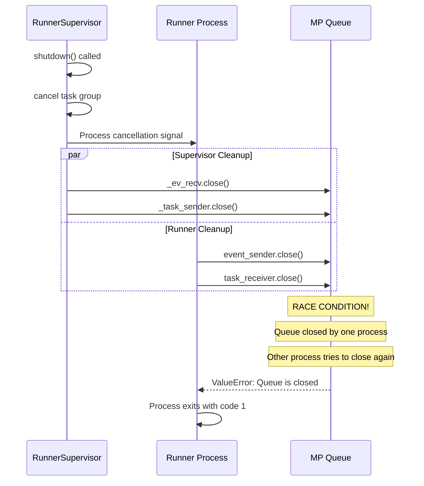
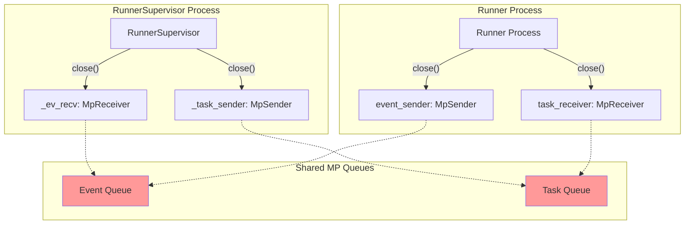

# EXO Multi-Node Race Condition Analysis

## Problem Summary

The EXO distributed inference system fails when creating multi-node instances due to a race condition in the multiprocessing channel cleanup during runner shutdown.

## Root Cause Analysis

### The Race Condition Sequence

1. **Runner Shutdown Initiated**: `RunnerSupervisor.shutdown()` is called
2. **Task Group Cancellation**: `self._tg.cancel_scope.cancel()` cancels the task group
3. **Event Forwarding Interrupted**: `_forward_events()` receives cancellation
4. **Channel Cleanup Race**: Multiple processes try to close the same multiprocessing queue simultaneously

### Specific Error Location

**File**: `src/exo/worker/runner/bootstrap.py`  
**Line**: 45  
**Code**: `event_sender.close()`

```python
finally:
    event_sender.close()      # <- Race condition here
    task_receiver.close()     # <- And here
    event_sender.join()       # <- Queue already closed
    task_receiver.join()      # <- Queue already closed
    logger.info("bye from the runner")
```

**Error**: `ValueError: Queue <multiprocessing.queues.Queue object at 0x...> is closed`

### The Race Window



## Current Architecture Problems

### 1. Uncoordinated Shutdown

- **RunnerSupervisor** and **Runner Process** both try to clean up the same resources
- No synchronization between processes during shutdown
- No ordering guarantees for resource cleanup

### 2. Improper Resource Lifecycle

```python
# In RunnerSupervisor.run():
async def run(self):
    # ... process runs ...
    self._ev_recv.close()      # Supervisor closes
    self._task_sender.close()  # Supervisor closes
    # ...

# In bootstrap.py finally block:
finally:
    event_sender.close()       # Runner also closes (SAME QUEUE!)
    task_receiver.close()      # Runner also closes (SAME QUEUE!)
```

### 3. Missing Error Handling

- No handling for `ClosedResourceError` during cleanup
- No graceful degradation when resources are already closed
- No timeout mechanisms for cleanup operations

## Multi-Process Communication Flow

### Current Channel Architecture



**Problem**: Both processes try to close the same underlying queues!

## Affected Code Locations

### 1. Bootstrap Cleanup (Primary Issue)
- **File**: `src/exo/worker/runner/bootstrap.py`
- **Lines**: 42-47
- **Issue**: Unconditional queue closure without checking state

### 2. RunnerSupervisor Cleanup
- **File**: `src/exo/worker/runner/runner_supervisor.py`  
- **Lines**: 103-105
- **Issue**: Closes channels without coordinating with runner process

### 3. Channel Implementation
- **File**: `src/exo/utils/channels.py`
- **Lines**: 133, 173
- **Issue**: No protection against double-close operations

## Impact Analysis

### Multi-Node Failure Pattern

1. **Pipeline Parallelism**: ❌ Fails consistently
2. **Tensor Parallelism**: ❌ Fails consistently  
3. **Single-Node**: ✅ Works (no inter-process coordination needed)

### Error Propagation

```
ValueError: Queue is closed
  ↓
anyio.ClosedResourceError  
  ↓
Runner Process exits with code 1
  ↓
RunnerFailed status
  ↓
Instance creation fails
```

## Timing Analysis

### Critical Race Window

The race condition occurs in a **~100ms window** during shutdown:

1. **T+0ms**: Shutdown signal sent
2. **T+10ms**: Task group cancellation starts
3. **T+20ms**: Supervisor starts closing channels
4. **T+30ms**: Runner process receives cancellation
5. **T+40ms**: Runner starts cleanup in finally block
6. **T+50ms**: **RACE WINDOW** - Both try to close same queue
7. **T+60ms**: ValueError raised
8. **T+100ms**: Process terminates with exit code 1

## Solution Requirements

Based on this analysis, the fix must address:

1. **Coordinated Shutdown**: Ensure only one process closes shared resources
2. **Resource Ownership**: Clear ownership model for multiprocessing resources
3. **Error Resilience**: Handle `ClosedResourceError` gracefully
4. **Timeout Safety**: Prevent indefinite blocking during cleanup
5. **State Synchronization**: Coordinate shutdown state across processes

## Next Steps

The analysis confirms our design approach is correct:

1. **ShutdownCoordinator**: Needed to orchestrate multi-process shutdown
2. **ResourceManager**: Needed to track resource ownership and lifecycle
3. **Enhanced Error Handling**: Needed to handle race conditions gracefully
4. **Three-Phase Protocol**: Needed to eliminate race windows

This analysis provides the foundation for implementing the race condition fix.